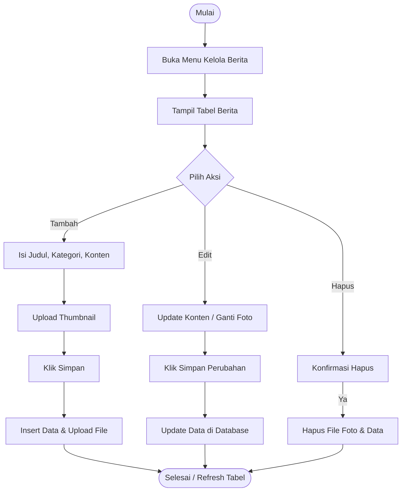
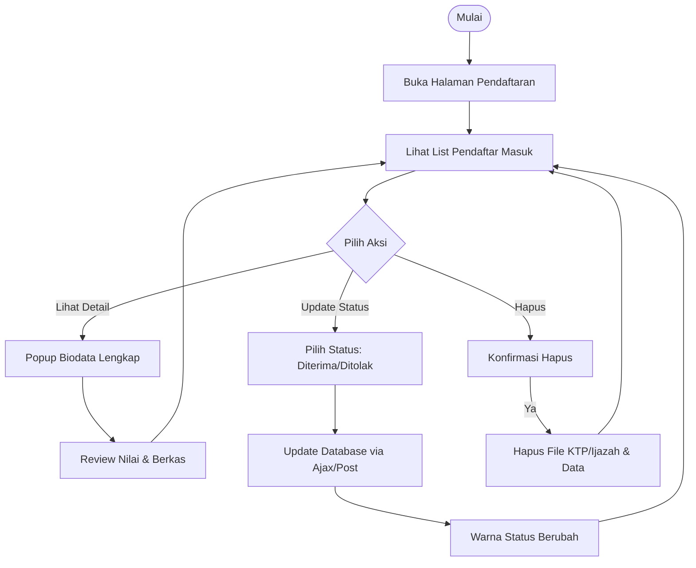

# Activity Diagram & Penjelasan - Admin Web FIKOM

Dokumen ini berisi **Activity Diagram** secara detail untuk setiap modul pengelolaan data di halaman Administrator.

> **Catatan:** Diagram di bawah ini menggunakan format **Mermaid Flowchart** yang kompatibel dengan GitHub.

---

## 1. Login Admin

Proses autentikasi administrator untuk masuk ke dalam sistem.


**Penjelasan:**
1.  Admin mengakses halaman login.
2.  Sistem menerima input username dan password.
3.  Sistem mengecek ketersediaan username di database.
4.  Jika username ada, sistem memverifikasi kesesuaian password (hashed).
5.  Jika valid, session `admin_logged_in` dibuat dan admin diarahkan ke Dashboard.

---

## 2. Kelola Data Dosen

Modul untuk manajemen data dosen tetap/tidak tetap, termasuk upload foto profil.


**Penjelasan:**
*   **Tambah**: Admin menginput NIDN, Nama, Prodi, Jabatan, dan upload Foto. Sistem memvalidasi ekstensi foto (JPG/PNG).
*   **Edit**: Admin dapat mengubah data. Jika foto baru diupload, foto lama dihapus secara otomatis.
*   **Hapus**: Menghapus baris data di database sekaligus file fisik foto di folder `uploads/dosen/`.

---

## 3. Kelola Berita

Modul untuk mempublikasikan berita, pengumuman, atau artikel kegiatan kampus.



**Penjelasan:**
*   Admin wajib mengisi Judul, Kategori, dan Tanggal Publish.
*   Konten berita dapat berupa teks panjang.
*   Foto yang diupload akan menjadi *thumbnail* berita di halaman depan.

---

## 4. Kelola Pendaftaran Mahasiswa

Modul untuk memverifikasi data calon mahasiswa yang mendaftar secara online.



**Penjelasan:**
*   Admin **tidak menginput** data, melainkan **memproses** data yang masuk dari form pendaftaran publik.
*   Fokus utama aktivitas adalah **Verifikasi** (Melihat Bukti Nilai/Ijazah) dan **Update Status** (Diterima/Ditolak).

---

## 5. Kelola Kerjasama (Partner)

Modul untuk menampilkan logo instansi yang bekerja sama dengan fakultas.


**Penjelasan:**
*   Digunakan untuk menampilkan logo mitra di footer atau halaman kerjasama.
*   Validasi file gambar sangat penting agar tampilan logo rapi.

---

## 6. Kelola Visi, Misi, & Tujuan

Modul *Multi-Section* yang mengelola beberapa jenis data dalam satu halaman.


**Penjelasan:**
*   Halaman ini unik karena menggabungkan form update tunggal (untuk Visi) dan list CRUD (untuk Misi/Tujuan) dalam satu tampilan.

---

## 7. Kelola Galeri & Dokumen

Modul umum untuk upload file (Gambar Kegiatan atau Dokumen Akademik).

```mermaid
flowchart TD
    Start([Mulai]) --> A[Buka Menu Galeri/Dokumen]
    A --> B[Klik Tambah]
    B --> C[Input Judul/Nama]
    C --> D[Upload File (Gambar/PDF)]
    D --> E{Ukuran Sesuai?}
    
    E -- Tidak --> F[Tolak Upload]
    E -- Ya --> G[Upload File ke Server]
    G --> H[Simpan info ke Database]
    H --> End([Selesai])
```

**Penjelasan:**
*   **Galeri**: Untuk foto kegiatan kampus.
*   **Dokumen**: Untuk SOP, Renstra, dan Kurikulum (File PDF).
