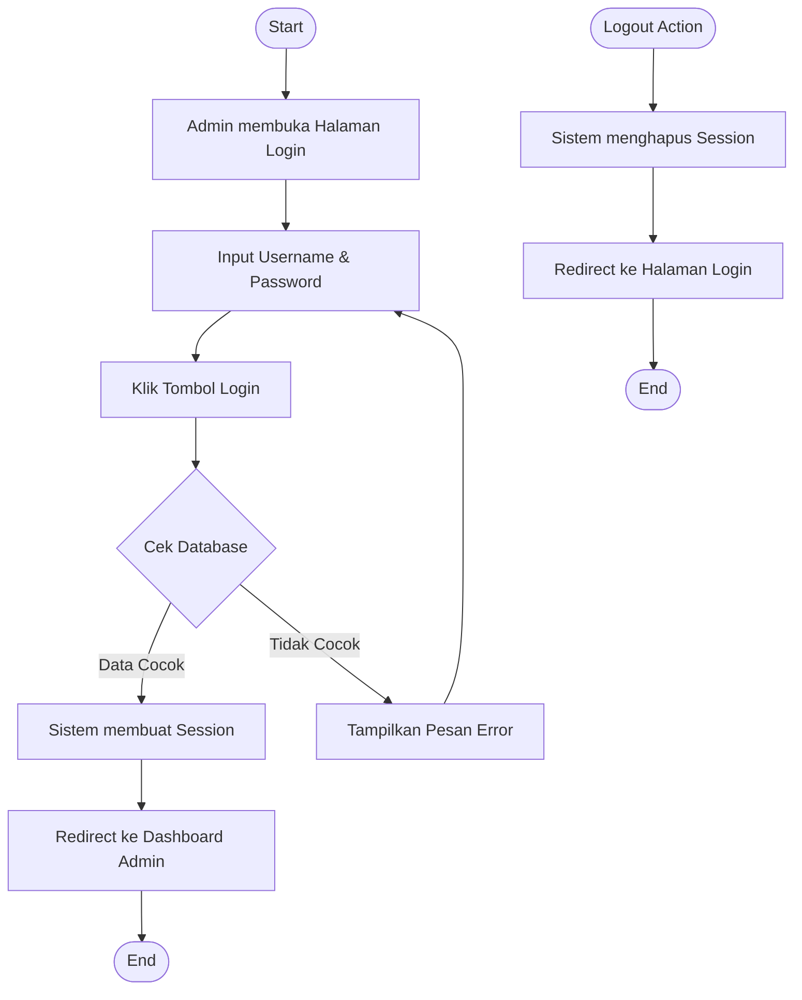
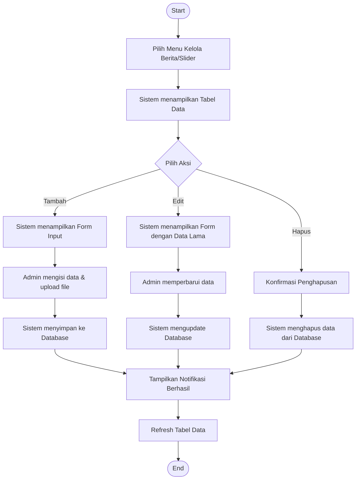
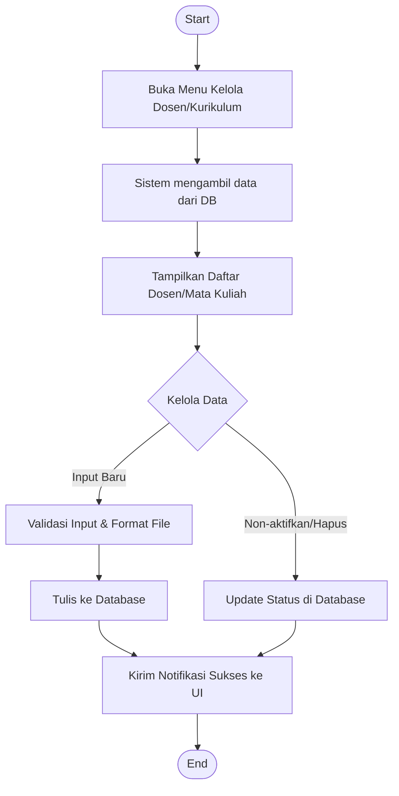
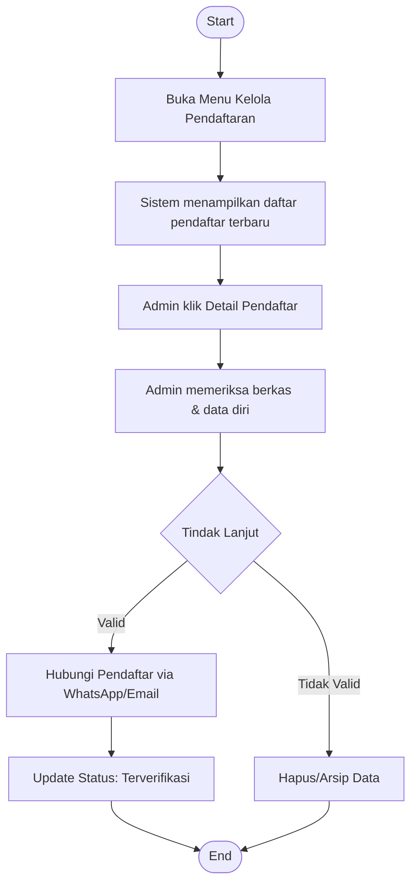
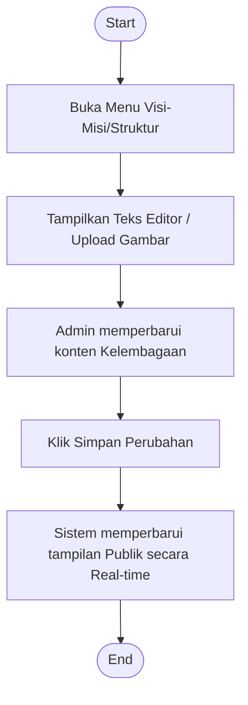

# Activity Diagram - Panel Admin

Dokumen ini berisi activity diagram untuk berbagai fitur administratif pada panel admin Website Fakultas Ilmu Komputer.

---

## 1. Diagram Otentikasi (Login & Logout)

Diagram ini menggambarkan alur keamanan saat administrator masuk ke sistem.

---

## 2. Diagram Manajemen Konten (CRUD Berita/Slider)

Alur umum untuk menambah, mengubah, atau menghapus konten dinamis.

---

## 3. Diagram Pengelolaan Data Akademik & Dosen

Diagram khusus untuk pengelolaan aset pendidik dan kurikulum.

---

## 4. Diagram Verifikasi Pendaftaran Mahasiswa Baru

Alur admin saat memproses data pendaftar yang masuk dari sisi publik.

---

## 5. Diagram Manajemen Kelembagaan (Visi-Misi & Struktur)

---

### Penjelasan Umum:
Semua proses administratif di atas dilindungi oleh middleware session. Jika session tidak valid atau telah berakhir, sistem secara otomatis akan mengalihkan admin kembali ke halaman login (Flow 1). Setiap perubahan data (Flow 2, 3, 5) akan langsung berdampak pada database dan tercermin pada tampilan pengunjung website.
