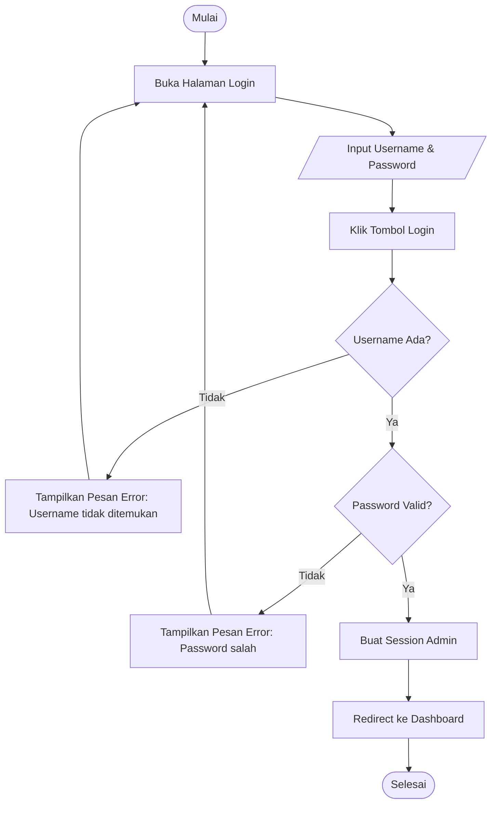
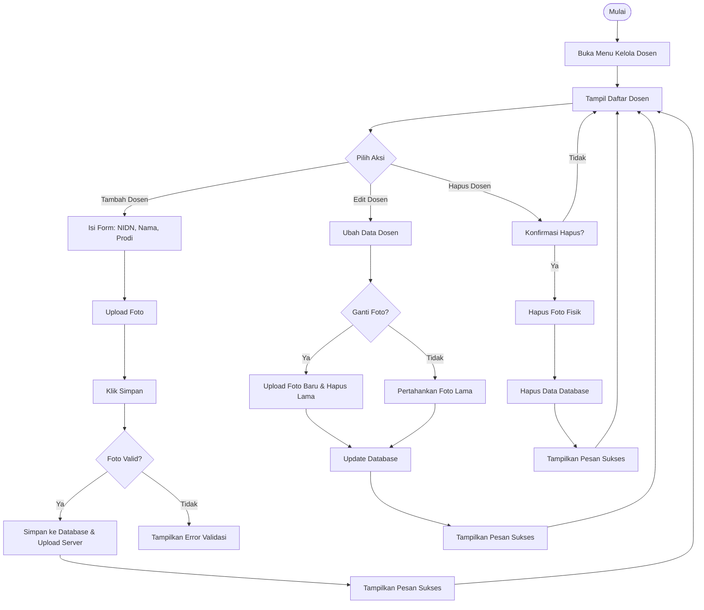
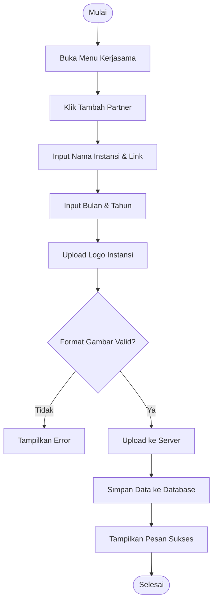
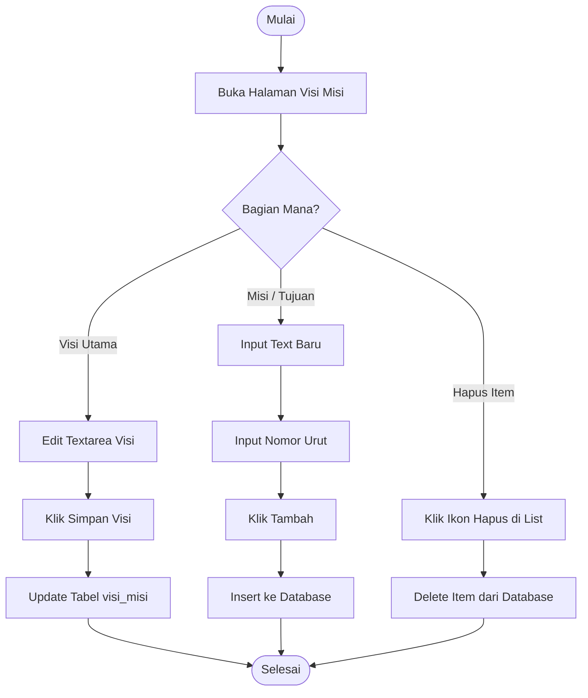
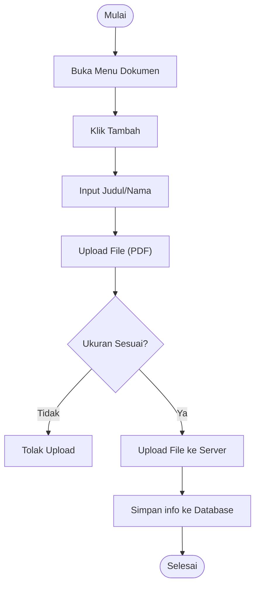

# Activity Diagram & Penjelasan - Admin Web FIKOM

Dokumen ini berisi **Activity Diagram** secara detail untuk setiap modul pengelolaan data di halaman Administrator.

> **Catatan:** Diagram di bawah ini menggunakan format **Mermaid Flowchart** yang kompatibel dengan GitHub. label teks menggunakan tanda kutip untuk mencegah error parsing.

---

## 1. Login Admin

Proses autentikasi administrator untuk masuk ke dalam sistem.

**Penjelasan:**
Proses login administrator merupakan gerbang utama keamanan sistem. Admin memulai dengan mengakses halaman login dan memasukkan kredensial berupa username serta password. Sistem kemudian melakukan pengecekan ganda secara berurutan: pertama memvalidasi keberadaan username di database, dan kedua memverifikasi validitas password menggunakan teknik hashing yang aman. Jika kedua tahap verifikasi ini berhasil, sistem akan menginisialisasi session admin untuk menjaga status login pengguna selama berinteraksi dengan dashboard. Seluruh proses ini dirancang untuk mencegah akses tidak sah sambil tetap memberikan kemudahan navigasi bagi administrator yang sah.

---

## 2. Kelola Data Dosen

Modul untuk manajemen data dosen tetap/tidak tetap, termasuk upload foto profil.

**Penjelasan:**
Modul manajemen dosen memungkinkan administrator untuk menjaga kemutakhiran data pengajar dengan kontrol yang presisi. Saat menambahkan dosen baru, admin menginput informasi dasar seperti NIDN dan kualifikasi akademik serta mengunggah foto profil yang akan divalidasi sistem agar sesuai standar. Fitur edit dirancang cerdas untuk menangani pembaruan foto, di mana sistem akan secara otomatis menghapus file fisik foto lama jika foto baru diunggah untuk menghindari penumpukan data sampah. Demikian pula pada proses penghapusan, sistem menjamin sinkronisasi antara record di database dan file fisik di server, memastikan integritas data tetap terjaga dengan baik.

---

## 3. Kelola Berita

Modul untuk mempublikasikan berita, pengumuman, atau artikel kegiatan kampus.

**Penjelasan:**
Pengelolaan berita fakultas dilakukan melalui antarmuka yang intuitif bagi administrator. Setiap berita yang dipublikasikan memerlukan informasi krusial seperti judul yang deskriptif, kategori untuk pengelompokan, dan konten lengkap yang informatif. Foto atau thumbnail yang diunggah berperan sebagai daya tarik visual utama di halaman depan website. Sistem menangani proses penyimpanan data dan manajemen file secara transparan, memungkinkan admin untuk melakukan pembaruan konten atau penggantian gambar kapan saja guna memastikan informasi yang sampai ke publik selalu terupdate dan relevan dengan perkembangan terkini di kampus.

---

## 4. Kelola Pendaftaran Mahasiswa

Modul untuk memverifikasi data calon mahasiswa yang mendaftar secara online.

**Penjelasan:**
Modul ini berfungsi sebagai pusat kendali untuk memantau arus pendaftaran mahasiswa baru. Berbeda dengan modul lainnya, di sini administrator lebih bersifat responsif terhadap data yang masuk dari calon mahasiswa. Admin dapat meninjau detail biodata, memeriksa berkas administrasi yang diunggah, dan melakukan verifikasi nilai. Pengambilan keputusan dilakukan dengan memperbarui status pendaftaran menjadi diterima atau ditolak, yang secara otomatis akan memberikan umpan balik visual dan memicu proses administratif selanjutnya. Sistem juga menyediakan opsi penghapusan data untuk membersihkan record pendaftaran yang tidak valid atau sudah lewat masa berlakunya.

---

## 5. Kelola Kerjasama (Partner)

Modul untuk menampilkan logo instansi yang bekerja sama dengan fakultas.

**Penjelasan:**
Kerjasama strategis dengan pihak eksternal didokumentasikan melalui modul mitra ini guna memperkuat reputasi fakultas. Administrator menginput nama instansi, tautan website resmi mitra, serta detail waktu dimulainya kerjasama. Aspek visual dikelola melalui unggahan logo instansi yang divalidasi secara sistematis untuk menjamin presisi tampilan di halaman publik. Setiap mitra yang ditambahkan akan memperkaya portofolio kolaborasi fakultas yang ditampilkan secara dinamis, memberikan informasi yang transparan kepada pengunjung mengenai luasnya jejaring kerjasama yang dimiliki Fakultas Ilmu Komputer.

---

## 6. Kelola Visi, Misi, & Tujuan

Modul *Multi-Section* yang mengelola beberapa jenis data dalam satu halaman.

**Penjelasan:**
*   Halaman ini unik karena menggabungkan form update tunggal (untuk Visi) dan list CRUD (untuk Misi/Tujuan) dalam satu tampilan.

---

---

## 7. Kelola Dokumen

Modul untuk manajemen file dokumen akademik dan strategis fakultas.

**Penjelasan:**
Modul pengelolaan dokumen dirancang untuk memudahkan administrasi file-file penting seperti SOP, Rencana Strategis, dan Kurikulum. Administrator dapat mengunggah file baru dalam format PDF, di mana sistem akan melakukan pengecekan ukuran file untuk menjaga kinerja server. Setiap dokumen yang berhasil diunggah akan tercatat secara sistematis di database, memungkinkan akses yang mudah dan terorganisir baik bagi internal fakultas maupun bagi publik yang memerlukan akses terhadap dokumen-dokumen resmi tersebut.
