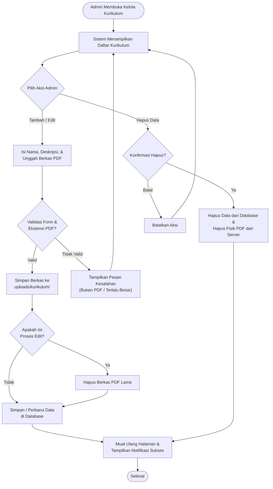
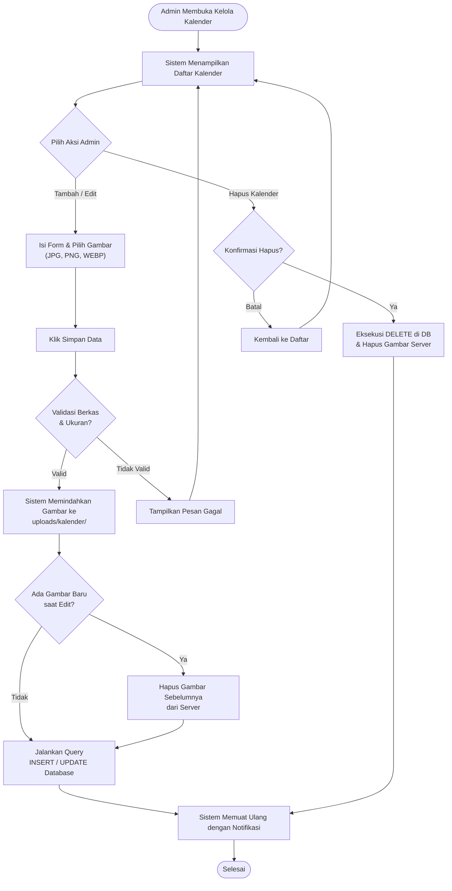
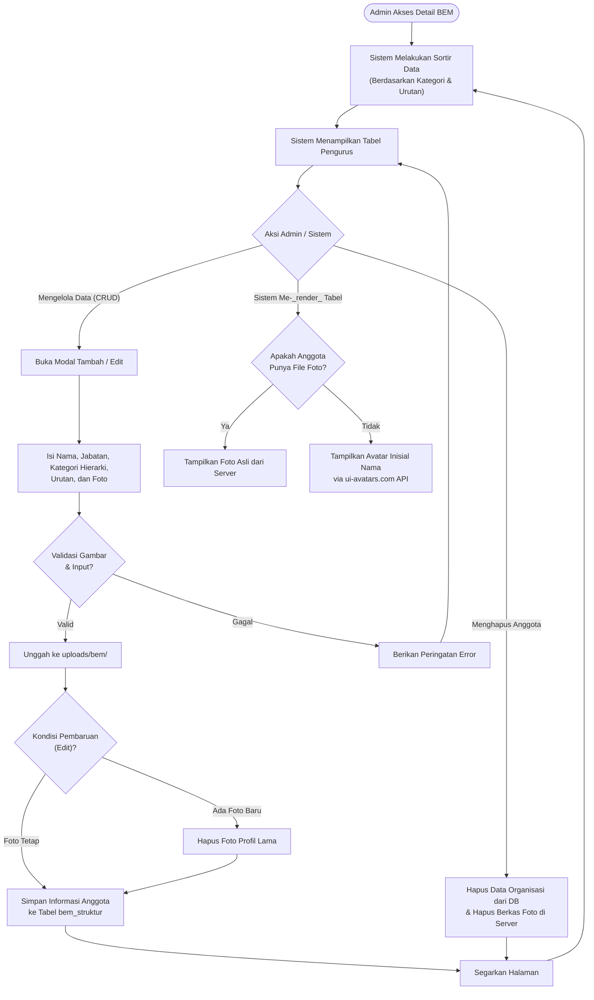

# Activity Diagram - Fitur Kurikulum, Kalender Akademik, dan BEM

Dokumen ini merinci alur kerja (Activity Diagram) dari sisi Administrator untuk tiga fitur utama pada Website Fakultas Ilmu Komputer, yaitu pengelolaan data **Kurikulum**, **Kalender Akademik**, dan susunan pengurus **Badan Eksekutif Mahasiswa (BEM)**.

---

## 1. Fitur Kelola Kurikulum 

Fitur ini memungkinkan Administrator untuk mengunggah dan mengelola dokumen panduan kurikulum berformat PDF yang nanti dapat diunduh (di-_download_) oleh pengunjung website.

### Penjelasan Alur (Kurikulum)
1.  **Tambah Data:** Admin mengakses halaman Kurikulum dan mengisi formulir (Nama Kurikulum, Deskripsi, dan File PDF). Sistem akan memvalidasi apakah berkas yang diunggah benar-benar berekstensi `.pdf` dan berukuran maksimal 10MB. Jika valid, berkas PDF tersebut akan dipindahkan ke server (`uploads/kurikulum/`) dan datanya disimpan ke dalam _database_.
2.  **Edit Data:** Admin memilih kurikulum yang ingin diubah. Admin dapat memperbarui teks atau mengganti berkas PDF lama dengan PDF baru. Jika ada berkas PDF baru yang diunggah, sistem secara otomatis akan menghapus PDF versi lama pada direktori server untuk menghemat kapasitas penyimpanan.
3.  **Hapus Data:** Admin mengklik tombol hapus. Sistem akan menghapus rujukan data dari _database_ sekaligus menghapus berkas fisik PDF-nya dari direktori server.

### Diagram (Kurikulum)

---

## 2. Fitur Kelola Kalender Akademik

Fitur ini berfungsi untuk menampilkan gambar jadwal kalender akademik per tahun ajaran.

### Penjelasan Alur (Kalender Akademik)
1.  **Tambah Data:** Admin memasukkan nama kalender, tahun akademik (contoh: 2023/2024), deskripsi, dan mengunggah gambar pendukung. Sistem memverifikasi ekstensi gambar (JPG/PNG/WEBP). Setelah lolos validasi, gambar disimpan ke direktori `uploads/kalender/` dan _database_ diperbarui.
2.  **Edit Data:** Serupa dengan kurikulum, jika admin mengunggah gambar baru saat melakukan edit (pembaruan data), gambar lama yang terkait dengan ID tersebut akan dihapus permanen dari memori server sebelum _database_ di-_update_.
3.  **Hapus Data:** Proses penghapusan akan membersihkan baik rekaman pada tabel `kalender_akademik` maupun menghapus berkas fisik gambar terkait tanpa menyisakan *cache*.

### Diagram (Kalender Akademik)

---

## 3. Fitur Kelola Organisasi BEM

Fitur kelola anggota Badan Eksekutif Mahasiswa (BEM) digunakan untuk mempublikasikan struktur organisasi pengurus mahasiswa secara interaktif.

### Penjelasan Alur (BEM)
1.  **Strukturisasi Data:** Formulir _input_ BEM sedikit lebih kompleks, di mana admin harus mengisi Nama, Jabatan, Program Studi, memilih "Kategori" (Pimpinan Inti, Sekretaris/Bendahara, atau Departemen), dan Nomor Urutan Tampil.
2.  **Pemrosesan Penambahan/Pengubahan:** Admin mengunggah foto profil pengurus. Sistem akan memvalidasi berkas dan menyimpannya di `/uploads/bem/`. Apabila sistem menemukan kolom foto kosong (ketika data dirender atau dikembalikan ke antarmuka klien), sistem diprogram untuk menghasilkan avatar _fallback_ (inisial nama) yang diambil dari pihak ketiga (`ui-avatars.com`).
3.  **Pengorganisasian Data (Tampilan):** Saat menampilkan daftar, sistem secara cerdas akan menyortir data menggunakan logika antrean hierarki berdasarkan _kategori_ secara otomatis (`ORDER BY FIELD('inti', 'sekben', 'departemen')`), kemudian mensortirnya kembali berdasar nomor _urutan_.

### Diagram (BEM)

