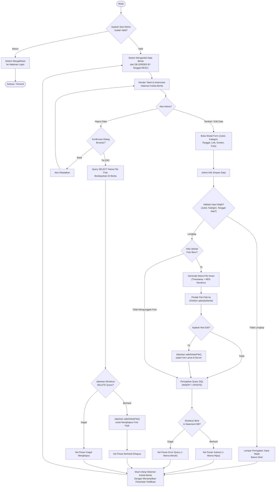

# Activity Diagram & Analisis Sistem - Kelola Berita

Dokumen ini disusun oleh **System Analyst** untuk membedah rancangan antarmuka, _business logic_, dan penanganan *error* pada **Modul Kelola Berita** di *backend* sistem (Admin Area).

---

## 1. Narasi Sistem & Pre-condition
Modul Kelola Berita merupakan fitur krusial yang digunakan oleh **Admin** untuk menyebarkan informasi (Informasi, Pengumuman, Kampus, Kegiatan UKM, Akademik) ke portal publik Fakultas Ilmu Komputer. Modul ini menjamin pengelolaan siklus hidup data (_Create, Read, Update, Delete_) berjalan aman, tervalidasi, dan mencegah penyimpanan *file cache* yang tidak penting (hemat _storage_).

**Pre-condition (Prasyarat):**
*   **Hak Akses:** Aktor harus tervalidasi sebagai administrator (`$_SESSION['admin_logged_in'] === true`). Jika sesi tidak valid, sistem secara otomatis melempar aktor ke halaman `login.php`.
*   **Struktur Direktori:** Server memiliki dan mengizinkan akses tulis (_write-permission_) pada direktori `../uploads/berita/` untuk menyimpan fail _image/cover_ berita.

**Post-condition (Hasil Akhir):**
*   **Keberhasilan:** Basis data MySQL termutakhirkan; fail gambar (jika ada) tersimpan rapi berformat ganti-nama terenkripsi (`timestamp` + MD5 acak) untuk mencegah tumpang tindih nama *file*, sistem menampilkan notifikasi sukses hijau.
*   **Kegagalan (Validasi / DB Error):** Proses diinterupsi; *state database* dan _file server_ kembali ke awal tanpa _corrupt data_; sistem merender notifikasi _error_ merah terperinci kepada Admin.

---

## 2. Activity Diagram (System Logic)

Diagram di bawah ini digambarkan menggunakan _Mermaid.js_ dengan tingkat ketelitian operasional logika di titik *backend*.

---

## 3. Penjelasan Signifikansi Tiap Tahapan (System Rationale)

Mengapa _flowchart_ di atas didesain sedemikian rupa? Berikut adalah analisis fungsional untuk tahapan kritikal yang sudah ditanam dalam *source code*:

### A. Otentikasi Lapis Pertama (Gatekeeper Logic)
Sebelum memuat sebaris _resource_ database (_Query Fetch_), sistem wajib membuktikan variabel kuki sesinya valid `$_SESSION['admin_logged_in']`. 
👉 *Rasionalisasi:* Mencegah insiden *bypass URL traversal* di mana siapa pun yang mengetik `/admin/kelola_berita.php` secara langsung di *browser* dapat membaca/mengubah sistem rahasia fakultas.

### B. Proteksi Keamanan Penamaan File (File Name Sanitization)
Saat _upload_ berjalan, fungsi khusus bernama `generateSafeFileName()` mengambil alih. Ekstensi file dipertahankan, lalu nama asli diobrak-abrik dan disisipi `time()` plus _hash string_ `MD5` acak.
👉 *Rasionalisasi:* Mencegah 2 ancaman sekaligus. Pertama, memastikan tidak ada file lama yang ter-_overwrite_ karena namanya kebetulan sama. Kedua, mengaburkan struktur teks *malware injection* semacam `.php.jpg` yang biasa disusupkan lewat lubang *upload*.

### C. Alur Hapus Fisik Terstruktur (Optimized Garbage Collector)
Diagram mendemonstrasikan metode `safeDeleteFile()`. Entah saat penghapusan seluruh row berita atuapun sekadar menekan edit untuk *update foto*, foto lama SELALU didelete menggunakan parameter fungsi _safe delete_ (bisa merubah hak guna `chmod` bila _file locked_ sebelum `unlink()`).
👉 *Rasionalisasi:* Direktori server memiliki kapasitas disk terbatas (_I/O space limit_). Jika ribuan berita mengalami edit gambar secara proaktif, dan sisa datanya tidak dikikis, server lambat laun akan mati gantung karena sisa sampah digital (*Orphaned Files*).

### D. Penumpukan *Query Order By* Parameter (User-friendliness)
Sistem memuat daftar Berita dalam skema *Read* yang dibalik (_Descending_ via kolom `tanggal_publish`).
👉 *Rasionalisasi:* Admin tidak perlu lelah menggulir tabel memanjang karena berita yang baru diproses/ditulis di *database* hari ini akan selalu menempati singgasana paling atas.
