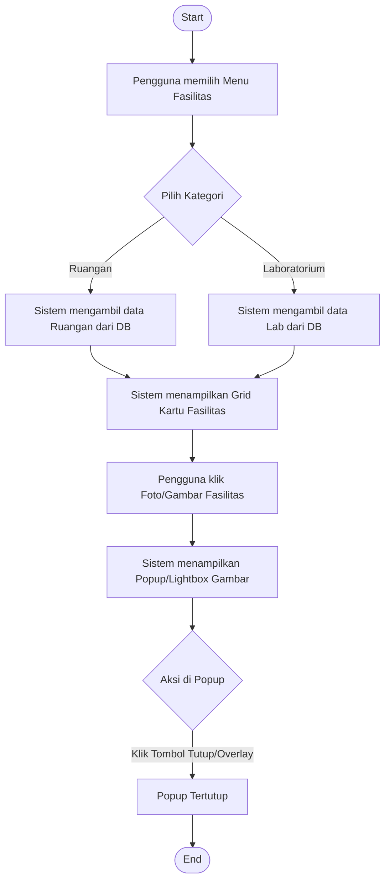
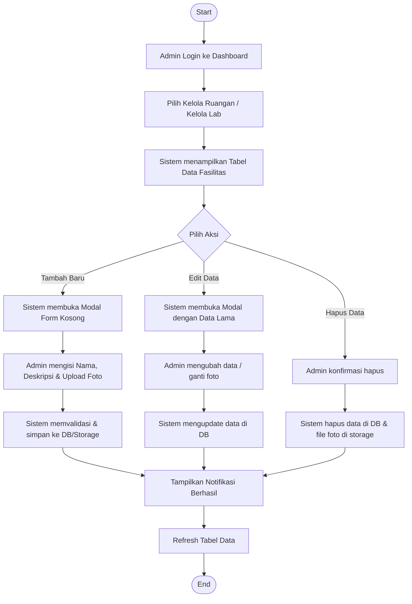

# Activity Diagram - Fasilitas (Ruangan & Laboratorium)

Dokumen ini berisi activity diagram untuk alur penggunaan dan pengelolaan fasilitas fisik (Ruangan & Laboratorium) pada Website Fakultas Ilmu Komputer.

---

## 1. Alur Tampilan Publik (Public View)

Diagram ini menggambarkan bagaimana pengunjung melihat informasi fasilitas dan memperbesar foto melalui fitur popup/lightbox.

---

## 2. Alur Pengelolaan Admin (Admin Management - CRUD)

Diagram ini merinci bagaimana administrator mengelola data fasilitas, termasuk proses upload foto.

---

### Penjelasan Teknis:
1.  **Public View**: Sistem menggunakan `IntersectionObserver` (via `main.js`) untuk memberikan efek rimbun (reveal) saat kartu fasilitas muncul di layar. Fitur popup dikelola oleh fungsi `showPopup()` yang memicu modal visual sederhana.
2.  **Admin View**: Pengelolaan data menggunakan kombinasi PHP dan Modal Bootstrap-like. Proses upload foto dilengkapi dengan validasi format (JPG/PNG) dan ukuran file maksimal 2MB untuk menjaga performa server. Setiap aksi penghapusan akan secara otomatis membersihkan file fisik di folder `uploads/` untuk mencegah penumpukan file sampah.
