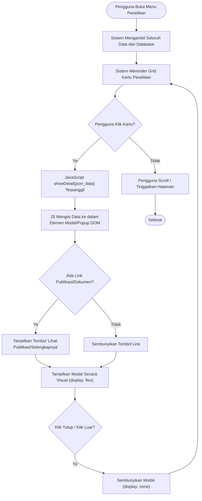
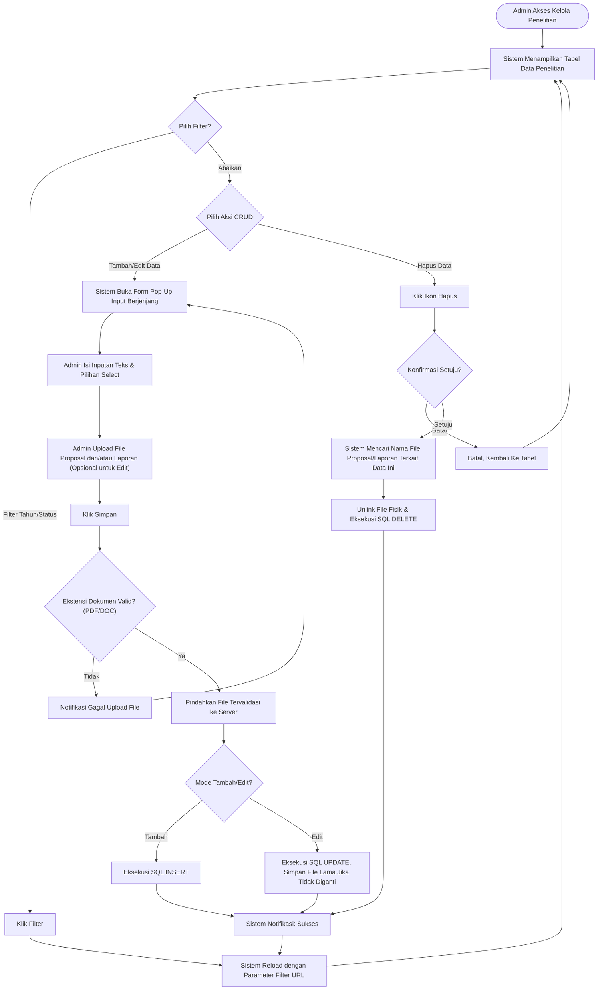

# Activity Diagram - Penelitian Dosen

Dokumen ini memetakan alur kerja untuk modul **Penelitian Dosen**, mencakup akses publik untuk melihat hasil riset dan pengelolaan data oleh admin.

---

## 1. Alur Tampilan Publik (Public View)

Diagram ini menggambarkan interaksi pengguna saat mengakses daftar penelitian dosen dan melihat detail spesifiknya.

---

## 2. Alur Pengelolaan Admin (Admin Management CRUD)

Fitur CRUD untuk modul ini melibatkan pengisian form identitas detail, serta opsi mengunggah dokumen fisik (PDF/DOC) seperti Proposal dan Laporan Penelitian.

---

### Penjelasan Teknis Modul Penelitian:
1.  **Keamanan File Upload**: Sistem sisi server secara ketat memvalidasi variabel ekstensinya: **hanya mengizinkan `pdf`, `doc`, `docx`** untuk dokumen penelitian, sekaligus merename nama file menggunakan enkripsi `uniqid()` untuk mencegah bentrok/tertabraknya nama file di direktori publik server.
2.  **Manajemen Pop-Up Publik**: Semua modul pop-up informasi detail (modal) di halaman publik tidak perlu me-reload halaman atau nge-hit AJAX API. Semua elemen dirender awal jadi atribut HTML berformat *JSON Strings* (`htmlspecialchars(json_encode())`), kemudian ditangkap JavaScript klien murni untuk mempercepat rendering (Zero Latency Modal).
