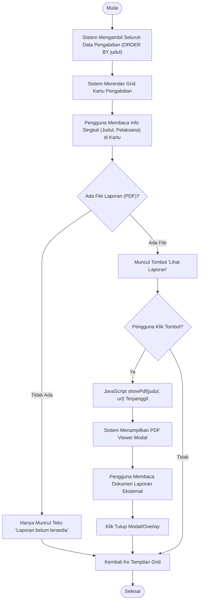
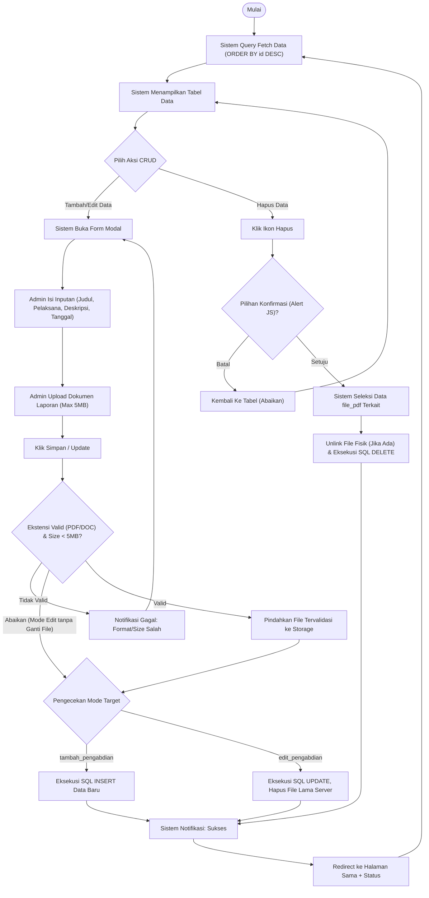

# Activity Diagram - Pengabdian Masyarakat

Dokumen ini memetakan alur kerja untuk modul **Pengabdian Masyarakat**, mencakup akses publik untuk melihat berbagai program pengabdian dan pengelolaan datanya oleh admin.

---

## 1. Alur Tampilan Publik (Public View)

Diagram ini menggambarkan interaksi pengguna saat mengakses daftar kegiatan pengabdian masyarakat beserta detail spesifiknya. Pada modul ini, pengguna dapat membaca ringkasan langsung di kartu, dan jika admin pernah mengunggah file laporannya (PDF), sistem akan menampilkan tombol khusus pembaca PDF.

---

## 2. Alur Pengelolaan Admin (Admin Management CRUD)

Fitur CRUD untuk modul ini terpusat pada pengisian form identitas kegiatan (Judul, Pelaksana, Deskripsi, Tanggal) dan mengunggah dokumen tunggal PDF/DOC sebagai Laporan Kegiatan. Skema kueri di sini dirancang lebih sederhana namun presisi pada manajemen filenya.

---

### Penjelasan Teknis Modul Pengabdian:
1.  **Format Inline Card Viewer**: Pemanggilan data publik modul ini sedikit berbeda dengan _Penelitian_. Alih-alih merender ulang data berupa string JSON untuk Pop-Up, ringkasan informasi langsung terlihat statis pada kartu grid, dan interaksi mendalam diserahkan pada file viewer khusus (terutama PDF) tanpa menduduki keseluruhan _viewport_.
2.  **Manajemen Dokumen Tunggal**: Berbeda dari sistem _Penelitian_ yang perlu memisahkan antara `file_proposal` dan `file_laporan`, mekanisme storage _Pengabdian_ mengkonsolidasi dokumen menjadi file laporannya saja. Validasi upload diperkuat dengan penjagaan ukuran berkas (size limit 5MB).
3.  **Clean Deletion Principle (Hapus Tuntas)**: Baik pada proses Edit (menggantikan file) maupun Hapus Record (menghapus baris pada _Database_), sistem menggunakan sintaks fungsional PHP `@unlink()` sehingga efisiensi ruang _drive_ dari aplikasi selalu dioptimalkan.
