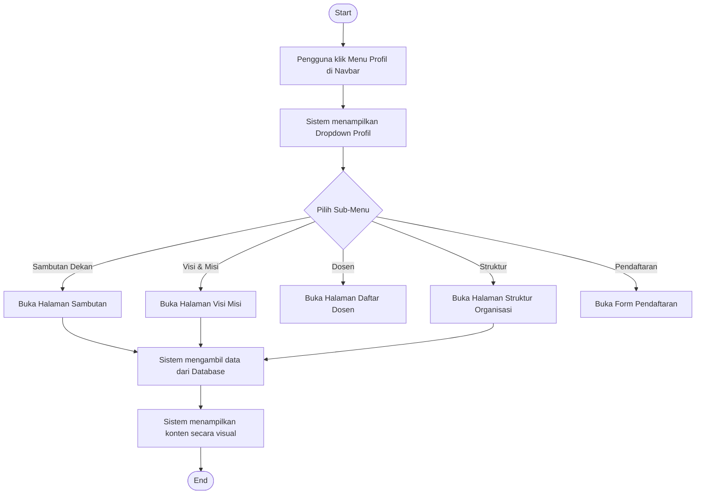
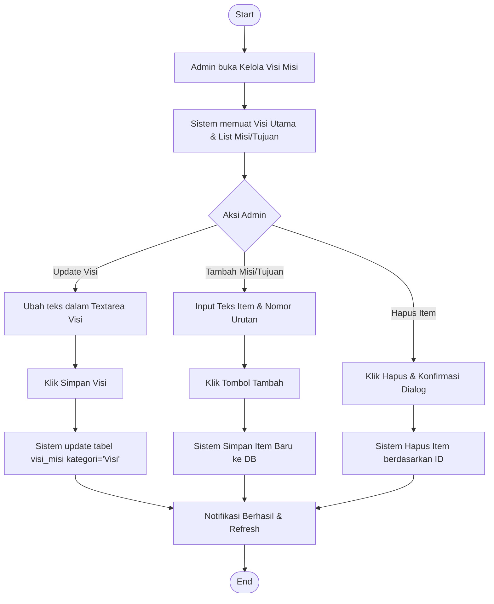
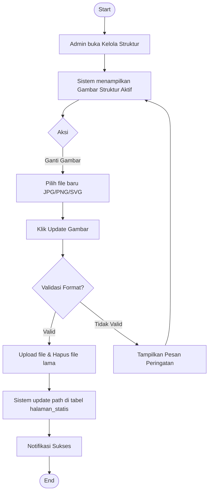
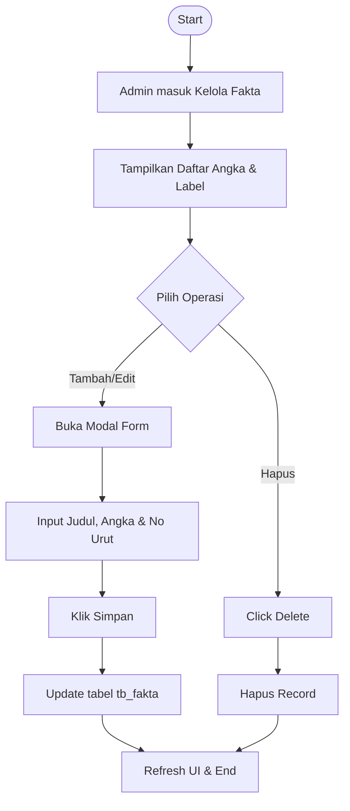
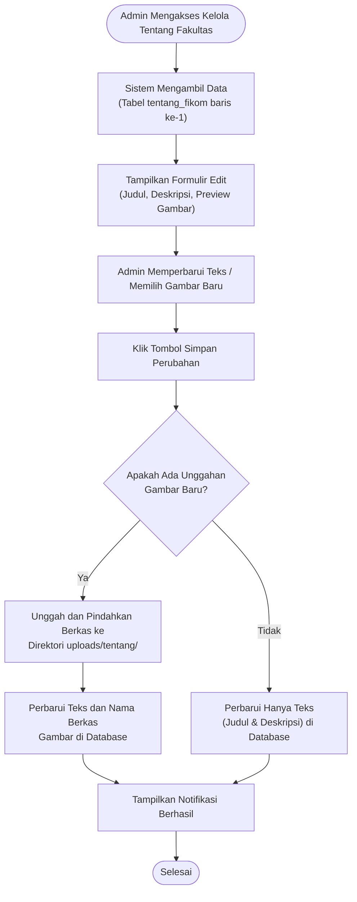

# Activity Diagram - Fitur Profil FIKOM

Dokumen ini menyajikan alur kerja mendalam untuk fitur-fitur yang tergabung dalam modul **Profil** pada Website Fakultas Ilmu Komputer.

---

## 1. Navigasi Profil (Public Perspective)

Menggambarkan bagaimana pengguna berinteraksi dengan menu profil untuk mendapatkan informasi fakultas.

---

## 2. Fitur Visi, Misi, Tujuan & Sasaran (Admin CRUD)

Fitur ini memungkinkan pengelolaan poin-poin strategis fakultas dengan urutan tertentu.

---

## 3. Fitur Struktur Organisasi (Admin Media Update)

Fokus pada pengelolaan dokumen visual struktur organisasi.

---

## 4. Fitur Fakta & Statistik (High-Impact Data)

Mengelola data angka yang ditampilkan secara dinamis di Beranda.

---

## 5. Fitur Tentang Fakultas (Representasi Identitas)

Fitur ini diperuntukkan bagi admin untuk mengelola narasi profil fakultas yang tampil pada halaman Beranda utama, mencakup pembaruan teks (judul & deskripsi) serta dokumentasi visual (gambar).

---

### Catatan Teknis Fitur Profil:
- **Optimasi Gambar**: Fitur Struktur Organisasi mendukung format **SVG** untuk memastikan diagram tetap tajam pada semua ukuran layar tanpa pecah (lossless scaling).
- **UX Counter**: Data dari fitur Fakta diintegrasikan dengan `animateCounters` di `main.js`, memberikan efek visual angka yang berhitung naik saat pengguna men-scroll ke bagian tersebut.
- **Relasi Data**: Semua fitur profil terikat dengan user ID administrator yang melakukan perubahan untuk keperluan audit sistem (log aktivitas).
