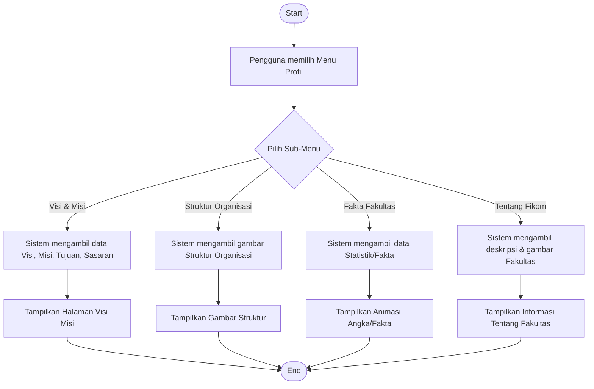
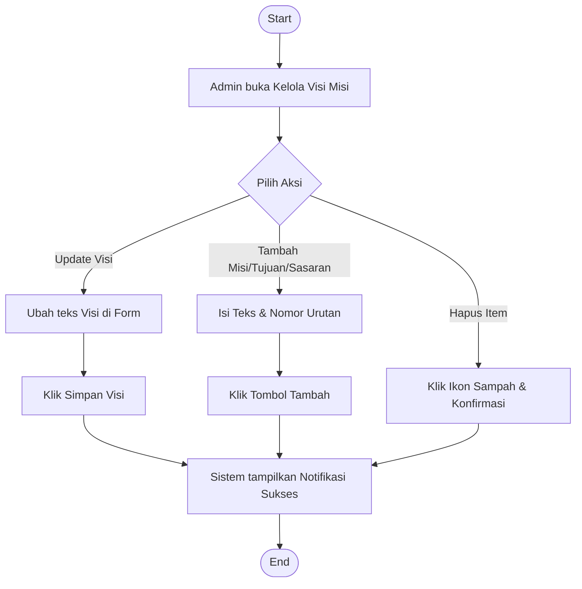
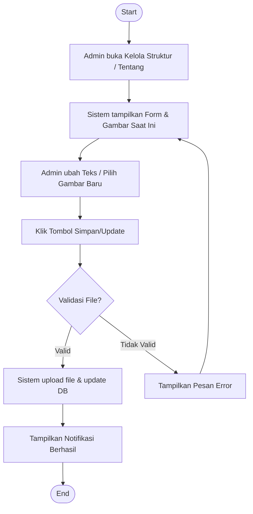
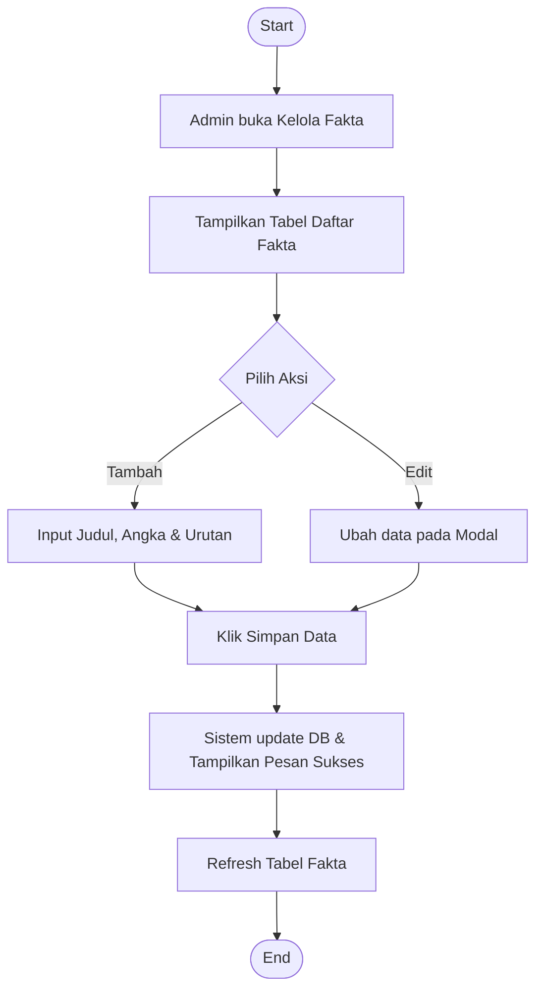

# Activity Diagram - Profil (Visi-Misi, Struktur, Fakta, Tentang)

Dokumen ini berisi activity diagram untuk alur penggunaan dan pengelolaan informasi profil fakultas pada Website Fakultas Ilmu Komputer.

---

## 1. Alur Tampilan Publik (Public View)

Diagram ini menggambarkan bagaimana pengunjung mengakses berbagai informasi profil fakultas.

---

## 2. Alur Pengelolaan Admin (Admin Management)

Diagram ini merinci bagaimana administrator mengelola berbagai komponen profil.

### A. Alur Visi, Misi, Tujuan & Sasaran

### B. Alur Struktur & Tentang Fakultas (Update Konten)

### C. Alur Fakta Fakultas (CRUD)

---

### Penjelasan Teknis:
1.  **Visi Misi**: Menggunakan tabel `visi_misi` dengan kolom `kategori` untuk membedakan jenis informasi. Admin dapat melakukan update langsung pada Visi utama atau menambah item list pada Misi/Tujuan.
2.  **Struktur Organisasi**: Menggunakan tabel `halaman_statis` (row: `struktur_organisasi`). Admin mengupload gambar yang akan menggantikan file lama di folder `uploads/profil/`.
3.  **Fakta Fakultas**: Menggunakan tabel `tb_fakta`. Data ini ditampilkan di halaman publik dengan animasi counter (angka bergerak) yang dikelola oleh `main.js`.
4.  **Tentang Fakultas**: Menggunakan tabel `tentang_fikom`. Admin dapat memperbarui deskripsi panjang menggunakan textarea dan mengupdate gambar utama fakultas.
