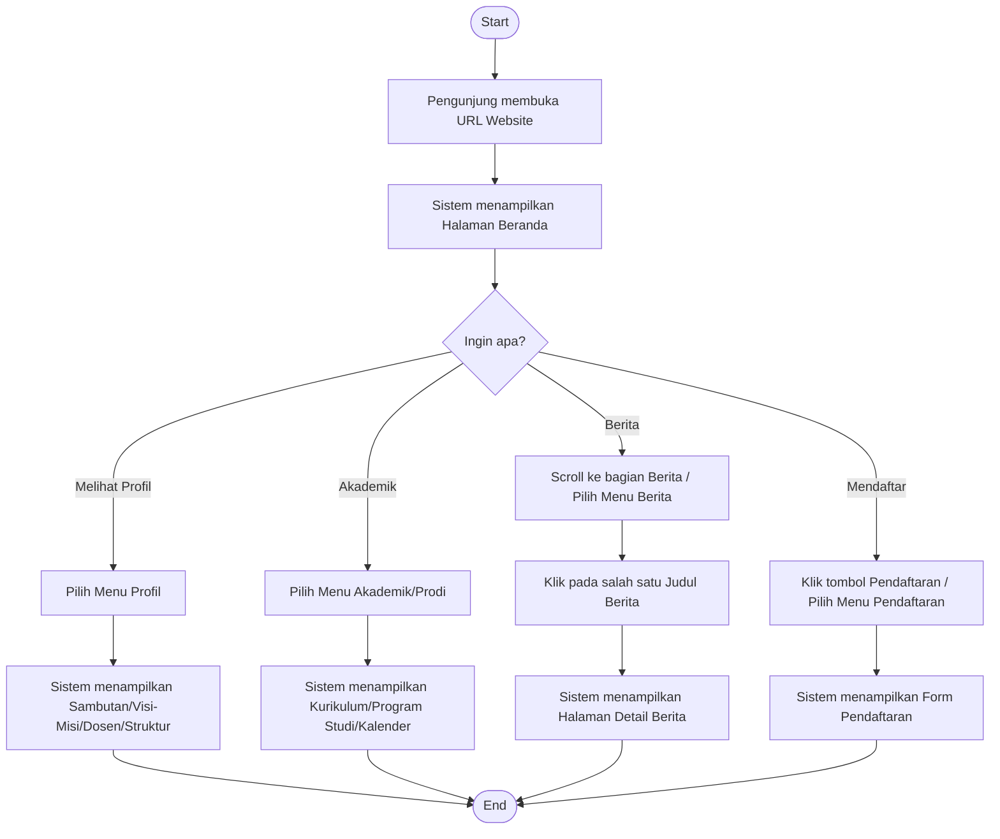
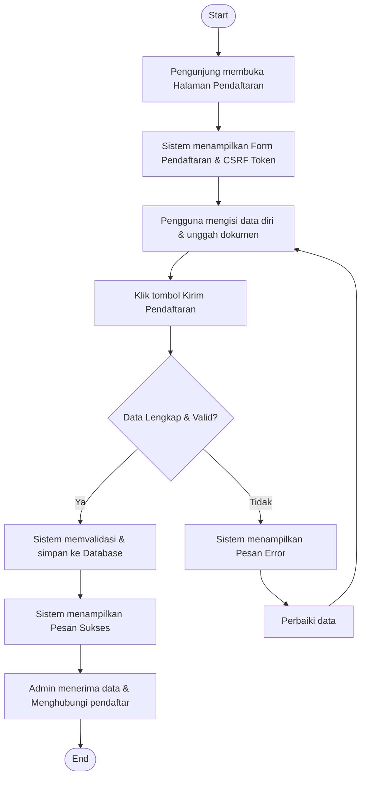
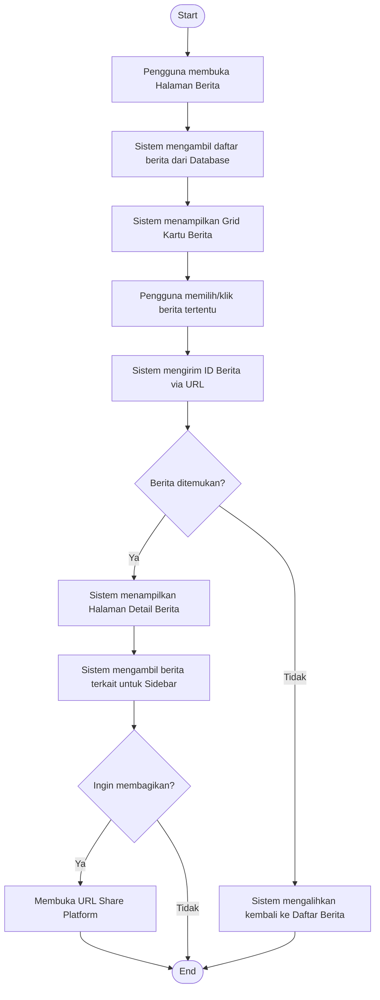

# Activity Diagram - Tampilan Publik (Public View)

Dokumen ini berisi activity diagram untuk alur pengguna pada tampilan publik website Fakultas Ilmu Komputer. Setiap diagram disertai dengan penjelasan langkah-langkah logikanya.

---

## 1. Diagram Navigasi Umum (General Navigation)

Diagram ini menggambarkan bagaimana pengunjung berinteraksi dengan website mulai dari halaman utama hingga menelusuri berbagai menu informasi yang tersedia.

### Penjelasan Diagram Navigasi Umum:
1.  **Start**: Pengguna mengakses website melalui browser.
2.  **Halaman Beranda**: Sistem menyajikan slider utama, statistik, dan ringkasan informasi.
3.  **Pengambilan Keputusan**: Pengguna dapat memilih berbagai jalur navigasi:
    *   **Profil**: Untuk mengetahui informasi dasar fakultas.
    *   **Akademik**: Untuk melihat kurikulum, jadwal, dan profil prodi.
    *   **Berita**: Untuk mendapatkan update kegiatan terkini.
    *   **Pendaftaran**: Jalur khusus untuk calon mahasiswa baru.
4.  **End**: Pengguna mendapatkan informasi yang dicari.

---

## 2. Diagram Alur Pendaftaran (Registration Flow)

Diagram ini merinci proses teknis saat calon mahasiswa melakukan pendaftaran online melalui form yang tersedia.

### Penjelasan Diagram Pendaftaran:
1.  **Persiapan**: Sistem menghasilkan CSRF token untuk keamanan form.
2.  **Input Data**: Pengguna mengisi berbagai field wajib (bertanda *).
3.  **Validasi Sistem**:
    *   Mengecek apakah semua field wajib sudah terisi.
    *   Memvalidasi format file yang diunggah (JPG/PNG/PDF).
    *   Memastikan keamanan melalui token CSRF.
4.  **Penyimpanan**: Jika valid, data dimasukkan ke tabel `pendaftaran`.
5.  **Konfirmasi**: Pengguna menerima notifikasi bahwa data telah tersimpan, dan proses berpindah ke sisi admin secara offline (menghubungi via WA/Email).

---

## 3. Diagram Penemuan Konten (Content Discovery - Berita)

Diagram ini menjelaskan alur sistem saat pengguna mencari dan membaca detail berita atau informasi riset.

### Penjelasan Diagram Penemuan Konten:
1.  **Daftar Berita**: Sistem melakukan query ke database untuk menampilkan ringkasan berita terbaru.
2.  **Interaksi**: Pengguna memilih berita yang menarik perhatiannya.
3.  **Proses Detail**:
    *   Sistem memvalidasi ID yang dikirim melalui parameter URL.
    *   Jika valid, konten lengkap berita ditampilkan beserta gambar dan meta data.
    *   Jika ID tidak valid atau berita dihapus, sistem secara otomatis melakukan redirect demi kenyamanan pengguna.
4.  **Fitur Tambahan**: Pengguna dapat langsung membagikan konten ke media sosial atau melihat berita populer lainnya di bagian sidebar.
