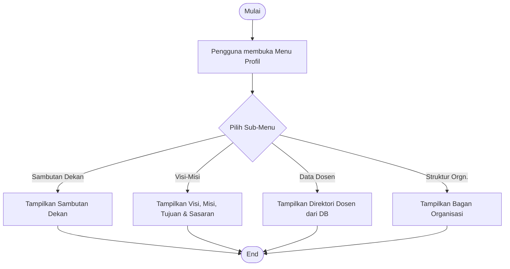
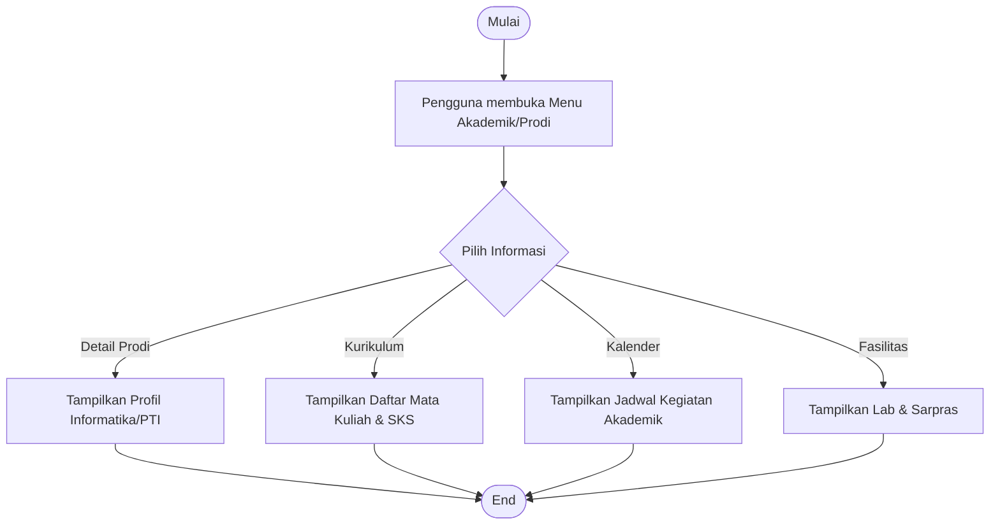
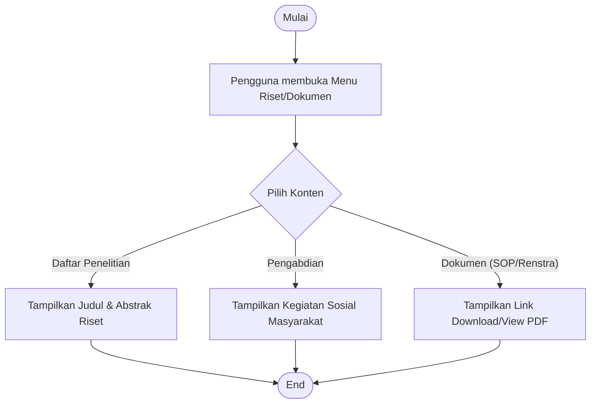
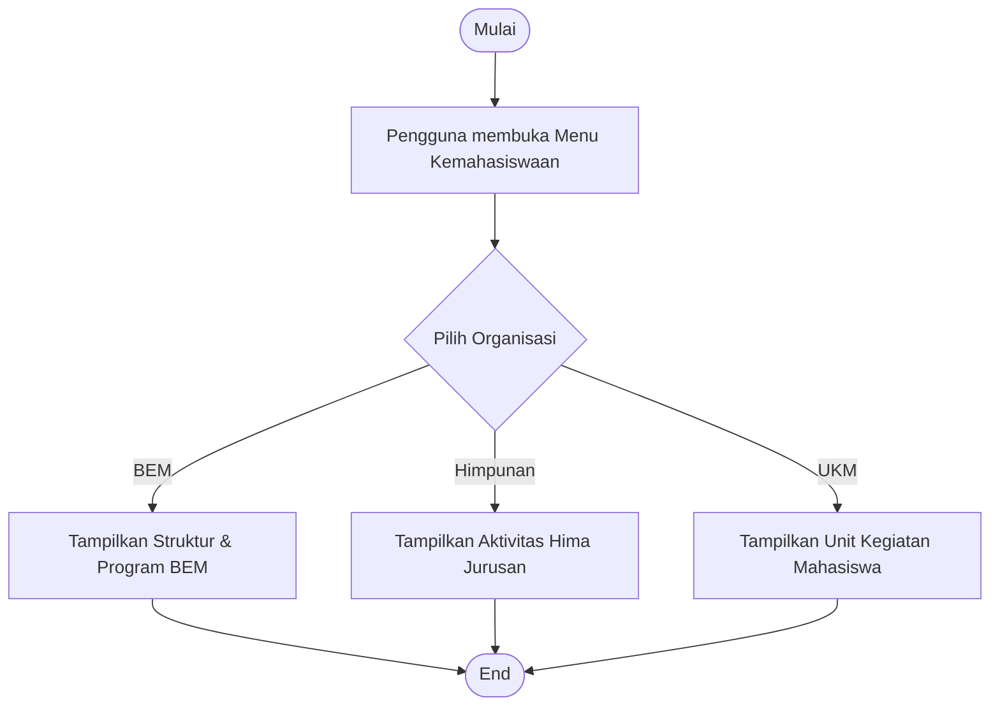
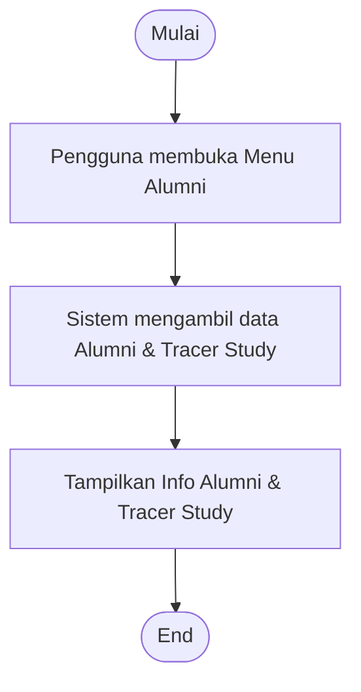

# Activity Diagram - Tampilan Publik (Public View)

Dokumen ini berisi activity diagram untuk alur pengguna pada tampilan publik website Fakultas Ilmu Komputer. Setiap diagram disertai dengan penjelasan langkah-langkah logikanya.

---

## 1. Diagram Navigasi Umum (General Navigation)

Diagram ini menggambarkan bagaimana pengunjung berinteraksi dengan website mulai dari halaman utama hingga menelusuri berbagai menu informasi yang tersedia.

### Penjelasan Diagram Navigasi Umum:
Alur navigasi umum website ini dirancang untuk memberikan kemudahan bagi pengunjung dalam mengakses berbagai informasi penting mengenai Fakultas Ilmu Komputer. Begitu pengunjung membuka URL website, sistem akan menyuguhkan halaman beranda yang kaya akan informasi, mulai dari slider interaktif hingga statistik fakta fakultas. Dari titik ini, pengunjung dihadapkan pada beberapa pilihan utama: menelusuri profil fakultas untuk memahami visi dan struktur organisasi, mengakses informasi akademik yang mencakup kurikulum dan kalender pendidikan, membaca berita terbaru untuk tetap terinformasi tentang kegiatan kampus, atau langsung menuju jalur pendaftaran jika mereka adalah calon mahasiswa baru. Setiap jalur ini telah dioptimalkan untuk memberikan respons cepat dan informasi yang akurat guna memenuhi kebutuhan setiap pengunjung.

---

## 2. Diagram Alur Pendaftaran (Registration Flow)

Diagram ini merinci proses teknis saat calon mahasiswa melakukan pendaftaran online melalui form yang tersedia.

### Penjelasan Diagram Pendaftaran:
Proses pendaftaran mahasiswa baru dilakukan secara digital untuk efisiensi dan transparansi. Alur dimulai dengan pengunjung mengakses halaman pendaftaran, di mana sistem secara otomatis menyiapkan form yang dilengkapi dengan token keamanan CSRF untuk melindungi data pengguna. Calon mahasiswa kemudian mengisi data diri secara lengkap dan mengunggah dokumen pendukung yang diperlukan. Begitu tombol kirim diklik, sistem melakukan validasi menyeluruh baik dari sisi kelengkapan field maupun format berkas yang diupload. Jika data valid dan berhasil disimpan ke database, sistem akan menampilkan pesan sukses. Setelah tahap ini, data akan diproses lebih lanjut oleh panitia pendaftaran (admin) untuk dilakukan verifikasi lanjutan dan komunikasi personal melalui platform digital.

---

## 3. Diagram Penemuan Konten (Content Discovery - Berita)

Diagram ini menjelaskan alur sistem saat pengguna mencari dan membaca detail berita atau informasi riset.

### Penjelasan Diagram Penemuan Konten:
Sistem penemuan konten, khususnya pada modul berita, dirancang agar pengunjung dapat dengan mudah menelusuri arsip berita yang ada. Saat halaman berita dibuka, sistem secara aktif menarik data terbaru dari database dan menyajikannya dalam bentuk grid kartu yang menarik secara visual. Pengguna dapat memilih berita tertentu untuk dibaca detailnya. Sistem kemudian melakukan verifikasi ID berita melalui parameter URL untuk memastikan konten yang diminta tersedia secara sah. Jika berhasil ditemukan, halaman detail berita akan ditampilkan lengkap dengan elemen pendukung seperti sidebar yang berisi rekomendasi berita terkait. Fitur ini bertujuan untuk meningkatkan keterikatan pengguna (user engagement) dan memastikan arus informasi di lingkungan fakultas tetap dinamis.

---

## 4. Diagram Profil & Struktur (Profile & Structure)

Diagram ini menggambarkan bagaimana pengguna mengakses informasi profil kepemimpinan dan data dosen.

### Penjelasan:
Halaman Profil dan Struktur Organisasi merupakan pusat informasi mengenai identitas fakultas. Pengguna dapat memilih berbagai sub-menu mulai dari Sambutan Dekan yang berisi visi kepemimpinan, hingga Visi-Misi sebagai landasan operasional pendidikan. Selain itu, sistem menyediakan direktori dosen yang datanya diambil langsung dari database untuk menjamin akurasi profil akademik pengajar. Struktur organisasi juga disajikan secara visual untuk memberikan kejelasan mengenai hierarki dan pembagian tugas di lingkungan fakultas, sehingga pengunjung mendapatkan gambaran menyeluruh tentang tata kelola Fakultas Ilmu Komputer.

---

## 5. Diagram Program Studi & Akademik (Academic & Departments)

Diagram ini merinci alur penelusuran informasi akademik dan detail program studi.

### Penjelasan:
- **Prodi**: Memberikan gambaran kompetensi lulusan dan prospek karir di bidang Informatika atau Pendidikan TI.
- **Fasilitas**: Dokumentasi fisik laboratorium untuk meyakinkan pengguna tentang kesiapan teknis pembelajaran.

---

## 6. Diagram Dokumen & Riset (Documents & Research)

Diagram ini menunjukkan alur akses dokumen strategis dan hasil karya ilmiah civitas akademika.

---

## 7. Diagram Kemahasiswaan & Organisasi (Student Affairs)

Diagram ini menggambarkan interaksi dengan lembaga kemahasiswaan.

---

---

## 8. Diagram Alumni

Alur melihat jaringan lulusan dan penelusuran karir.

### Penjelasan:
Modul Alumni difokuskan untuk membangun jejaring yang kuat antara fakultas dengan para lulusannya. Melalui menu ini, pengunjung dapat melihat hasil tracer study yang menggambarkan sebaran karir alumni serta kontribusi mereka di dunia industri. Data ini sangat krusial sebagai indikator keberhasilan program pendidikan sekaligus sebagai platform bagi mahasiswa aktif untuk mendapatkan inspirasi dari jejak langkah para senior mereka.
