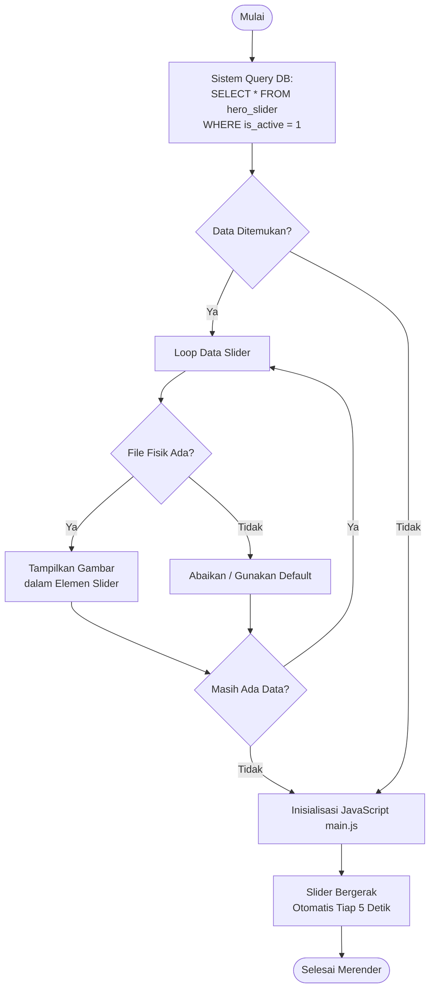
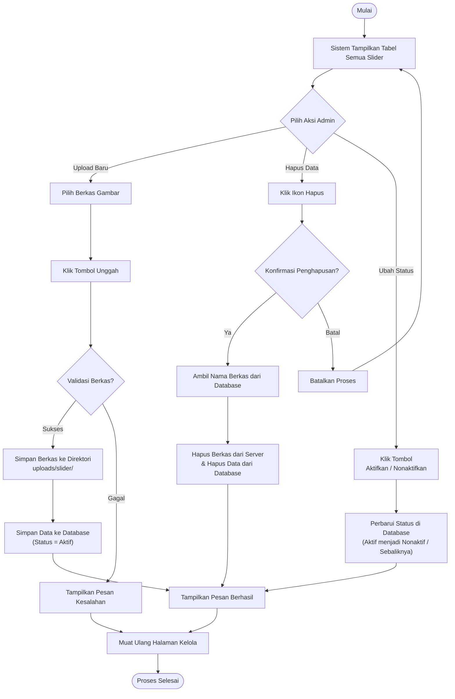

# Activity Diagram - Fitur Slider Beranda

Dokumen ini menjelaskan alur kerja sistem untuk fitur **Slider Beranda (Banner)**, baik dari sisi pengunjung website (publik) maupun dari sisi administrator yang mengelolanya.

---

## 1. Alur Tampilan Publik (Public View)

Diagram ini menggambarkan bagaimana sistem merender slider pada halaman beranda utama (`home.php`), termasuk logika penarikan data yang hanya menampilkan slider dengan status aktif.

**Catatan Publik:**
*   Hanya gambar dengan flag `is_active = 1` yang akan ditarik dari database ke halaman publik.
*   Logika rotasi otomatis (`setInterval`), navigasi next/prev, dan indikator (dots) dirender dan ditangani di sisi klien oleh fungsi `initHeroSlider()` dalam file `assets/js/main.js`.

---

## 2. Alur Pengelolaan Admin (Admin Management)

Diagram ini merinci bagaimana administrator menambahkan slider baru, menghapus slider lama, dan mengubah status tampilannya (Aktif/Nonaktif).

**Catatan Administrasi:**
1.  **Status Default**: Saat admin mengunggah (`upload`) gambar slider baru, sistem secara otomatis mengaturnya sebagai "Aktif" (`is_active = 1`).
2.  **Penghapusan Bersih**: Proses penghapusan tidak hanya menghapus referensi di *database*, tetapi juga menghapus (`unlink()`) file fisik gambar dari map penyimpanan server untuk mencegah pemborosan ruang disk.
3.  **Toggle Cepat**: Tombol ubah status langsung melakukan `query UPDATE` membalikkan nilai `is_active` tanpa memerlukan pengisian formulir tambahan.
