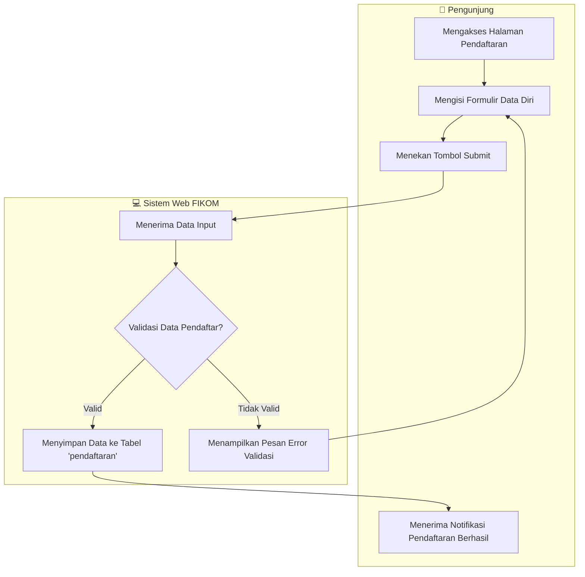
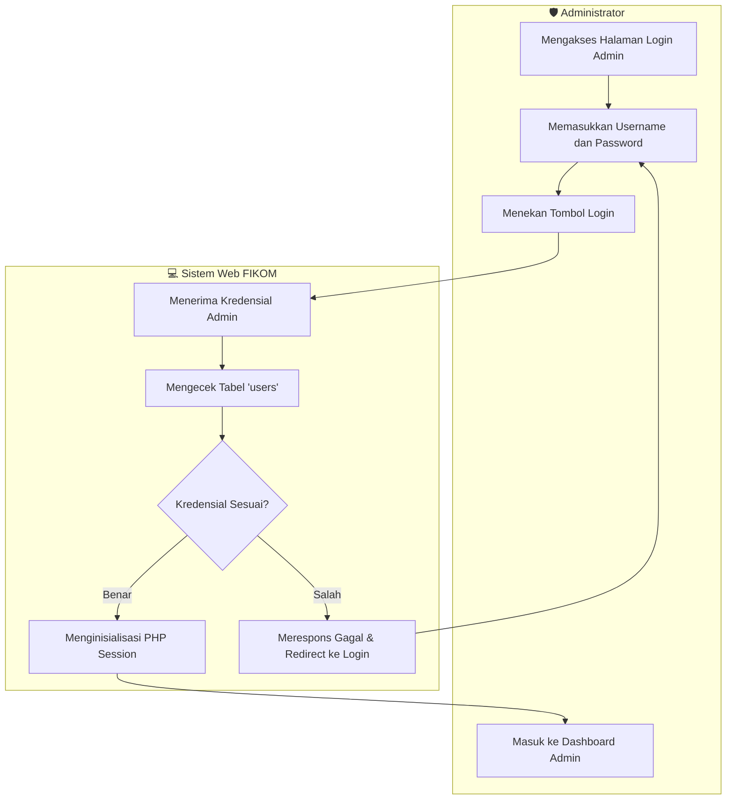
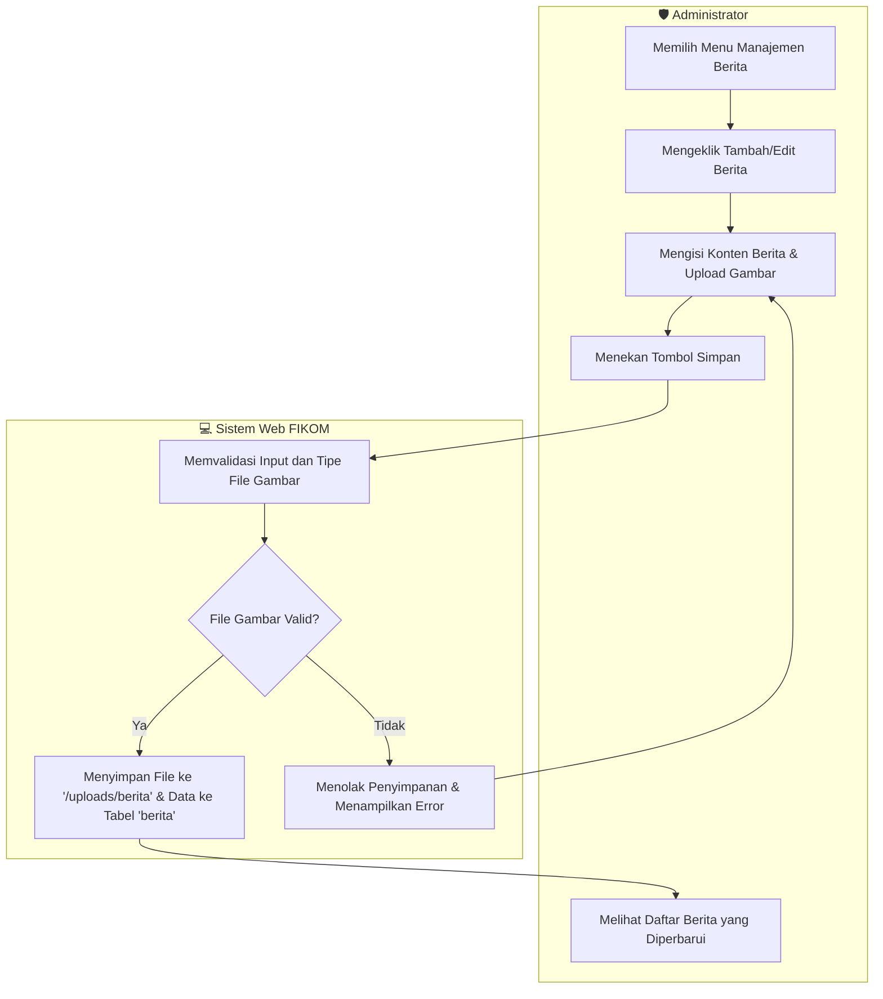
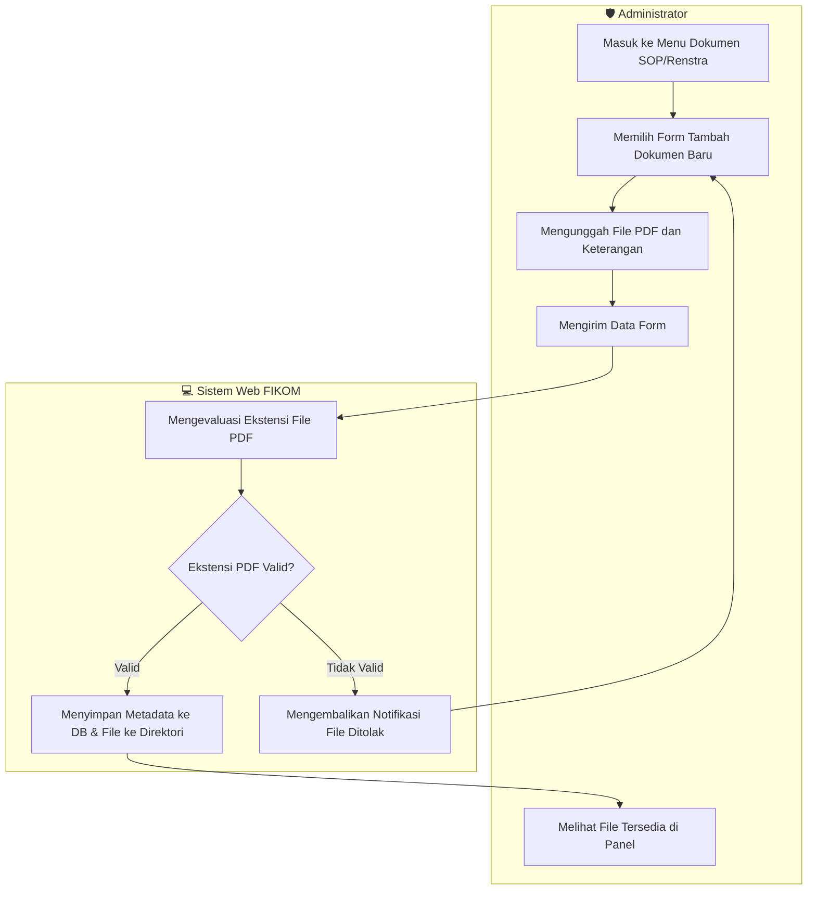

# BAB IV — PERANCANGAN SISTEM: 4.1 Activity Diagram

## 4.1.1 Pengertian *Activity Diagram* dan *Swimlane*
*Activity Diagram* adalah salah satu diagram perilaku (*behavioral diagram*) dalam *Unified Modeling Language* (UML) yang digunakan untuk mengilustrasikan alur kerja atau aktivitas dari sebuah sistem maupun proses bisnis. Diagram ini memodelkan langkah-langkah prosedural, percabangan keputusan (*decision*), hingga proses paralel. Penggunaan *Swimlane* (jalur renang) bertujuan untuk mempartisi atau membagi aktivitas berdasarkan aktor atau komponen yang bertanggung jawab atas setiap proses, sehingga memberikan kejelasan mengenai siapa yang mengeksekusi tindakan tertentu dan bagaimana interaksinya dengan sistem.

## 4.1.2 Aktor yang Terlibat
Pada sistem *Web* Fakultas Ilmu Komputer, aktor-aktor yang terlibat direpresentasikan dalam tabel berikut:

| Aktor | Emoji | Keterangan |
|:---|:---:|:---|
| Pengunjung / Mahasiswa | 👤 | Pengguna publik yang dapat mengakses fungsionalitas publik seperti melihat profil, berita, hingga melakukan pendaftaran calon mahasiswa baru. |
| Administrator | 🛡️ | Entitas pengelola sistem berhak akses penuh (*Super Admin*) untuk memanipulasi seluruh konten (*CRUD*), melakukan *upload* dokumen, hingga melihat data pendaftar. |

---

## 4.2 Alur Aktivitas Sistem

### 4.2.1 Pendaftaran Mahasiswa Baru (*Public*)

***Gambar 4.1** Activity Diagram Pendaftaran Mahasiswa Baru*

Diagram di atas mengilustrasikan alur proses ketika seorang pengunjung melakukan registrasi sebagai calon mahasiswa baru. Proses diawali saat pengunjung mengakses halaman formulir dan melengkapi seluruh *field* data yang dibutuhkan sebelum mengirimkan (*submit*) data tersebut. Sistem kemudian akan memvalidasi *form input* yang diberikan; apabila data dinyatakan valid, sistem akan mengeksekusi parameter SQL untuk mengamankan dan menyimpan rekaman tersebut ke dalam tabel `pendaftaran`. Namun, apabila validasi gagal, pengunjung akan dikembalikan ke formulir beserta pesan kesalahan (*error message*) untuk melakukan koreksi sebelum sistem memberikan respons final yang merampungkan interaksi.

---

### 4.2.2 Autentikasi Administrator (*Login*)

***Gambar 4.2** Activity Diagram Autentikasi Admin*

Diagram ini memvisualisasikan mekanisme autentikasi keamanan bagi entitas *Administrator* ke dalam panel administrator. Administrator diharuskan memberikan kredensial spesifik (*username* dan *password*) yang mana sistem akan melakukan komparasi melalui basis data pada tabel `users`. Apabila komparasi tersebut dievaluasi kredibel (*valid*), sistem akan membangkitkan dan menetapkan variabel **`$_SESSION`** sebagai tanda autorisasi akses yang mengizinkan administrator bernavigasi menuju layar *dashboard*. Sebaliknya, jika proses verifikasi gagal, akses akan sepenuhnya ditolak dan pengguna akan dikembalikan dengan status HTTP pengalihan ke halaman *login* semula.

---

### 4.2.3 Manajemen Berita (*Create, Read, Update, Delete*)

***Gambar 4.3** Activity Diagram Manajemen Berita*

Diagram alur di atas menggambarkan proses manajerial artikel berita oleh administrator, yang berpusat pada operasi *Create* dan *Update*. Administrator memprakarsai proses ini dengan memasukkan rincian artikel dan memilih berkas ilustrasi yang relevan. Sistem akan mengimplementasikan logika kontrol secara ketat, khususnya pada jenis ekstensi berkas untuk mencegah *upload* dokumen yang tidak sah. Proses yang diizinkan akan menyebabkan berkas aman diamankan secara fisik di dalam direktori `uploads/berita` seraya menanamkan nilai referensinya melintasi parameter basis data ke dalam tabel `berita` hingga memutar respons sukses.

---

### 4.2.4 Manajemen Dokumen Akademik (*Upload File* SOP, Renstra)

***Gambar 4.4** Activity Diagram Manajemen Dokumen Akademik*

Alur ini menyoroti prosedur pengunggahan entitas dokumen akademik (seperti Pedoman Akademik, Standar Operasional Prosedur, atau Rencana Strategis). Administrator ditugaskan untuk mengunggah dokumen biner melalui layanan antarmuka. Sistem bertanggung jawab penuh atas pemeriksaan sisi *server* secara kaku (***server-side checking***) yang menuntut format eksklusif `.pdf`. Jika hasil inspeksi menyatakan keselarasan pada kebijakan sistem, file biner dieksekusi pemindahannya menuju lumbung statis, diabadikan informasinya pada basis data referensial, dan sistem memfasilitasi antarmuka untuk merepresentasikan wujud pembaruan arsip tersebut ke hadapan pengguna.
