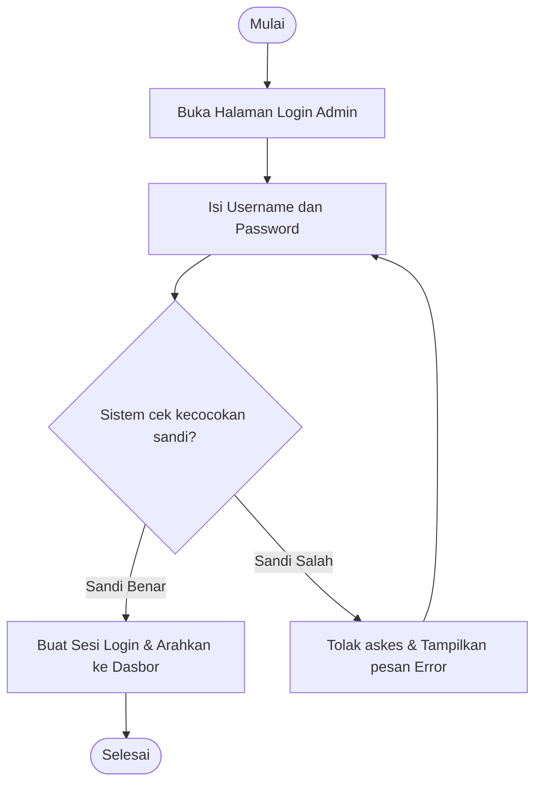
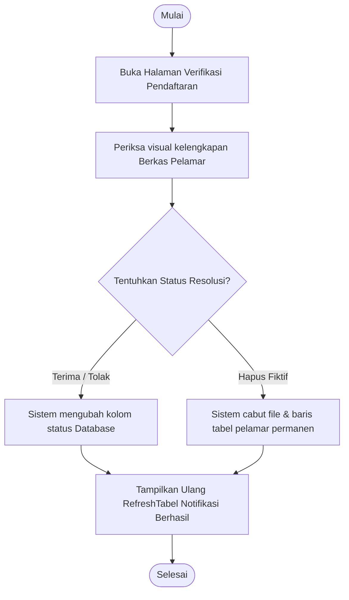
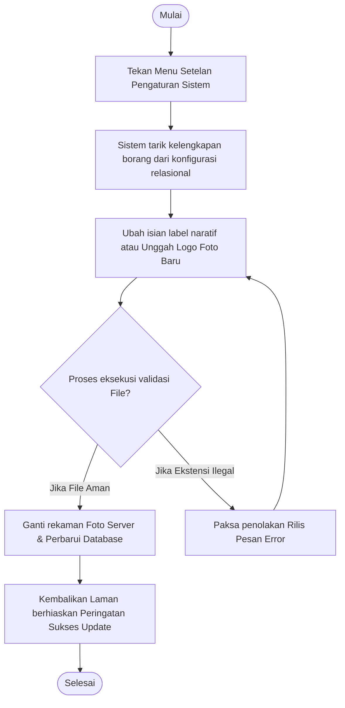

# Kumpulan Activity Diagram: Administrator (Backend)

Dokumen ini menjelaskan alur aktivitas pengguna (*user journey*) ketika administrator mengelola sistem melalui panel *Backend*. Penjelasan dibuat merangkum modul-modul utama menggunakan bahasa cerita (naratif) yang sederhana dan mudah dipahami.

---

## 1. Activity Diagram: Login Administrator

### Penjelasan Alur
Aktivitas pertama kali selalu diawali dengan pengelola masuk ke halaman **Login**. Begitu halaman terbuka, pengelola wajib mengisi *Username* dan *Password* lalu mengklik tombol masuk. Sistem di balik layar otomatis menyeleksi silang keamanan sandi tersebut ke dalam pangkalan data. Jika kombinasi teks nama pengguna dan kata sandinya cocok dan valid, sistem akan menyambut pengelola dan melontarkannya langsung masuk ke bentangan dasbor utama. Namun sebaliknya, apabila ketikan kata sandi tersebut salah tebak, sistem tanpa henti akan menolak askesnya sembari memunculkan seruan peringatan peringatan merah bahwa akun tidak dikenali. Pengelola lalu harus berusaha mengulang ketikannya.

### Diagram


---

## 2. Activity Diagram: Kelola Data Informasi (Sistem CRUD Universal)
*(Alur ini berlaku serentak untuk menu kelola Berita, Dosen, Fasilitas, Kurikulum, Dokumen, dll.)*

### Penjelasan Alur
Ketika administrator berniat memelihara atau mengontrol isi situs, mereka mengawalinya dengan mengunjungi salah satu menu manajemen (seperti Kelola Berita). Di halaman ini, mereka bisa memilih mengklik ikon **Tambah**, **Berubah/Edit**, atau **Hapus**. 
- Jika mereka memilih menambah atau mengubah rekaman, layar akan memandu meminta pengetikan form atau lampiran gambar unggahan (misal foto/pdf). Sehabis menekan tombol *Simpan*, sistem menapis standar ketentuan input (misal validasi ukuran). Andaikata valid, sistem menyimpannya ke database dan memberitahukan label sukses. Jika berkas terlalu rapuh/ilegal, sistem menolaknya.
- Bila administrator menekan tombol **Hapus**, sistem akan memohon konfirmasi radikal pembuangan akhir. Bila diiyakan, sistem tuntas membasmi lajur ingatan terkait beserta fisik berkasnya dari *server*.

### Diagram
```mermaid
flowchart TD
    A([Mulai]) --> B[Buka Laman Manajemen (Contoh: Kelola Dosen)]
    B --> C{Pilih Tindakan Aksi?}
    
    C -- Tambah / Edit --> D[Isi Formulir Data dan File Spesifik]
    D --> E{Sistem periksa keabsahan format?}
    E -- Format Valid --> F[Simpan masuk ke Database & Server]
    E -- Format Ilegal --> G[Tolak dan Berikan Pesan Peringatan]
    
    C -- Hapus Baris --> H[Konfirmasi Eksekusi Hapus]
    H --> I[Sistem hancurkan memori & file data tuntas]
    
    F --> J[Tampilkan Refresh Tabel Sukses]
    I --> J
    G --> D
    
    J --> K([Selesai])
```

---

## 3. Activity Diagram: Verifikasi Pendaftaran

### Penjelasan Alur
Langkah pengelolaan permohonan penerimaan dimulai tatkala administrator membuka panel **Verifikasi Pendaftaran**. Tabel layar akan dijejali urutan antrean pelamar yang berstatus *Pending*. Administrator akan menginspeksi rincian kelengkapan form pelamar secara visual dengan mengklik profil mereka. Tibalah saat memutuskan: mereka dapat menekan restu **Terima**, mencekal **Tolak**, atau bahkan menekan ikon tong sampah untuk **Hapus Permanen** bila pelamar dinilai fiktif. Sistem akan seketika menjalankan titah kepastian status tersebut secara total pada riwayat pangkalan dan menyiagakan antarmuka tabel bersih secara berantai. Setelah terbarui, proses usai dan dilanjut memecahkan antrean berikutnya. 

### Diagram


---

## 4. Activity Diagram: Pengaturan Sistem Situs

### Penjelasan Alur
Apabila tiba waktu di mana profil inti kampus bergeser dan memerlukan pergantian (contohnya peresmian desain logo lambang yang diubah), administrator akan memimpin lajunya menelusuri bilik **Pengaturan Sistem**. Halaman sigap menyorongkan rincian isian setelan situs yang sudah terisi eksisting. Administrator melakukan perombakan susunan teks atau unggah *file* gambar logo baru, disudahi lecutan mengklik tombol *Simpan*. Sistem web meratakan jalan pengujian; apakah standar file yang didorong wajar? Jika file wajar, instrumen gambar di-*server* lama akan dihapus diganti gambar anyar, serta Database akan diperbarui tunggal. Pesan selamat terbit menutupi babak pengaturan ini.

### Diagram

