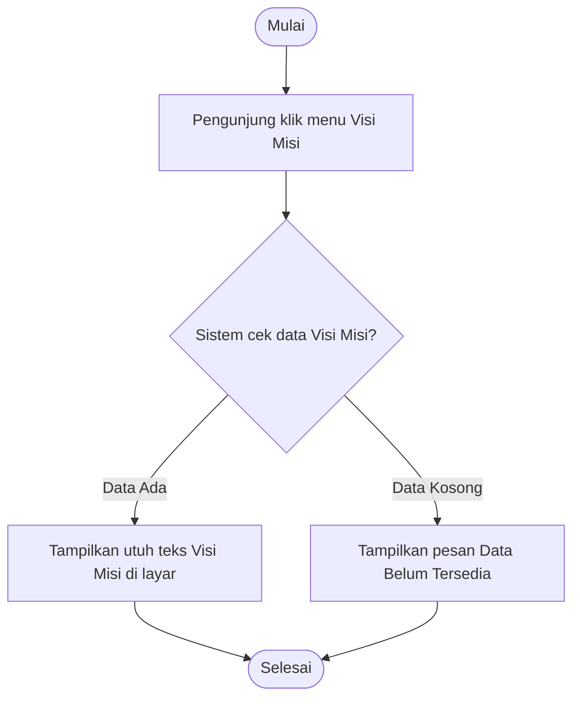
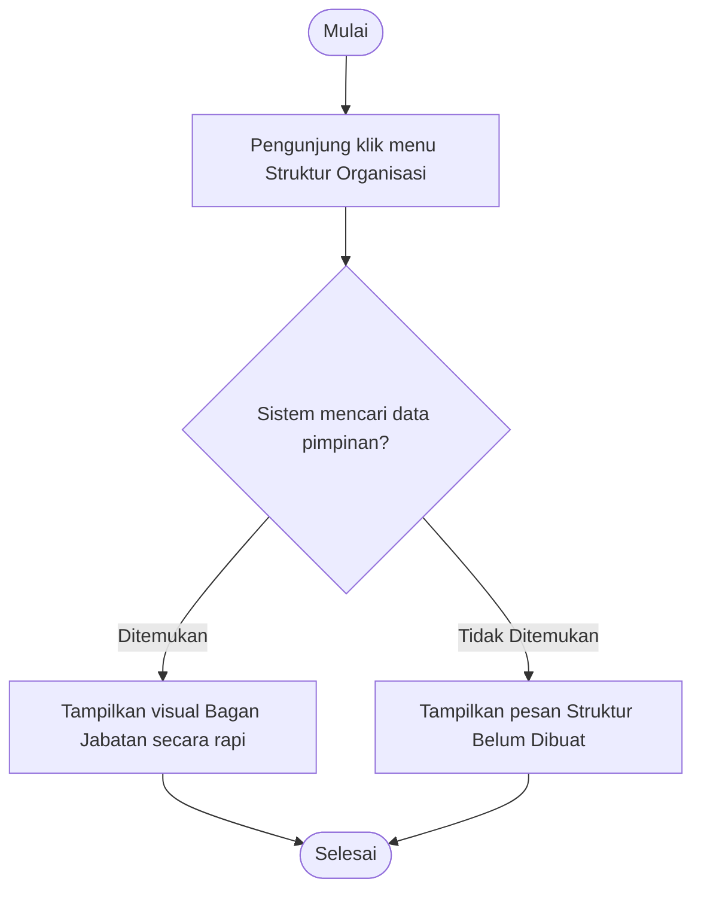
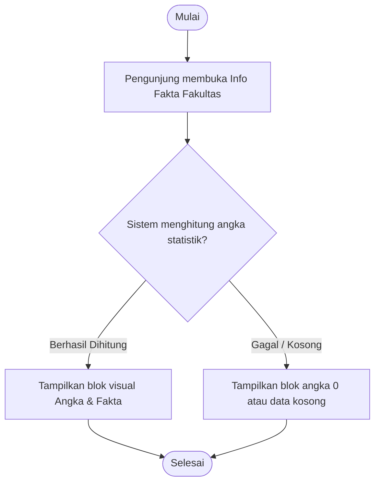
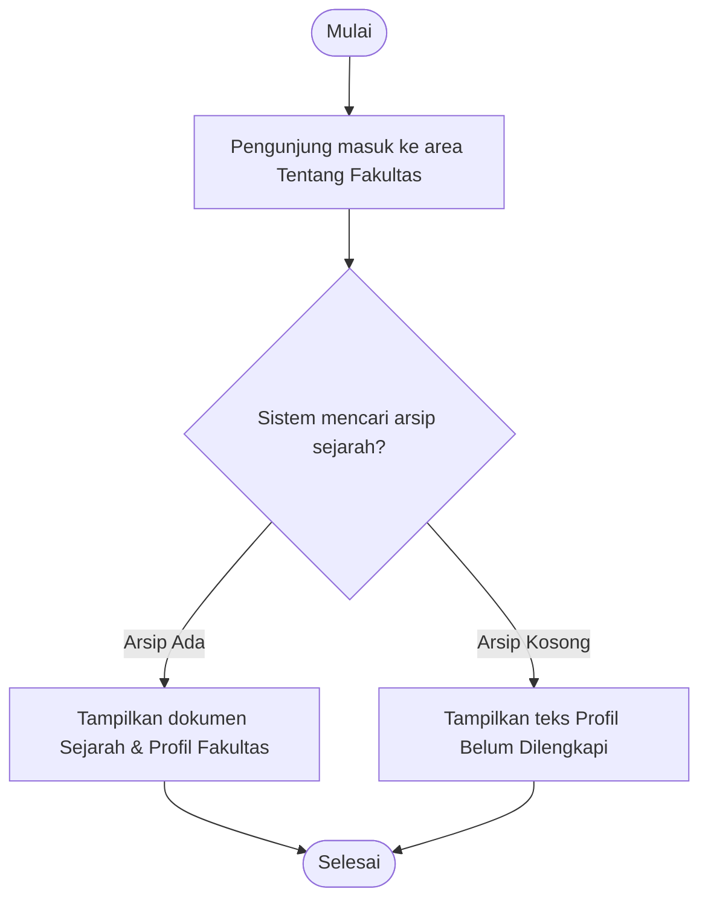

# Kumpulan Activity Diagram: Profil Publik (Frontend)

Dokumen ini menjelaskan alur aktivitas pengguna (*user journey*) ketika menelusuri halaman-halaman profil publik di antarmuka pengunjung. Seluruh penjelasan alur telah disederhanakan ke dalam bentuk paragraf cerita (naratif) agar langsung mudah dipahami secara logika tanpa kalimat teknis yang kaku.

---

## 1. Activity Diagram: Halaman Visi Misi

### Penjelasan Alur
Aktivitas dimulai ketika pengunjung masuk ke situs web dan mengklik menu pilihan **Visi Misi**. Segera setelah diklik, sistem akan mencoba memuat halaman tersebut dengan mencari arsip teks Visi, Misi, dan Tujuan di pangkalan data. Di titik ini, sistem membuat sebuah keputusan: apakah datanya ada atau kosong? Jika datanya berhasil ditemukan, sistem akan memunculkan teks beserta desain halaman Visi Misi secara utuh ke hadapan pengunjung. Sebaliknya, jika data ternyata belum pernah diisi oleh admin (kosong), sistem cukup mengeluarkan pesan pemberitahuan ramah bahwa "Data Belum Tersedia". Aktivitas membaca di halaman ini pun berakhir.

### Diagram

---

## 2. Activity Diagram: Halaman Struktur Organisasi

### Penjelasan Alur
Rute aktivitas ini diawali dengan keinginan pengunjung untuk mengetahui siapa saja pemangku jabatan di fakultas dengan menekan menu **Struktur Organisasi**. Sistem web kemudian akan merespons permintaan tersebut dengan menelusuri data para pimpinan (seperti Dekan, Wakil Dekan, hingga Kaprodi) di pangkalan data. Jika sistem melihat bahwa susunan datanya komplit, maka sistem akan merangkainya menjadi bagan visual yang elegan dan menampilkannya kepada pengunjung. Namun bila datanya kosong atau struktur belum diatur oleh administrator, pengunjung hanya disuguhkan informasi bahwa bagan organisasi masih dalam tahap penyiapan.

### Diagram

---

## 3. Activity Diagram: Halaman Fakta Fakultas

### Penjelasan Alur
Ketika pengunjung penasaran dengan angka-angka pencapaian kampus, mereka akan mengawali aktivitas dengan membuka halaman **Fakta Fakultas** (misalnya grafik jumlah mahasiswa, dosen, atau lulusan). Sistem di balik layar segera bekerja menghitung statistik terkini berdasar hitungan riwayat pangkalan data. Jika angka statistiknya valid dan tersedia, halaman akan menyajikan rangkuman angka tersebut dalam bentuk data visual yang menarik (*counter* angka). Apabila ada gangguan koneksi data atau arsip statistik terhapus, sistem hanya akan memunculkan angka nol (0) atau pesan permohonan maaf bahwa data statistik belum dapat disajikan.

### Diagram

---

## 4. Activity Diagram: Halaman Tentang Fakultas

### Penjelasan Alur
Aktivitas pamungkas di deretan profil ini terjadi ketika seorang pengunjung ingin membaca tapak tilas kampus melalui rute **Tentang Fakultas**. Sehabis pengunjung bermuara ke halaman tersebut, sistem akan mengeruk arsip pangkalan data yang menyimpan paragraf Sejarah dan Latar Belakang Institusi. Jika pangkalan data mengembalikan rekaman narasi yang utuh ke sistem, halaman sejarah tersebut akan dicetak ke layar pengunjung untuk mulai dibaca. Seandainya arsip catatan sejarah kampus terdeteksi kosong melompong, web hanya akan mengeluarkan pemberitahuan sederhana bahwa detail tentang fakultas sedang ditangguhkan atau belum dilengkapi. Navigasi pengunjung di modul ini bernavigasi ke garis finis (Selesai).

### Diagram

