# Kumpulan Diagram Backend

## Sequence Diagram: Login Administrator (Web FIKOM)
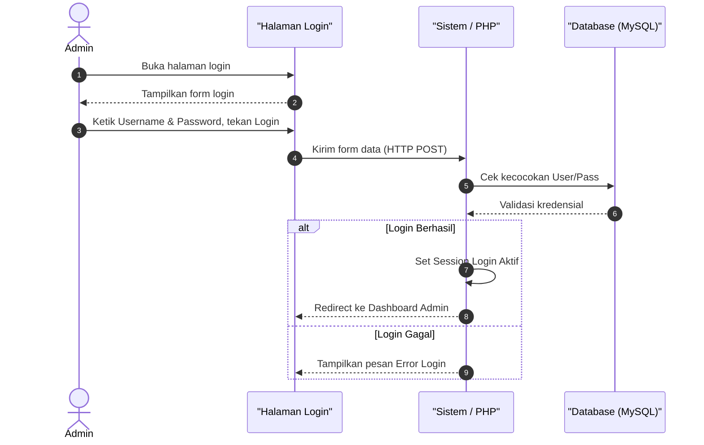

## Sequence Diagram: Kelola Slider Beranda (Admin Web FIKOM)
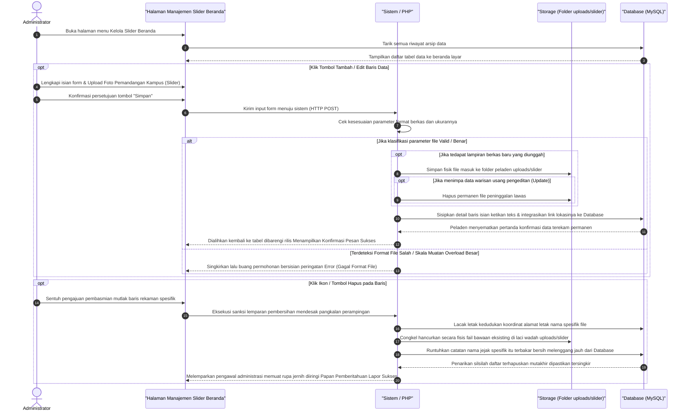

## Sequence Diagram: Kelola Berita (Admin Web FIKOM)
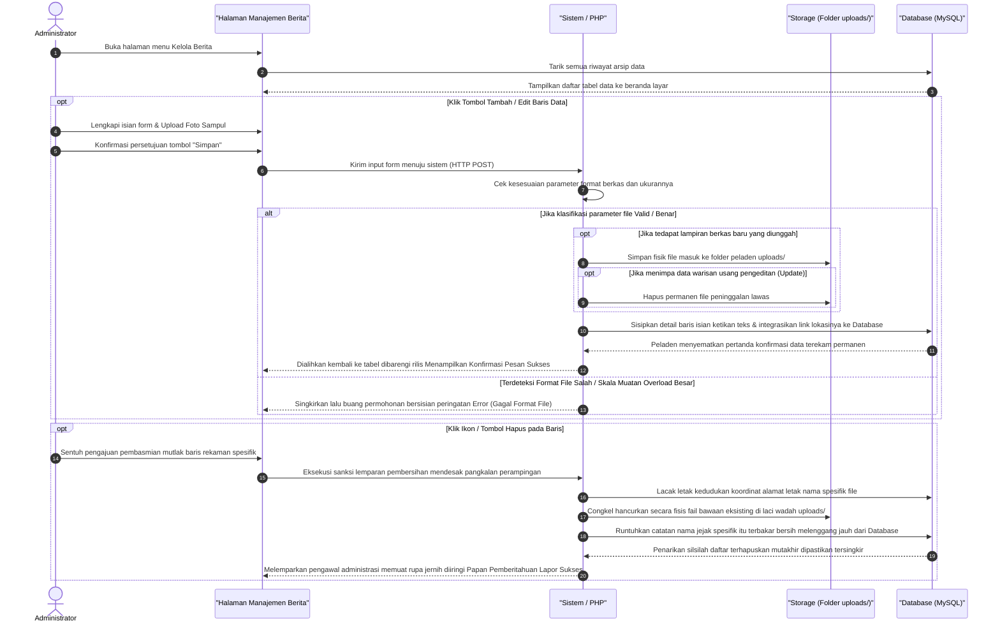

## Sequence Diagram: Kelola Dosen (Admin Web FIKOM)
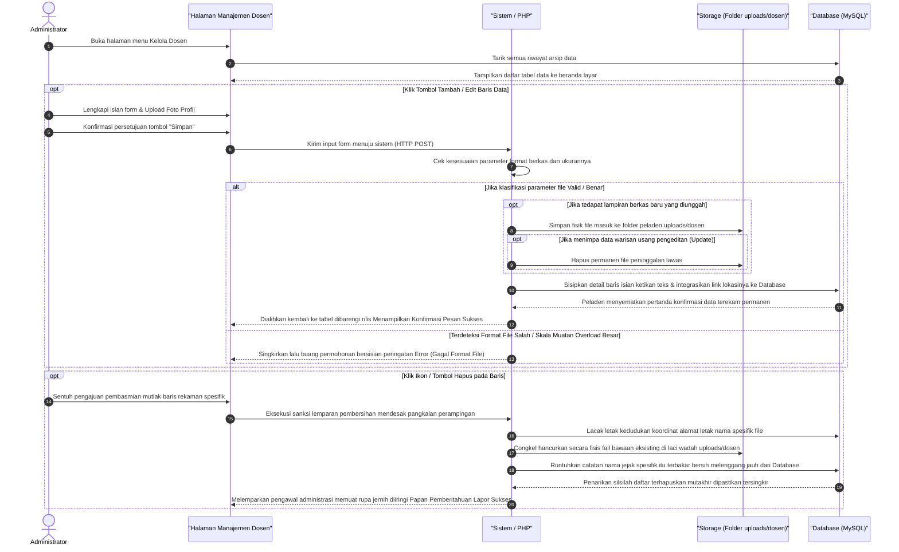

## Sequence Diagram: Kelola Fasilitas Ruangan (Admin Web FIKOM)
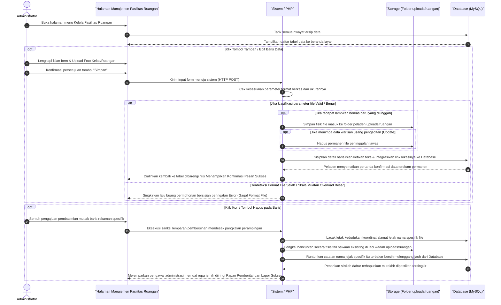

## Sequence Diagram: Kelola Fasilitas Laboratorium (Admin Web FIKOM)
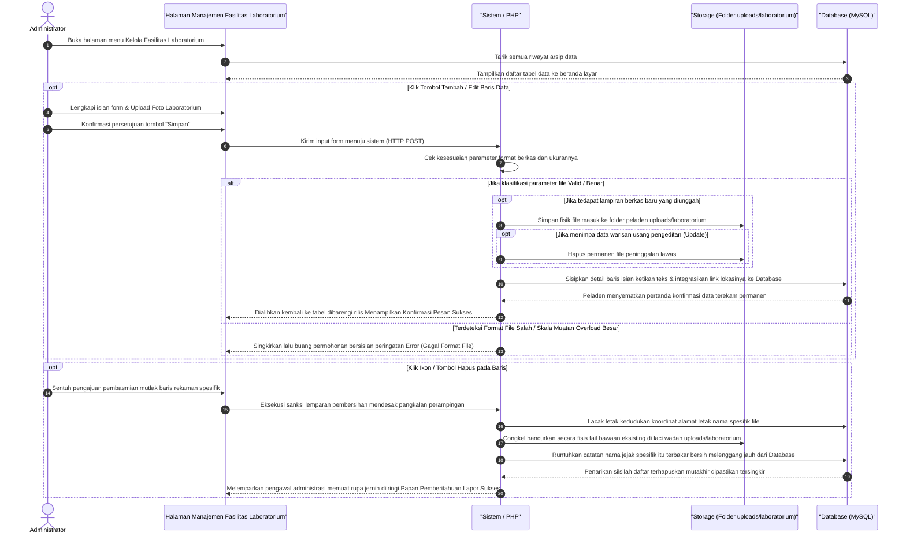

## Sequence Diagram: Kelola Kalender Akademik (Admin Web FIKOM)
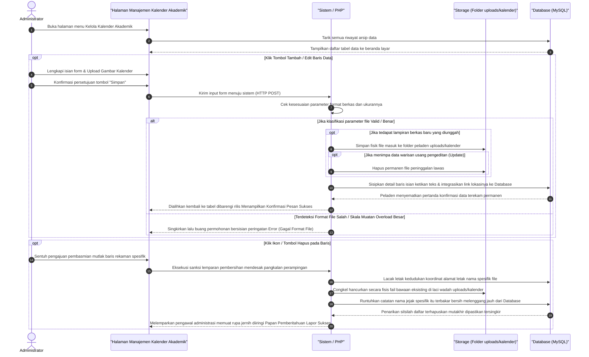

## Sequence Diagram: Kelola Dokumen Kurikulum (Admin Web FIKOM)
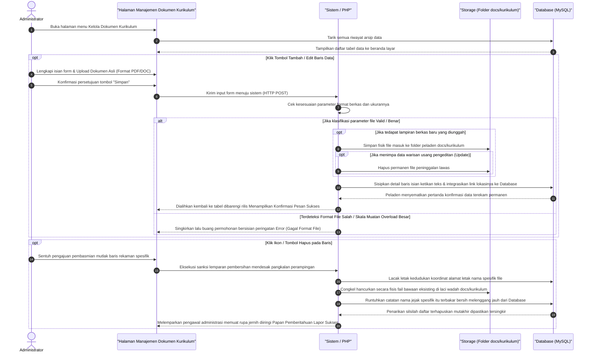

## Sequence Diagram: Kelola Mitra Kerjasama (Admin Web FIKOM)
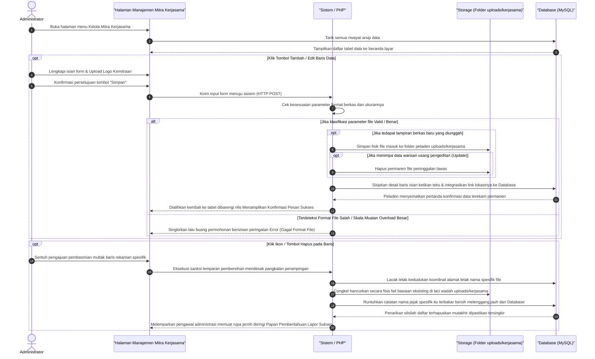

## Sequence Diagram: Kelola Data Penelitian (Admin Web FIKOM)
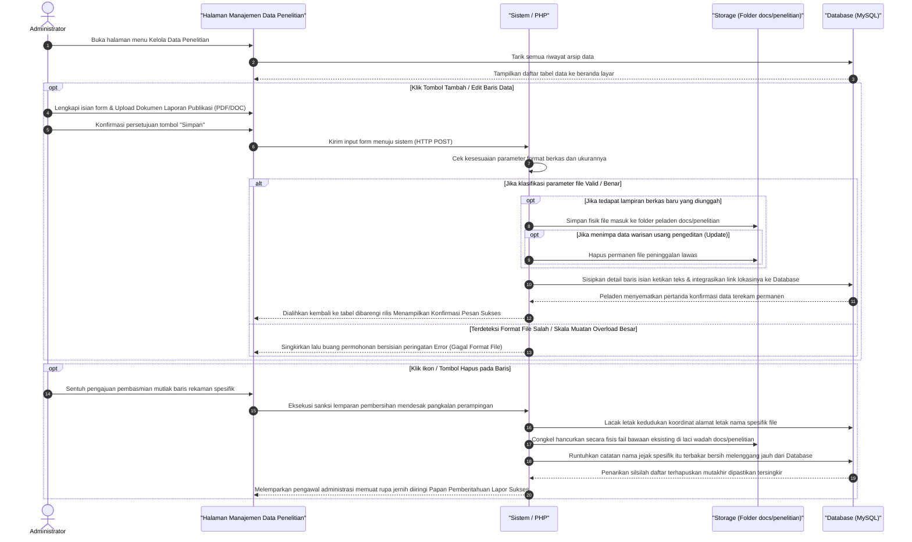

## Sequence Diagram: Kelola Data Pengabdian (Admin Web FIKOM)
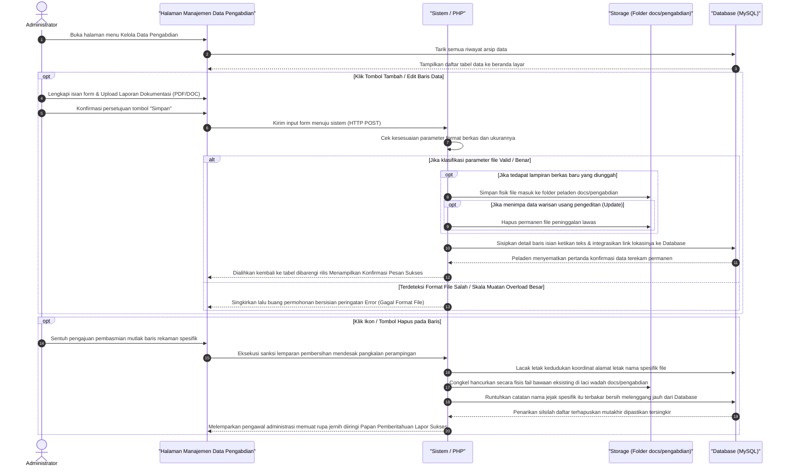

## Sequence Diagram: Kelola Dokumen Fakultas (Admin Web FIKOM)
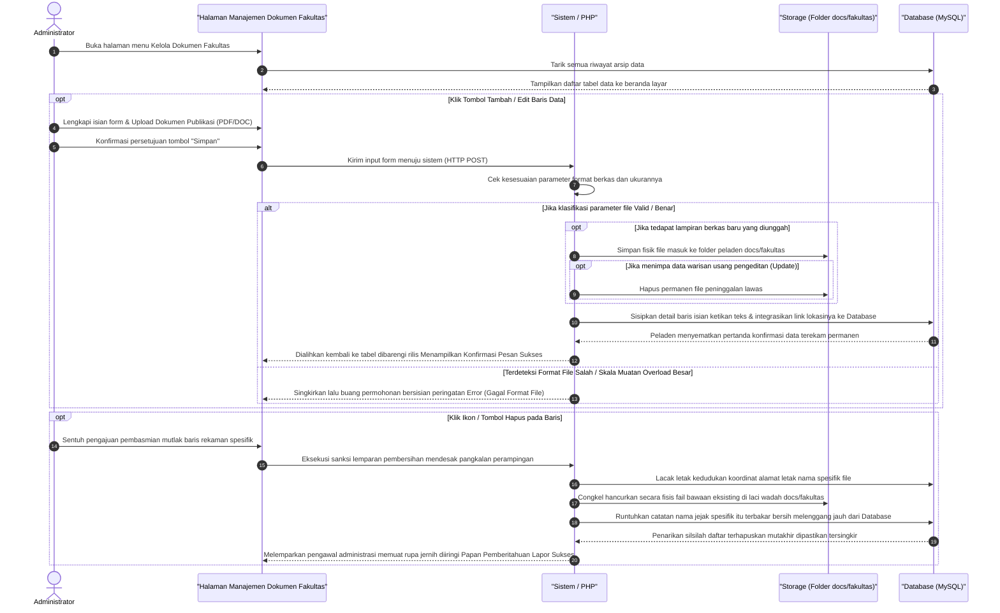

## Sequence Diagram: Kelola Rencana Strategis (Admin Web FIKOM)
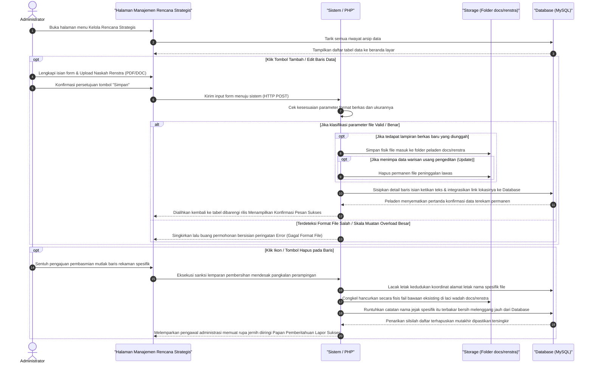

## Sequence Diagram: Kelola Standar Operasional Prosedur (SOP) (Admin Web FIKOM)
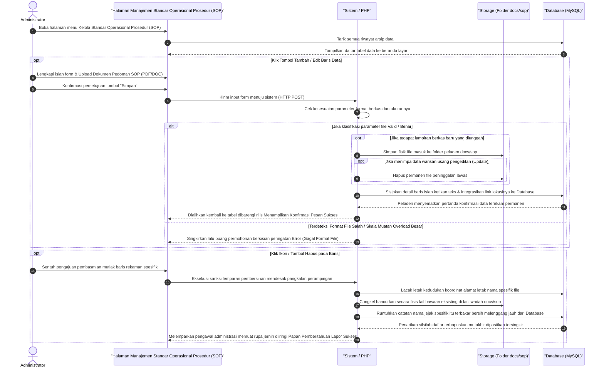

## Sequence Diagram: Kelola Data Organisasi BEM (Admin Web FIKOM)

## Sequence Diagram: Verifikasi Pendaftaran (Admin Web FIKOM)
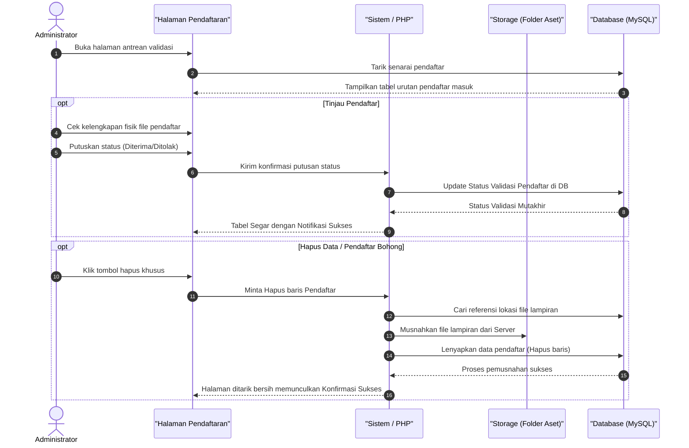

## Sequence Diagram: Pengaturan Sistem (Admin Web FIKOM)
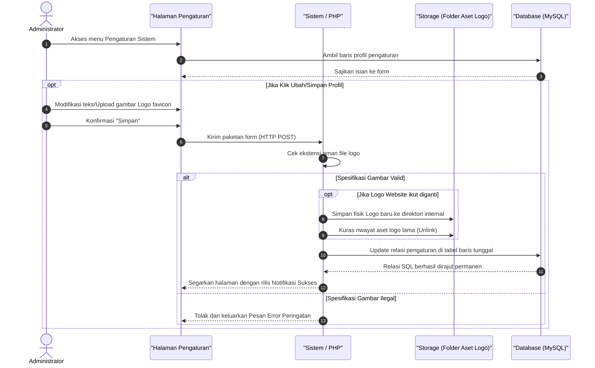

