# Kumpulan Diagram Frontend

## Sequence Diagram: Halaman Utama (Home)
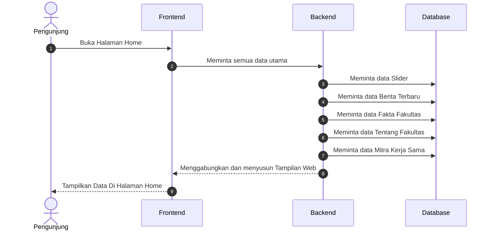

## Sequence Diagram: Halaman Data Civitas Akademika
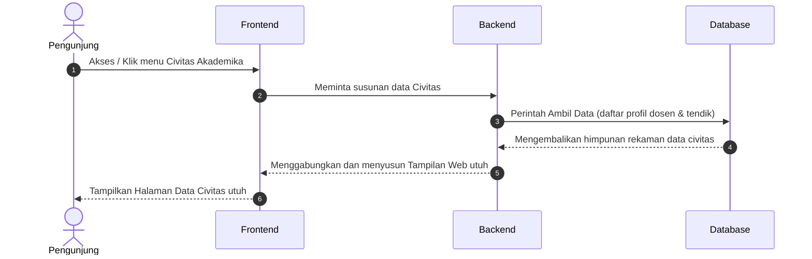

## Sequence Diagram: Halaman Struktur Organisasi
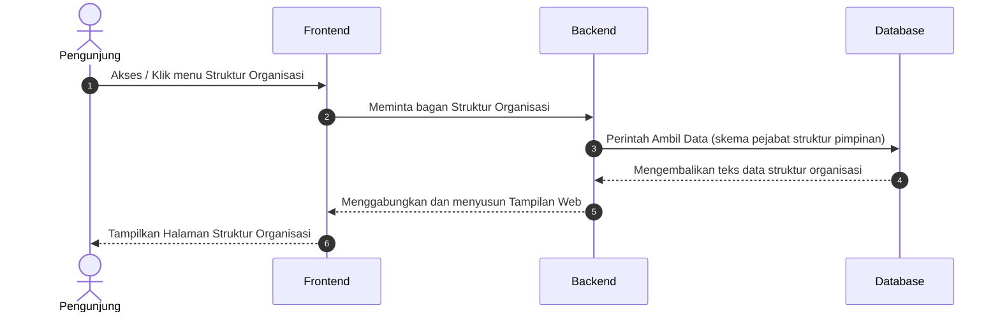

## Sequence Diagram: Halaman Tentang Fakultas
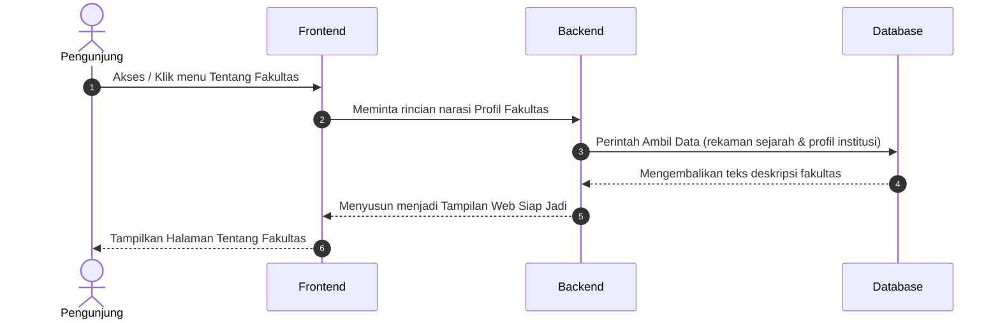

## Sequence Diagram: Halaman Visi dan Misi
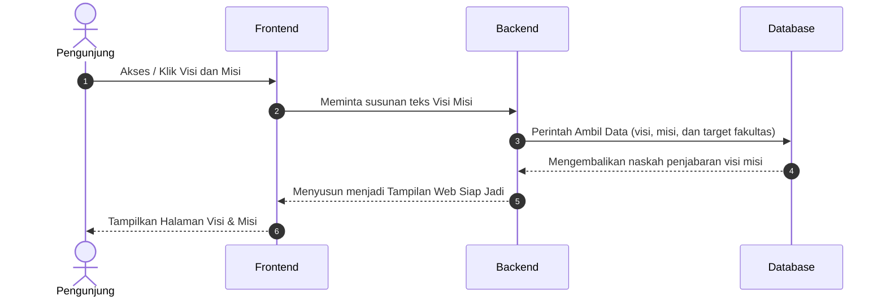

## Sequence Diagram: Halaman Profil Dosen
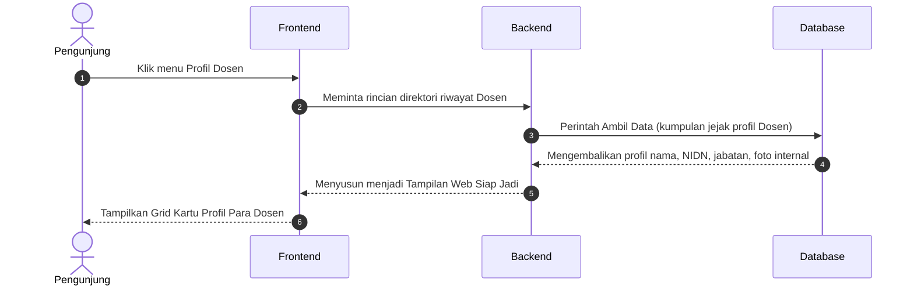

## Sequence Diagram: Halaman Pendaftaran Mahasiswa Baru
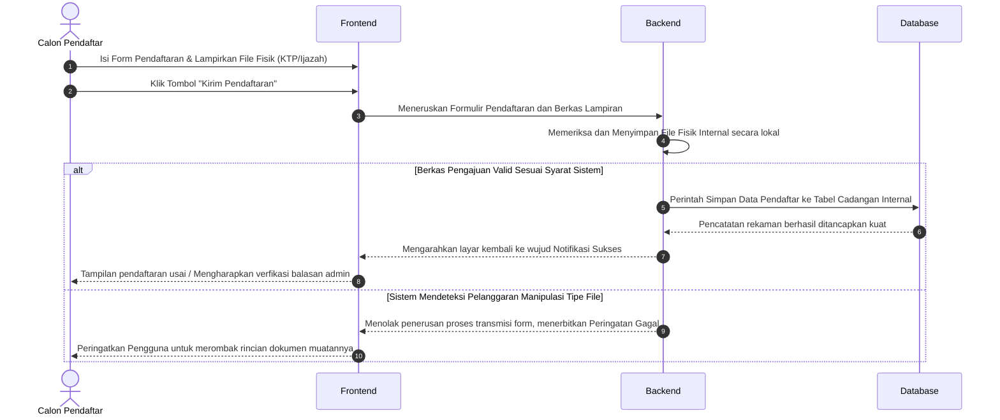

## Sequence Diagram: Halaman Program Studi TI (Teknik Informatika)
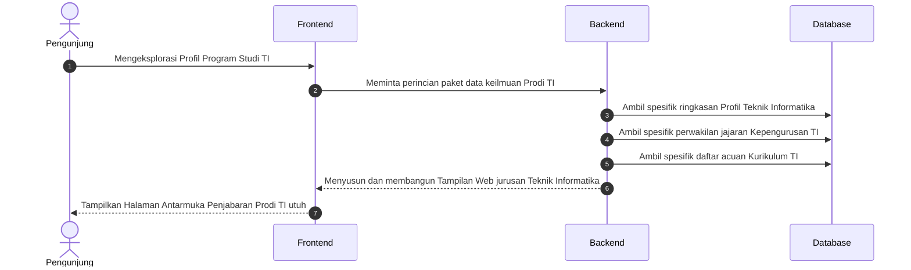

## Sequence Diagram: Halaman Program Studi PTI (Pendidikan Teknologi Informasi)
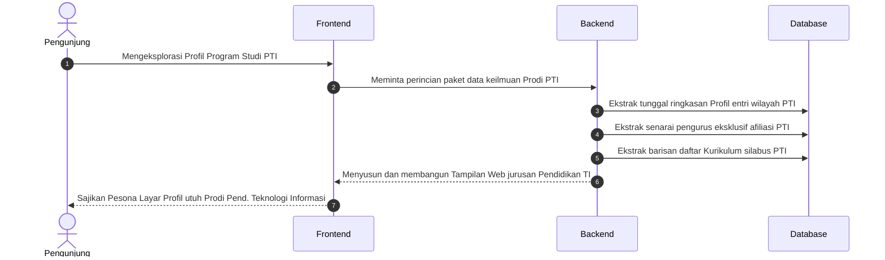

## Sequence Diagram: Halaman Fasilitas Ruangan
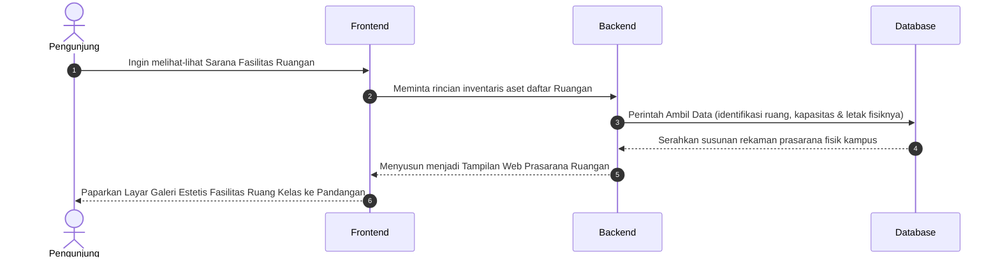

## Sequence Diagram: Halaman Fasilitas Laboratorium
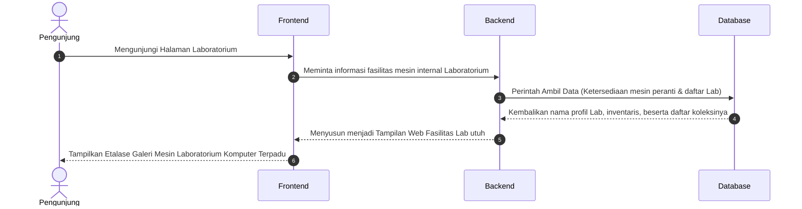

## Sequence Diagram: Halaman Kalender Akademik
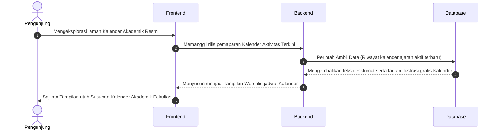

## Sequence Diagram: Halaman Dokumen Kurikulum
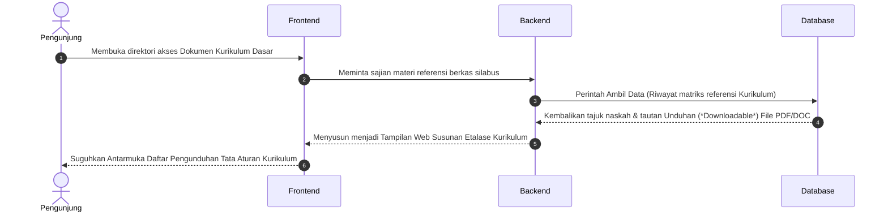

## Sequence Diagram: Halaman Dokumen Fakultas
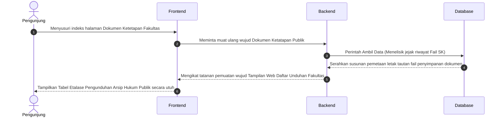

## Sequence Diagram: Halaman Rencana Strategis (Renstra)
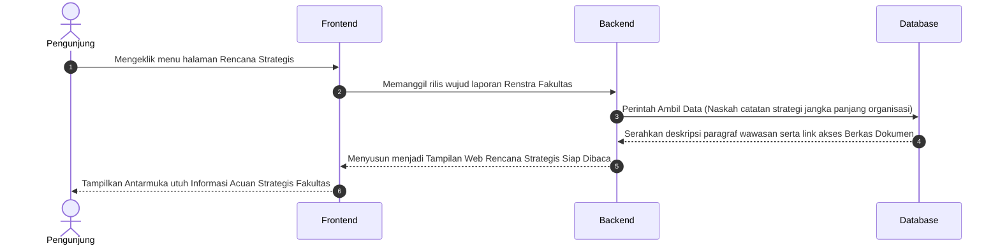

## Sequence Diagram: Halaman Standar Operasional Prosedur (SOP)
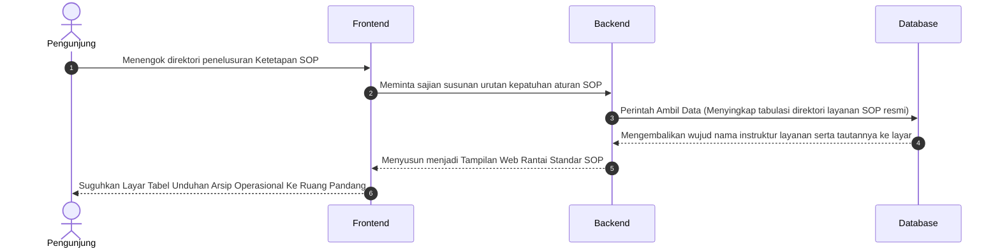

## Sequence Diagram: Halaman Data Penelitian
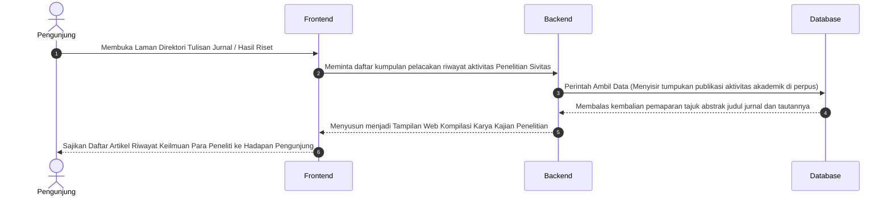

## Sequence Diagram: Halaman Data Pengabdian Masyarakat
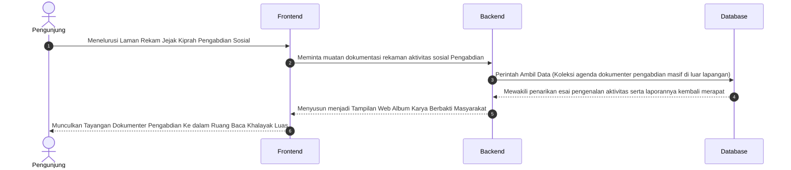

## Sequence Diagram: Halaman Profil Organisasi (BEM)
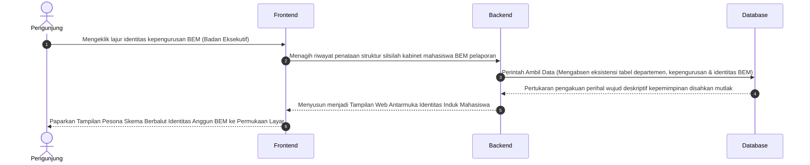

## Sequence Diagram: Halaman Unit Kegiatan Mahasiswa (UKM)
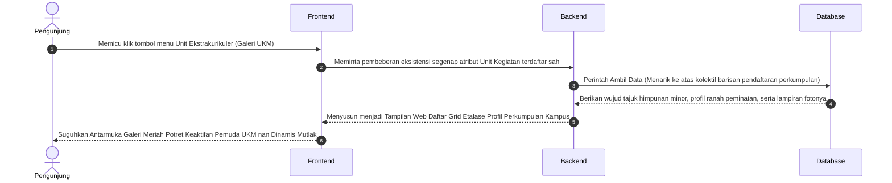

## Sequence Diagram: Halaman Himpunan Mahasiswa
```mermaid
sequenceDiagram
    autonumber
    actor User as Pengunjung
    participant Frontend as Frontend
    participant Backend as Backend
    participant Database as Database

    User->>Frontend: Mencari pangkalan letak susunan himpunan otoritatif prodi (Jurusan) eksklusif
    Frontend->>Backend: Meminta pengungkapan tata aturan perwakilan tiap jajaran HIMA di bawah naungan BEM
    
    Backend->>Database: Perintah Ambil Data (Menagih rincian struktural masing-masing kelompok perwakilan jurusan)
    Database-->>Backend: Mewujudkan pertukaran penyerahan tabel Program Kerja spesifik per rumpun perwakilan  
    
    Backend-->>Frontend: Menyusun menjadi Tampilan Web Etalase Kemerincian Susunan Kabinet Cabang Independen
    Frontend-->>User: Paparkan Profil Megah Relasional Aktivis Mahasiswa Pemegang Identitas Perjurusan Prodi
```

## Sequence Diagram: Halaman Profil & Tracer Alumni
```mermaid
sequenceDiagram
    autonumber
    actor User as Pengunjung
    participant Frontend as Frontend
    participant Backend as Backend
    participant Database as Database

    User->>Frontend: Singgah merunut pelacakan riwayat kelulusan pemuda cendekia (Ruang Pencarian Alumni)
    Frontend->>Backend: Mengajukan penarikan data wujud Direktori Kelulusan serta kiprah sukses riwayat Purna Kampus
    
    Backend->>Database: Perintah Ambil Data (Menelisik susunan deretan daftar riwayat prestasi alumnus kebanggaan per tahun)
    Database-->>Backend: Hadirkan rentetan kompilasi wawasan data karir penempatan serta rekam masa pelepasan ke tangan server
    
    Backend-->>Frontend: Menyusun menjadi Tampilan Web Riwayat Lintas Waktu para Pemegang Takhta Kesuksesan Belajar 
    Frontend-->>User: Tampilkan Lembar Kebanggaan Perjalanan Waktu Catatan Karier dan Keaktifan Anggota Purna Lulusan Web 
```