# Kumpulan Diagram Frontend

## Sequence Diagram: Halaman Utama (Home)
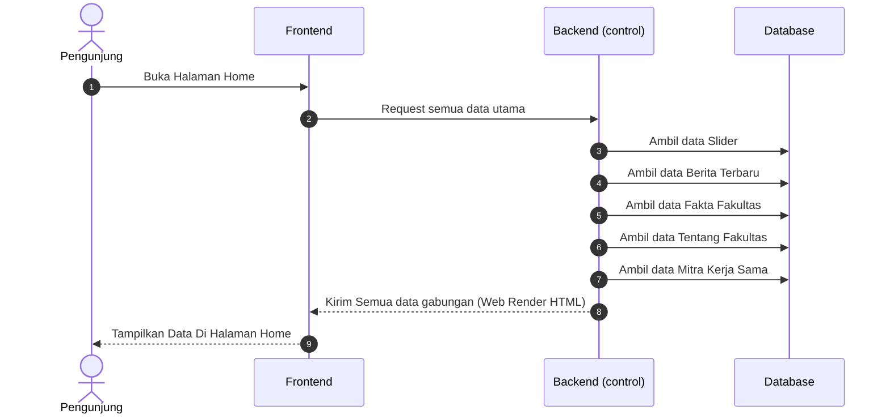

## Sequence Diagram: Halaman Data Civitas Akademika
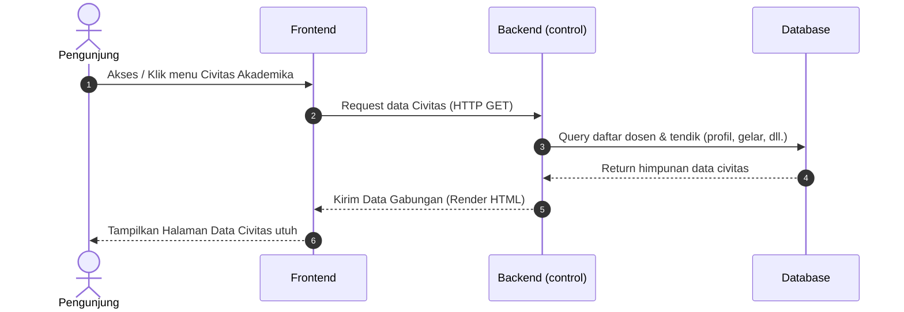

## Sequence Diagram: Halaman Struktur Organisasi
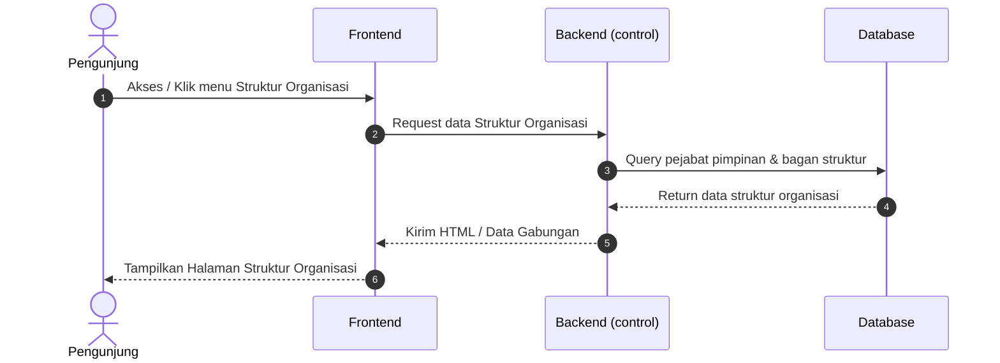

## Sequence Diagram: Halaman Tentang Fakultas
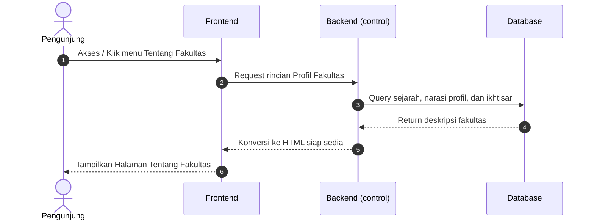

## Sequence Diagram: Halaman Visi dan Misi
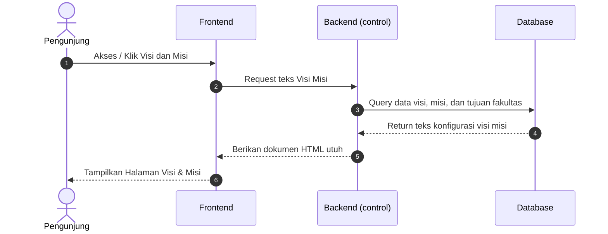

## Sequence Diagram: Halaman Profil Dosen
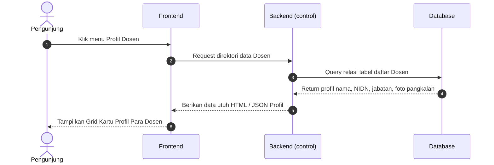

## Sequence Diagram: Halaman Pendaftaran Mahasiswa Baru
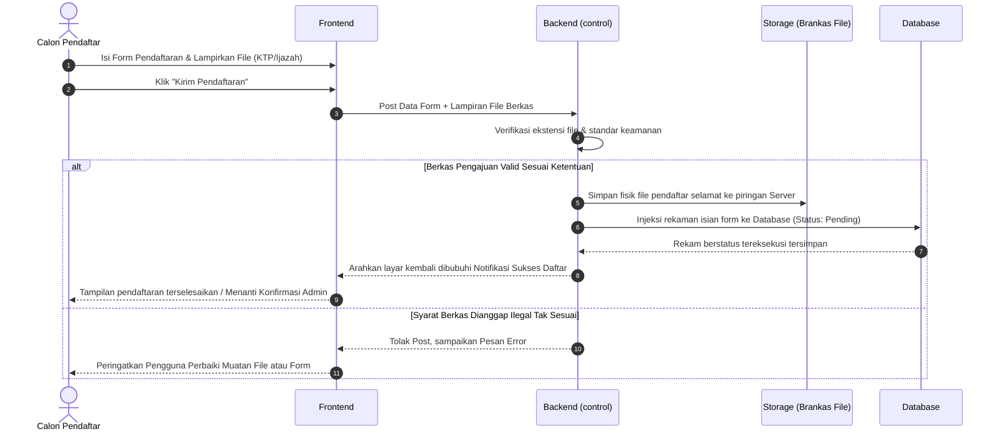

## Sequence Diagram: Halaman Program Studi TI (Teknik Informatika)
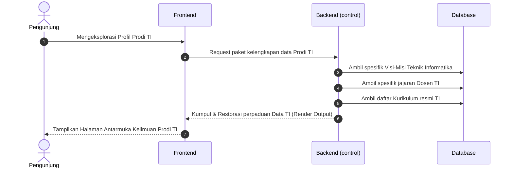

## Sequence Diagram: Halaman Program Studi PTI (Pendidikan Teknologi Informasi)
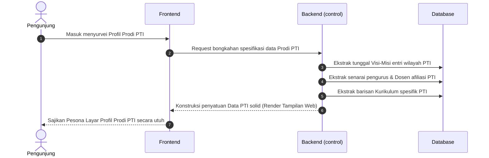

## Sequence Diagram: Halaman Fasilitas Ruangan
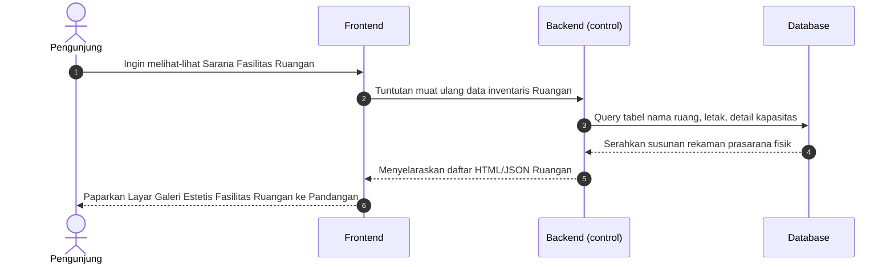
## Sequence Diagram: Halaman Fasilitas Laboratorium
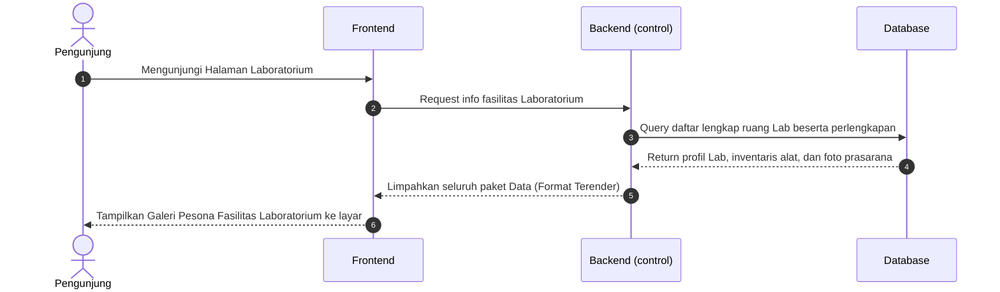

## Sequence Diagram: Halaman Kalender Akademik
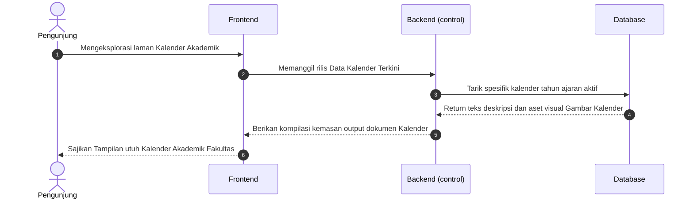

## Sequence Diagram: Halaman Dokumen Kurikulum
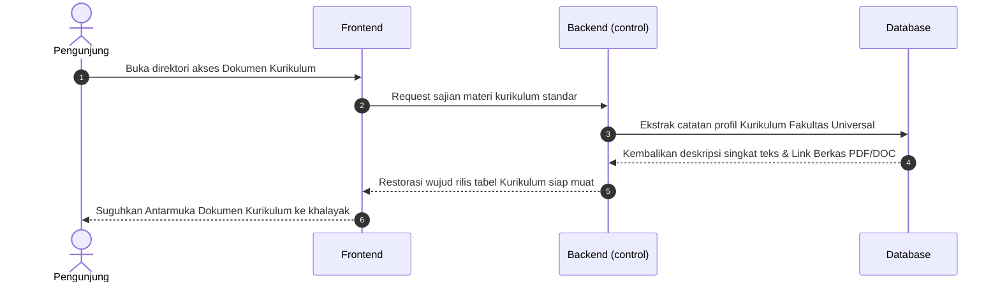

## Sequence Diagram: Halaman Dokumen Fakultas
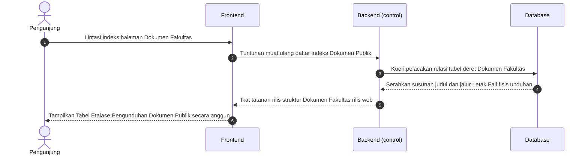