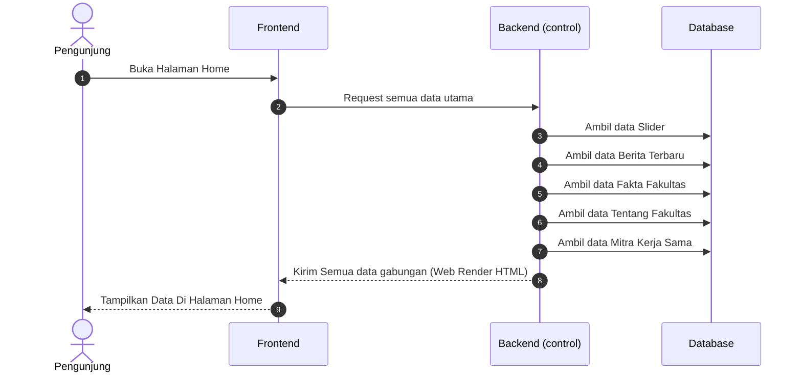
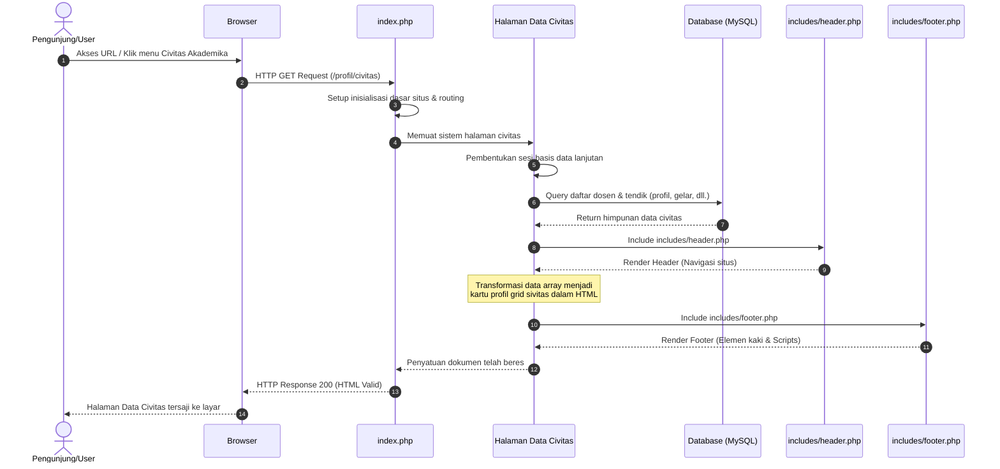
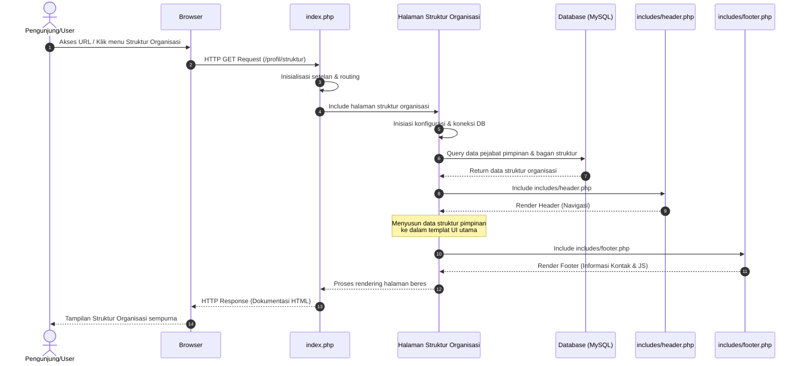
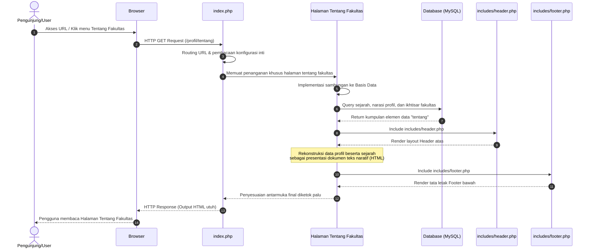
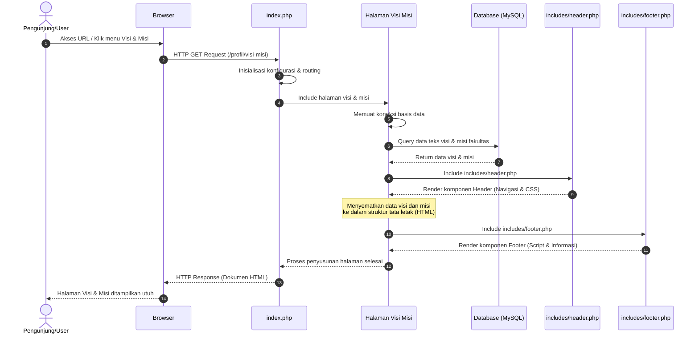

# Kumpulan Diagram Frontend

## Sequence Diagram: Halaman Utama (Home)

## Sequence Diagram: Halaman Data Civitas Akademika

## Sequence Diagram: Halaman Struktur Organisasi

## Sequence Diagram: Halaman Tentang Fakultas

## Sequence Diagram: Halaman Visi dan Misi

