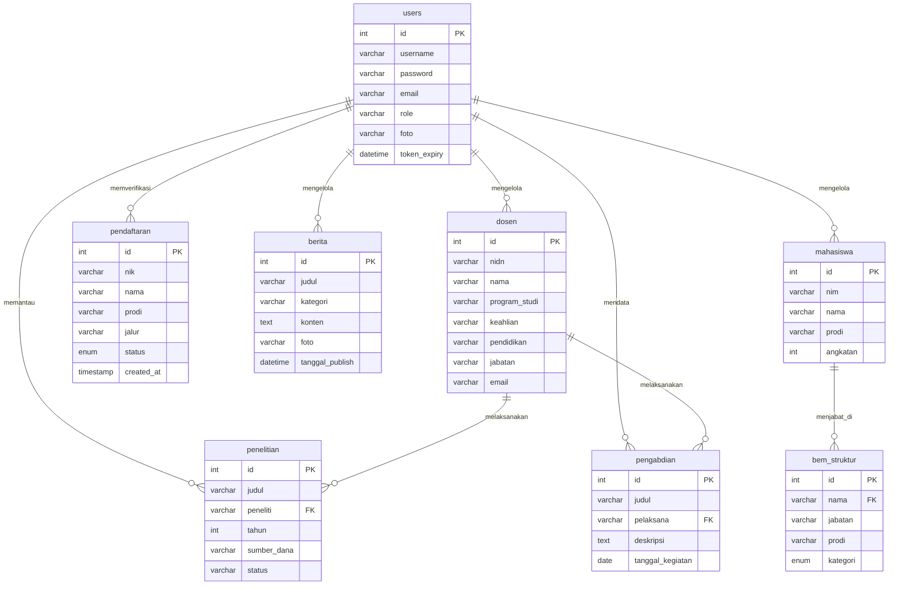

# Relasi Database dan Penjelasan Skema (Update)

Dokumen ini menjelaskan struktur relasional dari database `db_web_fikom` berdasarkan hasil ekstraksi skema terbaru. Sistem ini dirancang sebagai *Content Management System (CMS)* dengan konsepsi *loose-coupling* (relasi fisik *Foreign Key* tidak dikunci di level SQL, melainkan dikelola secara logis di level aplikasi PHP).

## 1. Entity Relationship Diagram (ERD) Logis

Berikut adalah gambaran relasi logis antar tabel utama dalam sistem. Relasi didominasi oleh peran **Administrator (`users`)** yang mengelola tabel-tabel konten lainnya, serta beberapa referensi logika seperti dari **Dosen** ke **Penelitian/Pengabdian**.

## 2. Penjelasan Per Modul

### A. Modul Pengguna & Autentikasi
*   **`users`**: Menyimpan data administrator untuk login backend CMS. Mengatur hak akses staf/admin untuk seluruh tabel lainnya.

### B. Modul Sivitas Akademika
*   **`dosen`**: Menyimpan profil lengkap dosen (NIDN, nama, keahlian, riwayat pendidikan).
*   **`tabel_dosen`**: Versi ringkas dari profil dosen untuk keperluan grid pada *front-end*.
*   **`mahasiswa`**: Menyimpan data identitas mahasiswa aktif.

### C. Modul Tridharma Perguruan Tinggi
*   **`penelitian`**: Mendata daftar publikasi dan penelitian (judul, sumber dana, file laporan). Kolom `peneliti` menangkap referensi logika dari nama/NIDN tabel `dosen`.
*   **`pengabdian`**: Mendata riwayat kegiatan pengabdian. Kolom `pelaksana` juga terhubung secara logika dengan `dosen`.

### D. Modul Publikasi & Informasi Front-End
*   **`berita`**: Artikel dan pengumuman kegiatan fakultas yang muncul di portal utama.
*   **`hero_slider`**: Mengelola aset gambar *banner* rotasi (*carousel*) di *homepage*.
*   **`tb_fakta`**: Menyimpan data statistik ringkas fakultas (seperti jumlah dosen/mahasiswa/prodi) untuk komponen widget animasi (*counter*).
*   **`tentang_fikom` & `visi_misi`**: Menyimpan profil teks naratif untuk laman sejarah dan Visi-Misi institusi.

### E. Modul Profil Fasilitas & Organisasi
*   **`bem_struktur`**: Daftar struktur organisasi Badan Eksekutif Mahasiswa. Secara logika, subjek personalnya bersinggungan dengan entitas `mahasiswa`.
*   **`laboratorium` & `ruangan`**: Mendokumentasikan gambar dan status ketersediaan fasilitas gedung perkuliahan maupun lab.

### F. Modul Dokumen Akademik Publik (Repositori)
Tabel-tabel ini berfungsi menampilkan daftar *file/document* PDF yang dapat diunduh pengguna web:
*   **`kurikulum`** (Silabus program studi)
*   **`kalender_akademik`** (Jadwal kegiatan tahunan)
*   **`rencana_operasional`** & **`rencana_strategis`** (Dokumen perencanaan fakultas)
*   **`sop`** (Buku manual/pedoman mahasiswa)
*   **`kerjasama`**: Mendata daftar instansi mitra kampus, lengkap dengan logonya.
*   **`halaman_statis`**: Konfigurasi teks *custom* (HTML) untuk halaman sisipan khusus.

### G. Modul Pendaftaran Calon Mahasiswa/Layanan Publik
*   **`pendaftaran`**: Memuat log *form* registrasi yang di-*submit* oleh publik. Menampung data KTP, Ijazah, dll. Registrasi ini membutuhkan proses persetujuan (kolom `status`) yang akan diverifikasi manual oleh pengelola di tabel `users` (Admin).

---
**Kesimpulan Relasi Konseptual:**
Aplikasi ini memanfaatkan relasi semantik pada *Application Layer* alih-alih *Database Constraint* tingkat SQL (seperti `FOREIGN KEY` dengan `ON DELETE CASCADE`). Pendekatan ini umum dalam skrip CMS ringan, memungkinkan tiap entitas (dosen, pengumuman, dsb) diproses secara mandiri (*loose-coupled*) tanpa risiko kegagalan kueri cascading.
