# Relasi Database dan Penjelasan Skema

Dokumen ini menjelaskan struktur database `db_web_fikom` yang digunakan dalam aplikasi Web Fakultas Ilmu Komputer.

## Entity Relationship Diagram (ERD)

Berikut adalah diagram relasi antar tabel dalam database. Karena aplikasi ini bersifat Content Management System (CMS), banyak tabel berdiri sendiri (independen) untuk menyimpan konten dinamis, namun semuanya dikelola oleh administrator yang terautentikasi melalui tabel `users`.

```mermaid
erDiagram
    users {
        int id PK
        string username
        string password "Hashed"
        string email
    }

    berita {
        int id PK
        string judul
        string kategori
        date tanggal_publish
        string link
        text konten
        string foto
    }

    dosen {
        int id PK
        string nidn
        string nama
        string program_studi
        string keahlian
        string pendidikan
        string jabatan
        enum status "Tetap/LB"
        string email
        string foto
    }

    tb_fakta {
        int id PK
        string judul
        string angka
        int urutan
    }

    galeri {
        int id PK
        string judul
        text deskripsi
        string gambar
        date tanggal_upload
    }

    kerjasama {
        int id PK
        string nama_instansi
        string logo
        string link_website
        string bulan
        string tahun
    }

    laboratorium {
        int id PK
        string nama_lab
        text deskripsi
        string foto
    }

    ruangan {
        int id PK
        string nama_ruangan
        text deskripsi
        string foto
    }

    bem_struktur {
        int id PK
        string nama
        string jabatan
        string prodi
        string kategori
        int urutan
        string foto
    }

    kurikulum {
        int id PK
        string nama_kurikulum
        text deskripsi
        string file_pdf
    }

    penelitian {
        int id PK
        string judul
        string peneliti
        string tahun
        string status
        string skim_penelitian
        string kelompok_bidang
        string nomor_sk
        string lama_kegiatan
        string sumber_dana
        string jumlah_dana
        date tanggal_mulai
        date tanggal_selesai
        string lokasi_penelitian
        string afiliasi
        string file_proposal
        string file_laporan
        string link_publikasi
    }

    pengabdian {
        int id PK
        string judul
        string pelaksana
        text deskripsi
        string file_pdf
        date tanggal_kegiatan
    }

    sop {
        int id PK
        string nama_sop
        text deskripsi
        string file_pdf
    }

    rencana_strategis {
        int id PK
        string nama_dokumen
        text deskripsi
        string file_pdf
    }

    rencana_operasional {
        int id PK
        string nama_dokumen
        text deskripsi
        string file_pdf
    }

    visi_misi {
        int id PK
        enum kategori "'Visi', 'Misi', 'Tujuan', 'Sasaran'"
        text konten
        int urutan
    }

    tentang_fikom {
        int id PK
        string judul
        text deskripsi
        string gambar
    }

    hero_slider {
        int id PK
        string gambar
        boolean is_active
    }

    pendaftaran {
        int id PK
        string nama
        string nik
        string email
        string hp
        string tempat_lahir
        date tanggal_lahir
        enum jk "L/P"
        string asal_sekolah
        string prodi
        string jalur
        text alamat
        string file_ktp
        string file_ijazah
        text catatan
        enum status "'Pending', 'Diterima', 'Ditolak'"
        datetime created_at
    }

    tracer_study {
        string status_pekerjaan
        int masa_tunggu
        decimal gaji_pertama
    }

    halaman_statis {
        string nama_halaman
        string gambar_path
    }

    %% Relationships
    %% Secara teknis, tabel-tabel konten tidak memiliki Foreign Key constraint ke Users,
    %% namun secara logika bisnis, semua tabel di bawah ini dikelola oleh Admin (Users).
    
    users ||--o{ berita : "mengelola"
    users ||--o{ dosen : "mengelola"
    users ||--o{ pendaftaran : "verifikasi"
    users ||--o{ penelitian : "mengelola"
    users ||--o{ pengabdian : "mengelola"
```

## Penjelasan Tabel

### 1. Tabel Utama (Admin & User)
*   **`users`**: Tabel ini menyimpan data administrator yang memiliki hak akses penuh ke halaman admin (`/admin`). Kolom utamanya adalah `username`, `password` (terenkripsi), dan `email`. Tabel ini digunakan untuk otentikasi saat login.

### 2. Tabel Akademik & Civitas
*   **`dosen`**: Menyimpan data lengkap dosen tetap maupun luar biasa, termasuk NIDN, jabatan fungsional, pendidikan terakhir, dan keahlian.
*   **`tb_fakta`**: Menyimpan data statistik fakultas (misal: jumlah mahasiswa, jumlah dosen) yang ditampilkan dalam bentuk angka "Fact Counter" di halaman depan.
*   **`kurikulum`**: Menyimpan dokumen kurikulum yang berlaku, biasanya dalam format PDF, untuk diunduh oleh mahasiswa.
*   **`visimisi`**: Tabel fleksibel untuk menyimpan teks Visi, Misi, Tujuan, dan Sasaran. Konten dibedakan berdasarkan kolom `kategori`.
*   **`bem_struktur`**: Menyimpan struktur organisasi Badan Eksekutif Mahasiswa (BEM), termasuk foto, jabatan, dan urutan tampilan.

### 3. Tabel Fasilitas
*   **`laboratorium`**: Menyimpan informasi fasilitas laboratorium komputer atau lainnya, termasuk deskripsi dan foto.
*   **`ruangan`**: Menyimpan data ruangan kelas atau fasilitas umum lainnya di fakultas.

### 4. Tabel Informasi & Publikasi
*   **`berita`**: Tabel untuk artikel berita atau pengumuman. Mendukung kategori, tanggal publish, dan foto <i>thumbnail</i>.
*   **`galeri`**: Menyimpan dokumentasi kegiatan fakultas berupa foto dan deskripsi singkat.
*   **`hero_slider`**: Mengatur gambar <i>slider</i> (banner berjalan) di halaman beranda. Memiliki status aktif/nonaktif untuk mengontrol tampilan.
*   **`tentang_fikom`**: Tabel tunggal (<i>single row usually</i>) yang menyimpan deskripsi profil fakultas dan gambar utamanya.

### 5. Tabel Penelitian & Pengabdian (Tri Dharma)
*   **`penelitian`**: Database lengkap penelitian dosen, mencakup judul, status pendanaan, anggota peneliti, hingga link publikasi dan file laporan.
*   **`pengabdian`**: Mirip dengan penelitian, namun khusus untuk kegiatan Pengabdian kepada Masyarakat (PkM).

### 6. Tabel Dokumen Resmi
*   **`rencana_strategis` (Renstra)**: Dokumen perencanaan jangka menengah fakultas.
*   **`rencana_operasional` (Renop)**: Dokumen rencana operasional tahunan.
*   **`sop`**: Kumpulan dokumen Standar Operasional Prosedur.
*   **`kerjasama`**: Mendata instansi mitra yang bekerja sama dengan fakultas, termasuk logo dan durasi kerjasama.

### 7. Tabel Pendaftaran & Alumni
*   **`pendaftaran`**: Menyimpan data calon mahasiswa baru yang mendaftar secara online. Mencakup data diri, dokumen (KTP/Ijazah), dan status penerimaan (Pending/Diterima/Ditolak).
*   **`tracer_study`**: Tabel ini (diinferensi dari query di `alumni.php`) digunakan untuk menyimpan data pelacakan alumni, seperti masa tunggu kerja dan gaji pertama.

## Catatan Relasi
Dalam desain database ini, relasi antar tabel bersifat **implisit**. Aplikasi dibangun dengan logika bahwa satu atau beberapa admin mengelola seluruh konten. Tidak ada relasi *Foreign Key* yang kompleks (seperti `user_id` di setiap tabel berita) karena sistem ini didesain sebagai CMS sederhana di mana kepemilikan konten tidak dibatasi per individu admin, melainkan "Milik Fakultas".
