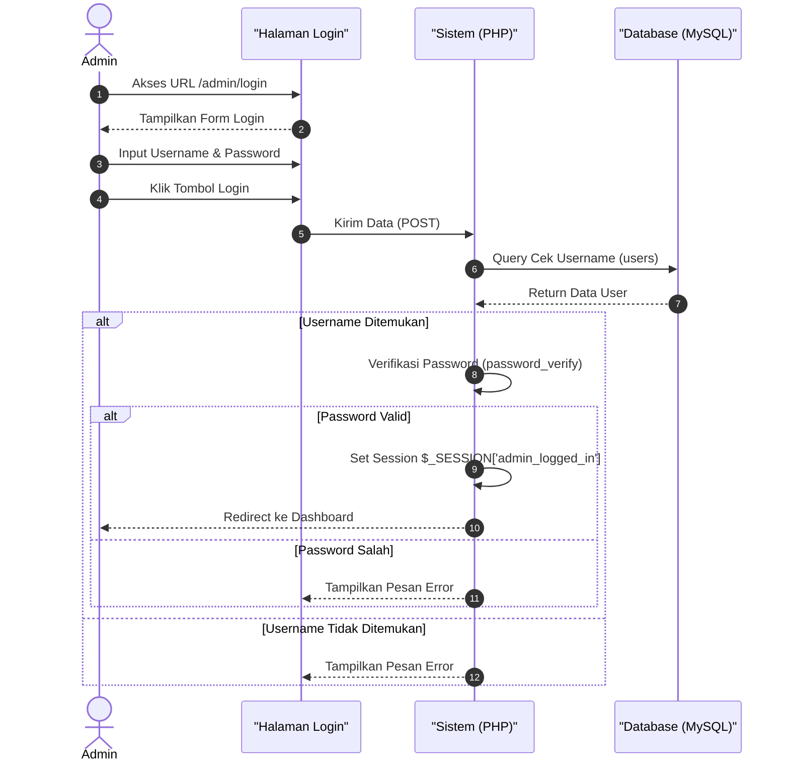
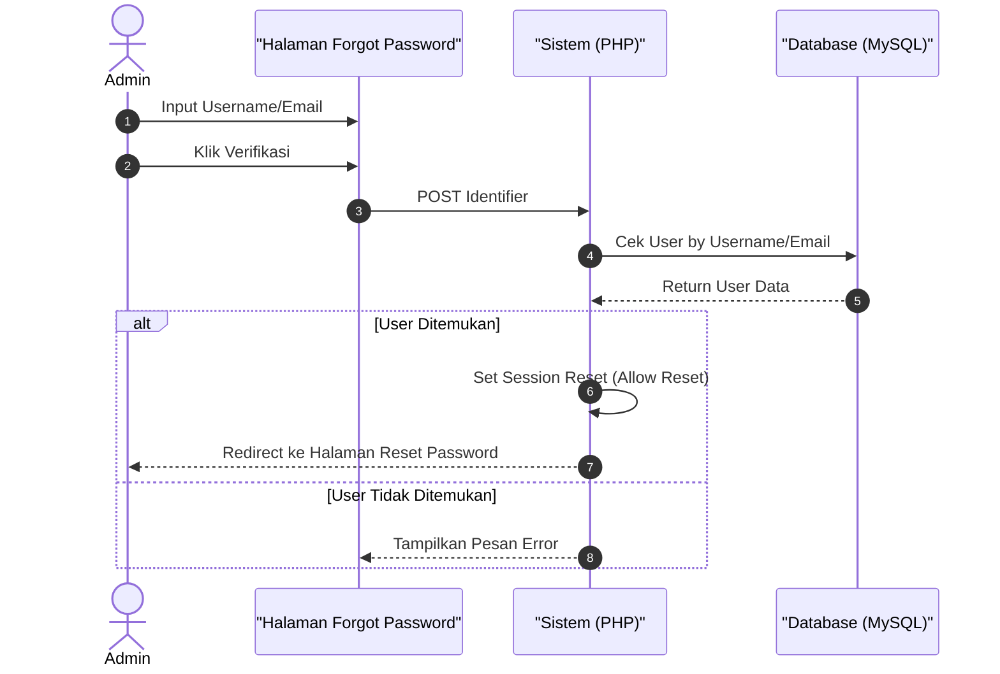
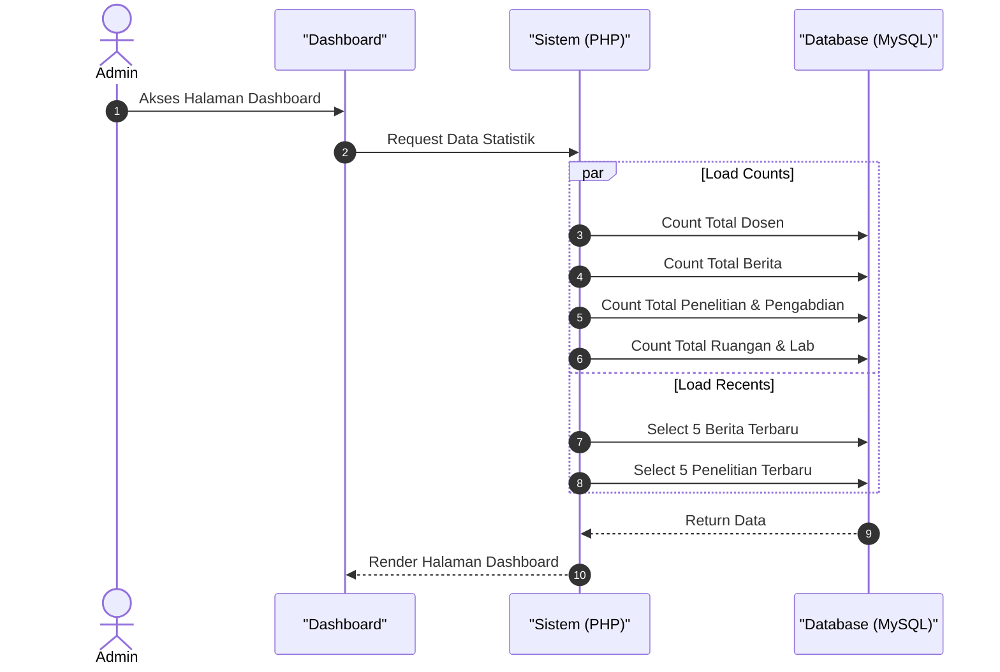
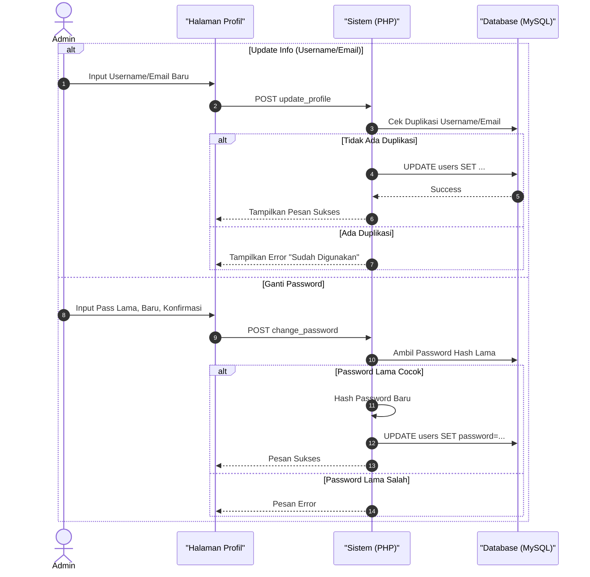
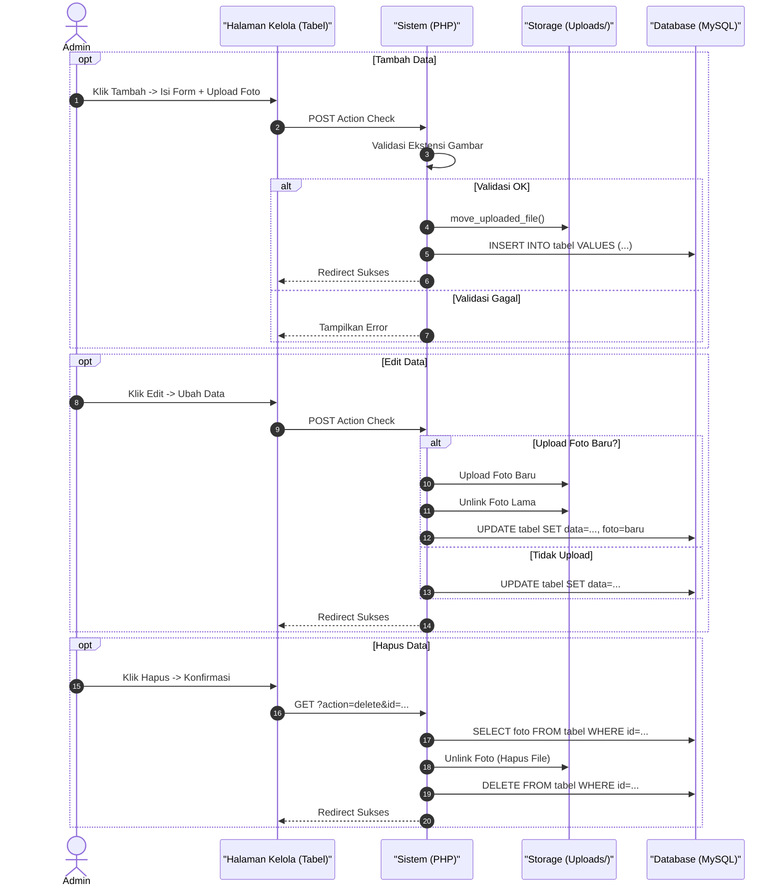
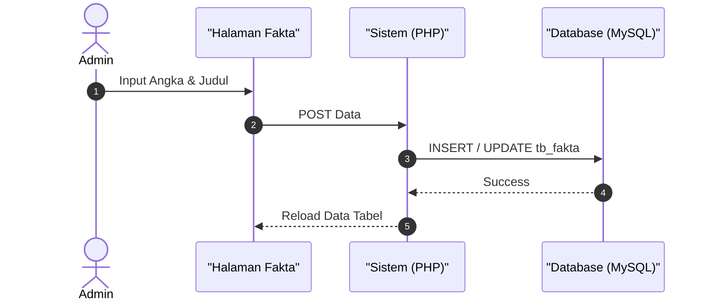
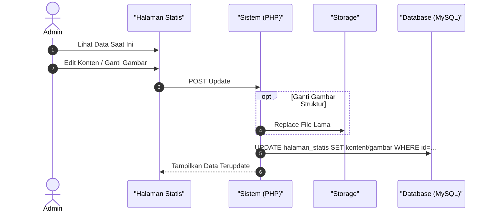
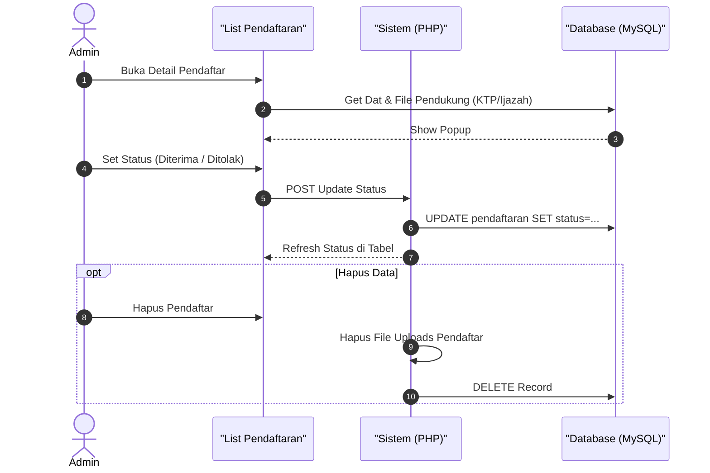
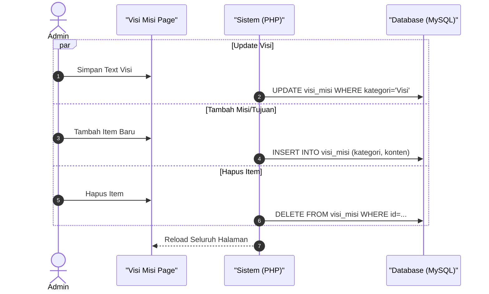

# Sequence Diagram - Admin Web FIKOM

Dokumentasi *Sequence Diagram* (diagram sekuensial) ini disusun untuk memberikan representasi visual yang komprehensif mengenai alur komunikasi dan interaksi antar entitas di dalam sistem panel administrator Web Fakultas Ilmu Komputer (FIKOM). Diagram ini secara spesifik menitikberatkan pada kronologi waktu dan urutan proses pengiriman pesan (*messages*) sejak administrator web menginisiasi sebuah aksi—seperti melakukan validasi '*login*', melangsungkan operasi penambahan, pembaharuan, hingga penghapusan *record* data inti (*master data*)—sampai dengan sistem memberikan respons akhir yang tepat. 

Pada skema-skema di bawah ini, proses logika internal berjalan konsisten antar subsistem; antarmuka dasbor akan secara rutin meneruskan format permintaan pos (*HTTP POST/GET Request*) dari admin ke ranah pemroses *backend* PHP. Mekanisme fungsional lalu mencocokkan kredensial sesi yang tengah aktif, mengamankan gerbang data, mengelola unggahan berkas ke peladen fisik, serta menjalin konektivitas ke *database* MySQL guna merekam jejak operasi basis data CRUD dengan tingkat presisi yang tinggi. Pada akhirnya, respons keberhasilan transaksi maupun lemparan galat operasional ditautkan kembali ke antarmuka untuk mencerminkan pangkalan data web secara utuh dan terjamin. Oleh karena itu, skema yang dirangkum menjadi satu dokumen sentral ini dibagi melintasi berbagai modul menurut pola arsitekturnya.

> **Catatan:** Diagram menggunakan format ekspresi **Mermaid Sequence Diagram**.

---

## 1. Autentikasi Admin

Meliputi: `login.php`, `logout.php`, `forgot_password.php`, `reset_password.php`.

### A. Login Admin

### B. Lupa Password

---

## 2. Dashboard & Profil

Meliputi: `dashboard.php`, `profile.php`.

### A. Dashboard (Load Statistik)

### B. Edit Profil & Password

---

## 3. Master Data (CRUD + Gambar)

Pola ini berlaku untuk file:
*   `kelola_berita.php`
*   `kelola_dosen.php`
*   `kelola_kerjasama.php`
*   `kelola_bem.php`
*   `kelola_kalender.php`

*   `kelola_slider.php`
*   `kelola_lab.php` (tambah/edit fasilitas)
*   `kelola_ruangan.php` (tambah/edit fasilitas)

---

## 4. Master Data (CRUD Dokumen)

Pola ini berlaku untuk file manajemen dokumen PDF/Doc:
*   `kelola_sop.php`
*   `kelola_renstra.php`
*   `kelola_renop.php`
*   `kelola_kurikulum.php`
*   `kelola_penelitian.php`
*   `kelola_pengabdian.php`

```mermaid
sequenceDiagram
    autonumber
    actor Admin
    participant View as "Halaman Dokumen"
    participant System as "Sistem (PHP)"
    participant Server as "Storage (docs/)"
    participant DB as "Database (MySQL)"

    Admin->>View: Form Upload Dokumen (PDF/DOC)
    View->>System: POST Upload
    
    System->>System: Cek Ukuran & Tipe File (Max 10MB)
    
    alt File Valid
        System->>Server: Upload File
        System->>DB: INSERT data dokumen
        System-->>View: Pesan "Dokumen Berhasil Diupload"
    else File Invalid
        System-->>View: Pesan Error
    end

    opt Download / Hapus
        Admin->>View: Klik Link Download atau Hapus
        
        alt Hapus
            System->>Server: Hapus File Fisik
            System->>DB: DELETE record
        end
    end
```

---

## 5. Master Data Sederhana (Tanpa File)

Pola ini berlaku untuk file:
*   `kelola_fakta.php`

---

## 6. Single Page Update

Pola ini berlaku untuk halaman yang hanya mengelola SATU data statis:
*   `kelola_struktur.php` (Update Gambar Struktur)
*   `kelola_tentangfak.php` (Update Deskripsi/Sejarah)

---

## 7. Verifikasi Pendaftaran

Khusus file: `kelola_pendaftaran.php`

---

## 8. Multi-Section Management

Khusus file: `kelola_visimisi.php`

