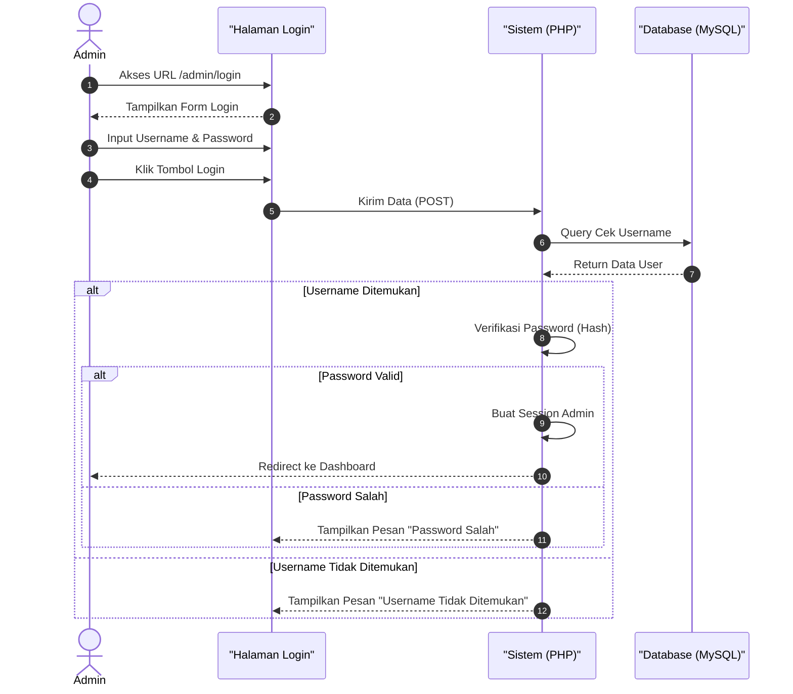
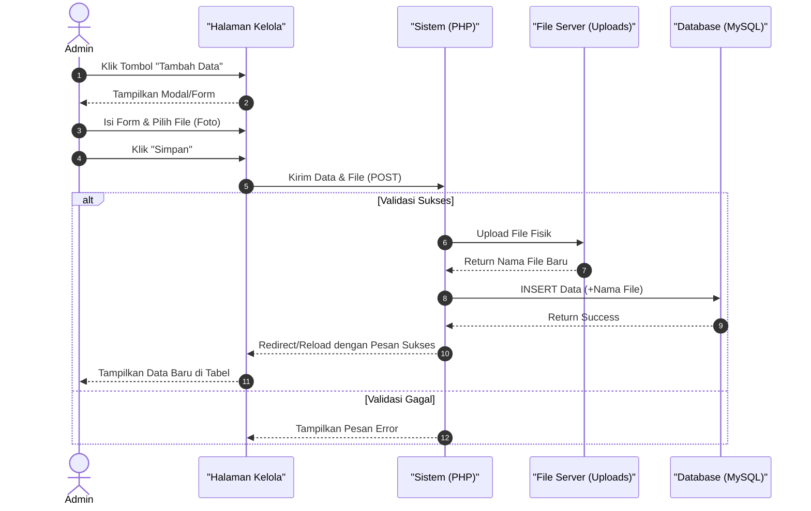
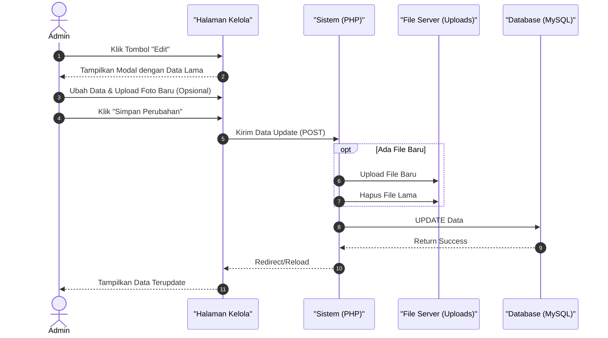
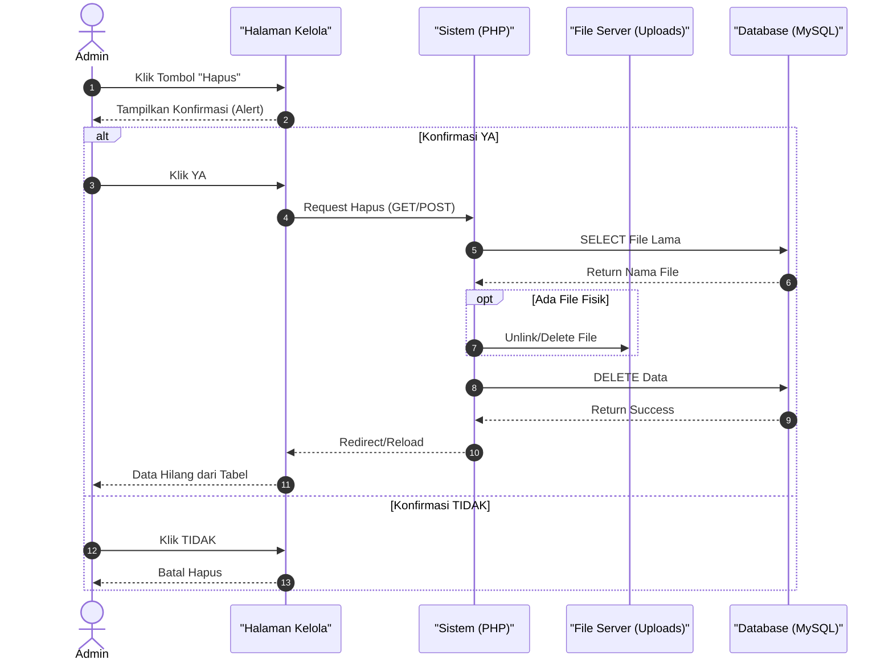
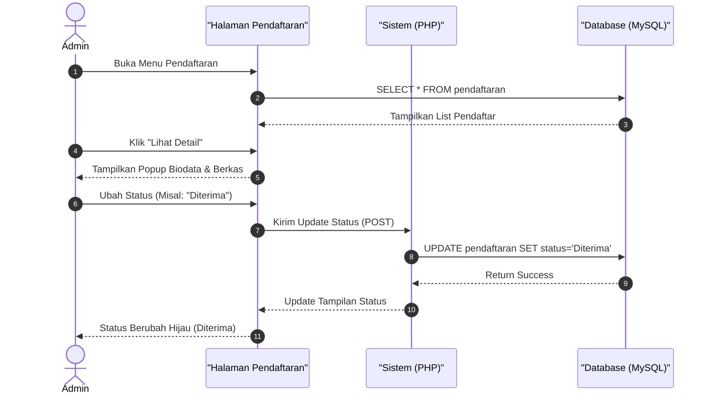
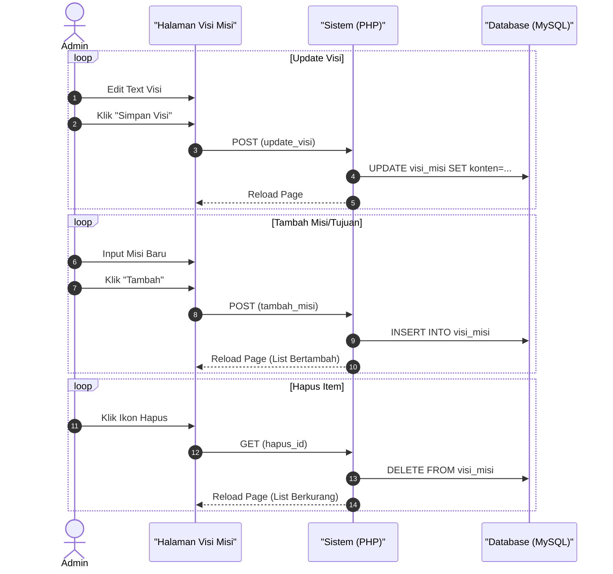

# Sequence Diagram - Admin Web FIKOM

Dokumen ini berisi **Sequence Diagram** yang menggambarkan interaksi antar objek (Admin, Antarmuka, Sistem/Server, dan Database) dalam sistem Web FIKOM.

> **Catatan:** Diagram menggunakan format **Mermaid Sequence Diagram**.

---

## 1. Login Admin

Proses admin masuk ke dalam sistem.

---

## 2. Kelola Data (CRUD)

Contoh representatif untuk modul: **Berita, Dosen, Kerjasama, Galeri**.

### A. Tambah Data (Create)

### B. Edit Data (Update)

### C. Hapus Data (Delete)

---

## 3. Verifikasi Pendaftaran

Khusus untuk modul **Kelola Pendaftaran Mahasiswa**.

---

## 4. Kelola Visi Misi (Multi-Section)

Khusus untuk modul yang memiliki beberapa bagian form dalam satu halaman.

