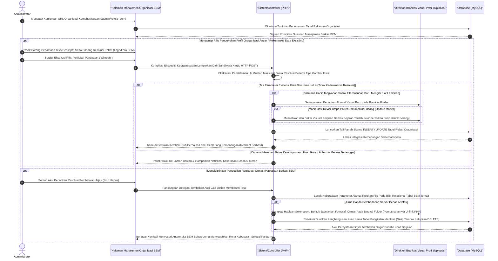

# Sequence Diagram: Kelola Data BEM / Organisasi (Admin Web FIKOM)

Diagram sekuensial ini merinci pemetaan alur komputasi di dalam modul administrasi laman "Kelola BEM" (Badan Eksekutif Mahasiswa) yang difungsikan guna memanipulasi etalase portofolio pergerakan organisasi kemahasiswaan.

## Penjelasan Alur

Sorotan apresiasi kegiatan sivitas mahasiswa tergambarkan di pelataran publik situs FIKOM melalui corong pengendali "Kelola BEM". Pola kerangka kerja antarmukanya beradaptasi sempurna dengan mekanisme master data profil lainnya. Pintu kedatangan rutinitas ini terbuka sewaktu administrator menjajaki tautannya. Sistem dengan cekatan meraup himpunan daftar nama pengurus, divisi, atau bahkan dokumentasi visual kegiatan dari lapis *database* MySQL untuk dibariskan ke papan etalase pandangan pengelola web.

Dalam mengemban kewajiban memugar portofolio BEM, administrator dibekali kapasitas unggul layaknya arsitek ruang publik—berwewenang menyunting atau mendirikan organisasi/pengurus baru (*Create/Update*) serta leluasa membubarkan catatan organisasi terdahulu (*Delete*). Setiap deklarasi susunan keorganisasian mensyaratkan deskripsi naratif padat dan kerap disempurnakan sisipan unggahan logo departemen atau arsip rupa kegiatan (*image format*). Kumpulan informasi itu diberangkatkan lewati kargo tertutup `HTTP POST`. Unit pelindung server (*PHP handler*) mengambil peran eksekutor filter, senantiasa menepis paksa lampiran fail bila ketahuan melampaui ukuran ruang aman dan menyasar rasio format asing. Memenuhi takaran resolusi, pindaian wajah organisasi ini langsung ditanam dalam wadah *folder system public*. Pada ketukan waktu bersamaan, skrip `SQL (INSERT/UPDATE)` disuntikkan ke bilik memori agar data deskriptifnya menyilang padu bersama tautan lokasi rupa file eksak tersebut di tabel pangkalan MySQL. 

Pemotongan nafas catatan organisasi masa lampau tak dibiarkan mencederai kesehatan ruang diska memori. Seumpama admin mendelegasikan perintah tebang (*Action Hapus lewat perintah pemutus GET*), sepasukan mesin peretas akan menggeruduk direktori memori untuk mencongkel akar eksistensi file foto ormas (`unlink routine`), seketika menyalurkan ledakan penghancuran terakhir untuk menamatkan garis keberadaannya pada baris pangkalan (*DELETE* record pada MySQL). Proses sirkulasi perampingan catatan organisasi ini selalu menemukan titik kedamaian dengan memantulkan administrator balik pada gerbang antarmuka awal diselimuti lencana biru kesuksesan mutlak.

## Diagram

