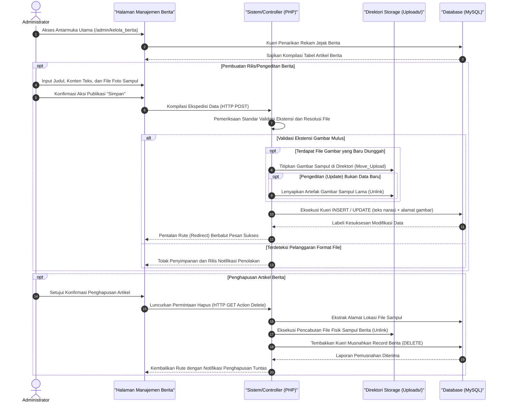

# Sequence Diagram: Kelola Berita (Admin Web FIKOM)

Diagram sekuensial ini merunut jalur interaksi komprehensif bagi modul Kelola Berita, tempat administrator membuat, mengedit, dan menghapus rilis publikasi artikel berserta gambar sampul utamanya.

## Penjelasan Alur

Rangkaian operasional pada diagram sekuensial ini menjabarkan tatanan eksekusi internal (*backend*) ketika seorang administrator merilis atau memperbarui warta informasi massa melalui modul Kelola Berita. Sejak halaman awal tabel berita diakses, sistem secara berkala melempar kueri pengangkatan data dari skema MySQL agar daftar pemberitaan sebelumnya terpapar merata di layar admin. Alur utama modul ini dapat terpecah menjadi tiga fase krusial: penciptaan artikel perdana, revisi teks maupun sampul (*cover*), dan pencabutan berita.

Dalam skenario perumusan rilis pemberitaan perdana, administrator dipersyaratkan untuk mengetikkan detail komponen tulisan—seperti tajuk berita, isi konten artikel, kategori, hingga melampirkan berkas resolusi tinggi yang akan dijadikan sampul tajuk. Peramban web merajut serangkaian masukan teks dan kepingan berkas foto tersebut ke dalam kendaraan protokol `HTTP POST`. Tepat ketika paket ini tiba di peladen pelaksana (skrip PHP), gerbang validasi akan mencekal file gambar untuk pertama kali; menilik keseuaian tipe format sekaligus memastikan spesifikasi ukurannya tetap rasional bagi beban peladen. Andaikata parameter sensor keamanan tak mendeteksi pelanggaran file, instruksi dilanjutkan pada perintah operasional pemindahan berkas (*move_uploaded_file*), yang merelokasi gambar sampul ke panggung direktori statis `/uploads` pada mesim. Segaris dengan keberhasilan itu, jalinan asinkron mesin *database* diaktifkan guna merampas dan mengunci teks konten rilis ke dalam *database* (`INSERT INTO tb_berita`).

Pola kehati-hatian ganda berlaku tatkala fungsi ganti gambar (*update*) atau fitur pencabutan artikel (*delete*) ditekan. Seandainya di momen pengeditan itu halaman menerima sampul kabar terbaru, peladen tak sekadar mencatatnya di basis data, melainkan menyalakan pisau bedah mesin lokal untuk menemukan gambar tajuk yang kadaluwarsa dari folder repositori dan menghanguskannya (*unlink*) secara permanen. Ekstirpasi serupa juga secara harfiah dititahkan setiap kali tombol Hapus Berita dipicu (lewat pemicu rute `HTTP GET ?action=delete`), memusnahkan potret sampul fisik menyongsong dihapusnya *record* tulisan pada tabel basis informasi web. Rentetan kemenangan manipulasi arus *database* itu kelak membangkitkan pentalan pengalihan rute (*redirect*) pamungkas, memajang bendera notifikasi pengerjaan sukses di dahi peramban administrator.

## Diagram

