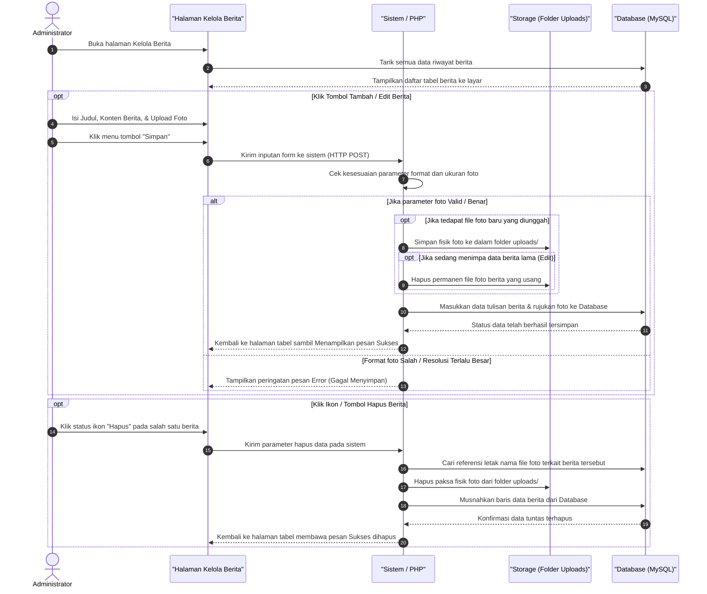

# Sequence Diagram: Kelola Berita (Admin Web FIKOM)

Diagram sekuensial ini menjelaskan langkah-langkah yang terjadi pada sistem ketika Admin mengelola data berita (menambah, mengubah, atau menghapus berita).

## Penjelasan Alur

Berikut adalah urutan proses yang terjadi ketika admin berinteraksi dengan halaman Kelola Berita:

1. **Melihat Daftar Berita**: 
   Saat admin membuka menu "Kelola Berita", sistem akan langsung mengambil semua data berita yang tersimpan di dalam *Database* (MySQL) dan menampilkannya ke layar dalam bentuk tabel.

2. **Proses Tambah / Edit Berita**: 
   - Ketika admin menekan tombol **Tambah** atau **Edit**, formulir isian akan muncul. Admin memasukkan Judul, Isi Berita, dan mengunggah Foto Sampul (*Cover*).
   - Setelah admin menekan tombol **Simpan**, data tersebut dikirimkan ke sistem (*Controller / PHP*).
   - Sistem akan mengecek apakah foto yang diunggah memiliki format yang benar (misalnya `.jpg` atau `.png`) dan ukurannya tidak terlalu besar.
   - Jika foto valid, sistem akan memindahkan file foto tersebut ke dalam folder penyimpanan server (`/uploads`).
   - Khusus untuk proses **Edit**, sistem akan otomatis mencari file foto berita yang lama di dalam server dan menghapusnya agar memori tidak penuh.
   - Setelah foto tersimpan, judul dan isi berita berserta nama file fotonya akan dimasukkan dan dirangkum secara permanen ke dalam *Database*.
   - Terakhir, sistem akan mengembalikan (*redirect*) tampilan layar ke tabel berita dengan memunculkan pesan pop-up sukses.

3. **Proses Hapus Berita**:
   - Jika admin menekan tombol **Hapus** pada salah satu berita, sistem akan mencari tahu letak penyimpanan file foto sampul berita tersebut.
   - Sistem segera menghapus file fisik foto tersebut secara langsung dari folder server.
   - Setelah fotonya lenyap, sistem lalu menghapus baris tulisan beritanya dari *Database*.
   - Tampilan akan ditutup dengan kembalinya admin ke layar tabel berita yang membawa pesan konfirmasi bahwa data sudah musnah.

## Diagram

