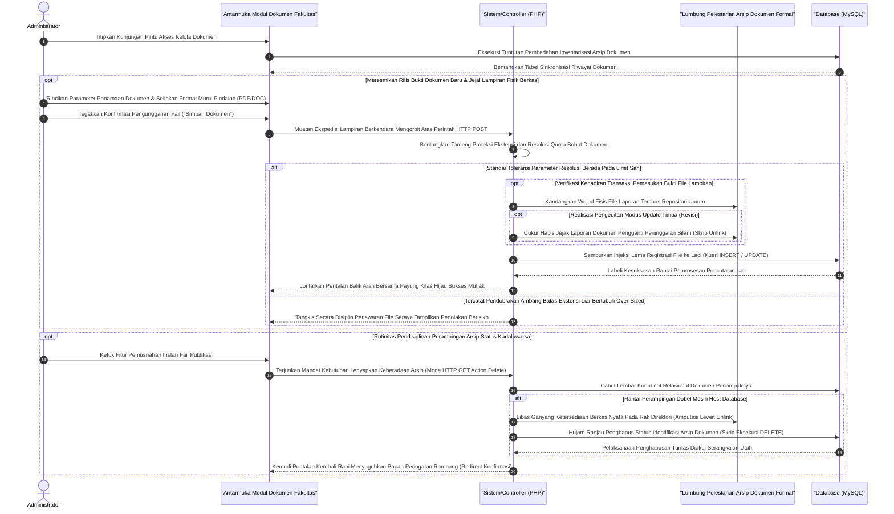

# Sequence Diagram: Kelola Dokumen Fakultas (Admin Web FIKOM)

Diagram sekuensial representatif berikut mendeskripsikan kerangka komputasional alur interaksi modul Kelola Dokumen Fakultas, tempat sirkulasi penarikan dan penempatan arsip legal publik berbasis berkas murni (*PDF / DOCX*) dikendalikan administrator.

## Penjelasan Alur

Di ruang pustaka digital "Kelola Dokumen Fakultas", skema eksekusi interaktif bermula tatkala skrip antarmuka menagih senarai deretan berkas pindaian publik. Penagih (*request handler*) menjangkau tabel pangkalan data (MySQL) sembari mengangkat ke permukaan indeks-indeks fail kebijakan formal, pedoman edukasi, maupun ragam edaran statis yang patut diketahui sivitas akademika. Perilaku operasional administrasi mencakup kuasa penuh menyebar berkas perdana (*Upload*), mendobrak masuk dengan dokumen perbaikan (*Update*), serta pelenyapan permanen lembar pedoman masa lalu (*Delete*).

Momen pendaftaran eksemplar arsip keilmuan yang baru diawali oleh pemasukan identitas judul dokumen berserta kelengkapan deskriptifnya. Beriringan, berkas lampiran asli direkatkan dalam wujud murni dokumen formal. Mengangkut muatan itu, perintah siber `HTTP POST payload` didaratkan ke pos keamanan skrip pemroses (PHP). Parameter keselamatan internal segera merentangkan tameng sensor tipe dokumen—hanya mensahihkan identitas format sah (berlaku batas rasional hingga 10MB per fail). Selama tidak meledakkan limit tersebut, peladen luluh merestui proses pindahan fail pindaian menuju palung peristirahatan direktori umum (`storage folders`). Kepindahan fail fisis itu seketika menstimulasi pemancangan perintah relasional untuk menandai tugu indeks pangkalan data (`SQL INSERT/UPDATE`); menautkan tautan lokasi dengan lema deskriptifnya agar siap diambil oleh penuai informasi publik.

Tak pelak, mekanisme penjagaan disk dari residu file usang wajib dikembangkan ketat lewat prosedur pembasmian (*deletion trigger*). Manakala insting administrator memutuskan penarikan status peredaran dari sebuah rilis dokumen, tombol `Hapus` dilabuhkan memanggil rute kiamat bersandi `HTTP GET Delete`. Peladen segera mengekstrak koordinat nama berkas, mengasah pisau memori bedah (*unlink operator*), dan menetak hilang fisik fail dari memori penyimpanan mesin penampung sistem tanpa celah toleransi. Titik klimaks ini dituntaskan persamaannya oleh semburan taktis eksekusi letup `DELETE FROM table`, membakar sisa coretan kenangan sejarah berkas terkait dari dalam jeroan MySQL. Kesigapan runtutan logis ini lalu melepaskan kendali balik layaknya sirkuit pental (*redirect*), menyodorkan antarmuka teriluminasi peringatan lunas pekerjaan secara damai kepada admin.

## Diagram

