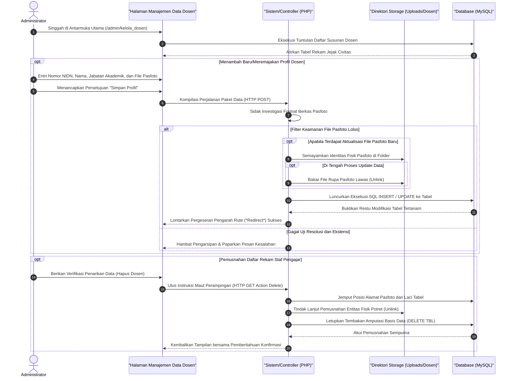

# Sequence Diagram: Kelola Data Dosen (Admin Web FIKOM)

Diagram sekuensial ini memetakan tahapan sirkulasi kelola data (CRUD) untuk mengatur rincian matriks profil staf pengajar (*Civitas*) pada modul Kelola Dosen oleh administrator sistem.

## Penjelasan Alur

Skema interaktif berikut menyingkap tata susunan eksekusi proses yang melatarbelakangi pengarsipan identitas staf pendidik (*dosen*) Fakultas Ilmu Komputer. Sama halnya dengan pola pengelolaan arsip sentral yang lain, rutinitas ini dimulai dengan menyusuri beranda Kelola Dosen, di mana modul secara proaktif memanen tumpukan data rekam jejak dosen yang mendiami tabel basis operasi *database* MySQL untuk dipaparkan pada barisan antarmuka penelusuran administrator. Perputaran arus komputasional lantas berakar pada prosedur krusial, mulai dari pemasukan identitas (NIDN) dosen pendatang, pengubahan gelar serta kedudukan fungsional manakala staf pengajar naik tingkat, hingga prosedur memusnahkan riwayat portofolio entitas pengabdi yang tak lagi menduduki kursi fakultas.

Saat mengentaskan figur dosen yang baru merapat atapun memperbaiki data staf bersuara lawas, administrator dituntut untuk mengimpor muatan isian sensitif layaknya identitas nomor induk khusus (NIDN/NIP), rekam akademik/gelar pendidikan, status struktur posisi hierarki, menginklusi muatan foto pas berwajah presisi resolusi standar. Seluruh kumpulan lema portofolio ditambah bongkah data potret ditumpangkan penuh ke jalur pertukaran persinyalan bersandi `HTTP POST`. Unit penelaah pusat pada palung sistem pelaksana PHP langsung meraba wujud paket lampiran pasfoto. Andaikata ekstensi potret tidak mencelakai pelindungan filter, tumpukan berkas figur di relokasi masuk secara fisik (`move_uploaded_file`) menemui pangkal arsip penyimpanan memori sistem. Seusai file foto itu ditambatkan aman pada folder *uploads*, keran transaksi menuju lautan *database* diretas terbuka sejenak; sistem menyatukan deretan isian NIDN, nama lengkap, gelar, beserta nama kunci foto langsung ke relung tabel profilnya masing-masing.

Modul skrip ini kian dipersenjatai daya bedah ketelitian pada waktu administrator meng-klik penyesuaian (meremajakan profil potret) atau perwujudan eksekusi pencabutan data pengajar murni (*Delete*). Andaikata file anyar diselundupkan di atas kolom foto eksisting, skrip dengan berani mendesak repositori disk server meleburkan pasfoto yang using (`unlink`) seketika saat berkas unggahan bersemayam menggesernya. Rentetan pemusnahan itu secara konsisten dijalankan manakala instruksi Hapus Dosen dimuntahkan melalui sinyal perampingan `HTTP GET`. Sistem peladen tak semata menjatuhkan data basis dosen dari *database*, namun juga menghantam ke akar-akarnya dengan menyensor permanen wujud media fisik fotonya. Alur siklus pembaruan portofolio berestafet ini diakhiri ketukan pengarahan halaman terpusat (*page redirect*), memberikan isyarat sinyal kesuksesan warna hijau seraya merampingkan papan data profil di layar sang admin.

## Diagram

