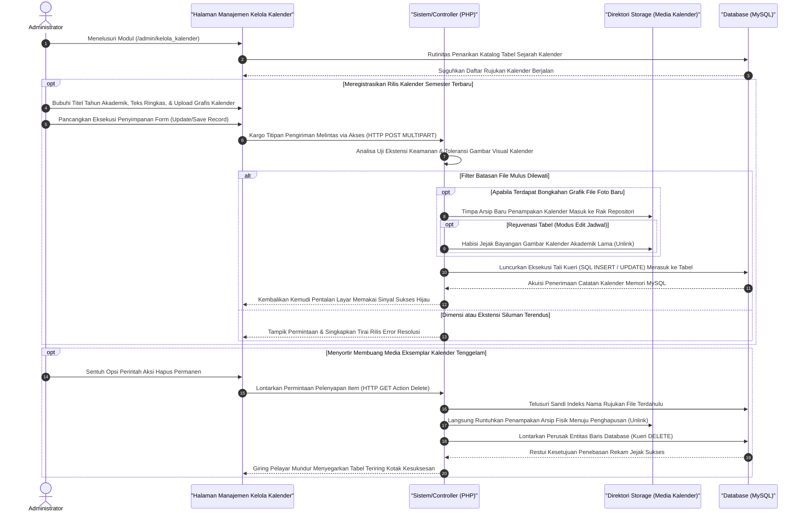

# Sequence Diagram: Kelola Kalender Akademik (Admin Web FIKOM)

Diagram sekuensial ini mendokumentasikan serangkaian alur komputasional teknis dalam manajemen mengunggah dan merilis edaran wujud pedoman waktu (Kalender Akademik) kepada khalayak antarmuka.

## Penjelasan Alur

Dalam kerangka lalu-lintas web Fakultas Ilmu Komputer, modul "Kelola Kalender Akademik" disusun ringkas untuk menghandel rilis pementasan media visual atau grafik lembar penunjuk waktu pendaftaran, ujian, hingga operasional edukatif tahunan. Mengingat kalender ini merupakan tongsi krusial yang perlu senantiasa diremajakan di setiap pergantian semesta perkuliahan, administrator cukup menjajaki alamat pengelola untuk meninjau kepingan potret penanggalan yang disuguhkan mesin *database* di papan penelusuran. Melalui antarmuka visual sederhana tersebut, tugas administrator ditekankan pada dua pokok fundamental: mengunggah susunan baru piktogram kalender yang dikemas dalam gambar, serta melakukan penyortiran pencabutan arsip dokumentasi tahun pengajaran yang kadaluwarsa.

Selayaknya modul pemuat aset berwujud visual lainnya, siklus administrasi dipacu kala admin menetapkan judul semester penanggalan terkini dan mulai menyelundupkan hasil cetak biru file gambar kalender tersebut di borang pengisian. Menekan tombol pasak eksekusi segera mengirim formulasi *multipart HTTP POST* ini mengarungi lorong aplikasi (*PHP backend*). Sistem akan menyeleksi resolusi dan kualitas *jpg/png* agar proporsi bentangan grafis tersebut tetap cemerlang tanpa menekan ketersediaan penyimpanan peladen fisik utama. Menyadari keabsahannya, barisan perintah peladen menempatkan gambar pada rak arsip web `/uploads` atau keranjang publik yang ditugaskan. Tak lama kelang penyerahan mandat keamanan fisik berkas, kueri skrip memproyeksikan lintasan tautan URL (*path string*) dan judul periode perkuliahan ke kerangka struktur rekam jejak lajur kalender (*insert/update*) ke pangkalan *MySQL*. 

Demi terhindarnya tumpukan boros gambar visual pedoman pengajaran tahunan, admin disediakan juga dengan fitur amputasi aset (Hapus Kalender Eksisting). Saat ekuitas data ditabrak perintah `Delete Action Get Request`, mekanisme perampingan server berjalan cepat menyerang nama tabel kalender terkait. Lapis operasional peladen tanpa ampun membakar presensi bayangan jejak potret kalender kuno (*unlink command*) sebelum perusak basis data berlanjut memberantas rekaman isian lajur kalender pada MySQL. Pertarungan komputasi ini lekas diakhiri dengan peredaman konflik (*redirect*) untuk mendapuk kembali administrasi web menampilkan status bersih sukses terangkut kepada hadapan layar peramban.

## Diagram

