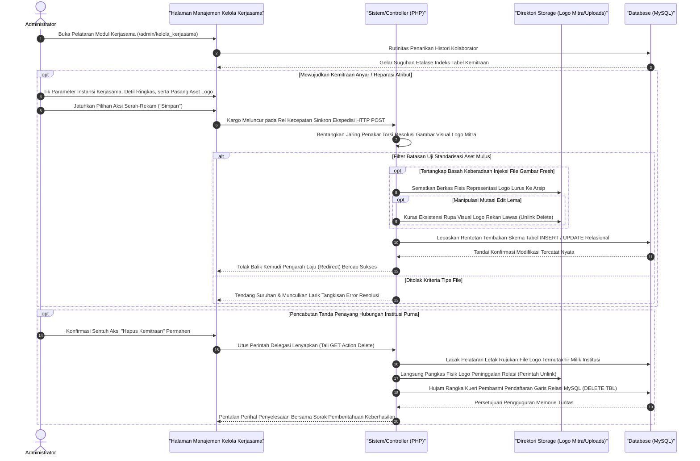

# Sequence Diagram: Kelola Mitra Kerjasama (Admin Web FIKOM)

Diagram sekuensial ini mengerucut pada alur komunikasi antarmuka sistem ketika administrator melakukan pengarsipan, perbaikan data, hingga pembatalan rekam jejak relasi institusional pada modul Kelola Mitra Kerjasama.

## Penjelasan Alur

Jalinan instansi dan rupa logo kemitraan yang silih berganti dipampang pada bentangan serambi utama website fakultas berhulu dari dalam laci modul manajemen admin ini. Begitu rute pengelola "Kelola Kerjasama" disentuh peramban, seruan tak kasat mata diutus dari peladen perantara (PHP) menuju jantung ruang tabel MySQL guna menyerok seluruh riwayat histori institusi relasi. Setibanya lembaran indeks mitra ini diantarkan kepada admin, mereka sewaktu-waktu dibebaskan mengendalikan instrumen tambah (*create*), tinjau mutasi spesifikasi (*update*), hingga likuidasi kontrak pajangan mitra (*delete*).

Skema penanaman institusi pionir bermula dari kewajiban entri deskriptif. Admin bakal memahat sederet tajuk pengenal mitra (misal: "Universitas X", "Industri Y"), menguraikan deskripsi payung ikatan kolaborasinya, seraya tak terlewat memautkan selembar file grafis visual (lazimnya berformat *PNG/JPG*) sebagai repereksentasi wajah jalinan tersebut (logo). Seusai administrator menyegel pengajuannya, kereta paket dokumen HTTP POST bermanuver melintasi penjagaan rute web. Filter keamanan lekas dipasang guna menakar batas ukuran bobot serta kelayakan ekstensi fail pelacak (*image validation*) agar terhindar dari kargo penyusup bawaan yang dapat melumpuhkan pangkalan sistem fakultas. Apabila rupa fail berhak divalidasi, lapis disk terhamparkan menjemput fail itu untuk dikekang ke ranah lokasi `uploads/kerjasama`. Sebagai bentuk persetujuan komplit, panah pangkalan data `INSERT/UPDATE` melesat memahat identitas mitra menyilang indeks wujud letak gambarnya. 

Pola putaran bedah aset dan pemusanahannya pun menganut rutinitas seragam yang lugas. Andai kelak logo mitra diubah (*update file*), prosedur pemotongan otomatis menyayat leher eksistensi fail fisik kuno agar luruh ke jurang ketiadaan komputasi (*unlink system function*). Pembasmian hingga pucuk akar itu direplikasi tanpa tolerir setiap kali eksekutor penghapus menekan panel 'Hapus' pada daftar pajang. Bersandarkan utusan pemicu rute mematikan berlapis `HTTP GET`, gerbong mesin *server* sekonyong-konyong akan menyemburkan racun ke dua titik: luruh memusnahkan potret fisis logo dari bingkai *folder*, selaras mencerabut riwayat kemitraan dari lumbung rujukan pangkalan data selamanya. Prosesi perampingan aset ini digenapi dengan pelemparan paksa kembali laman tersebut (*redirect*) yang langsung terias senyuman sapaan kotak peringatan notifikasi penyelesaian eksekusi warna cemerlang.

## Diagram

