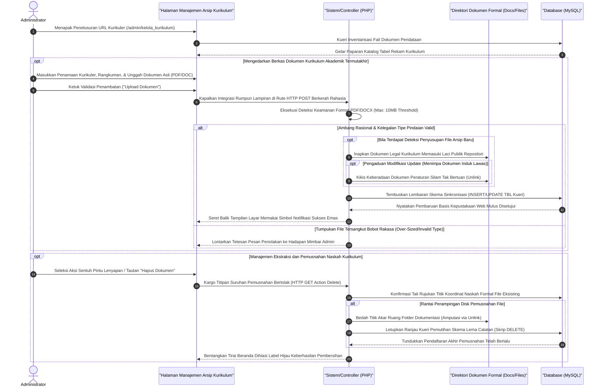

# Sequence Diagram: Kelola Kurikulum (Admin Web FIKOM)

Diagram sekuensial ini memetakan persimpangan garis interaksi antara administrator dan sistem peladen web, khususnya dalam pengembanan beban modul Kelola Kurikulum yang menaungi pendistribusian dokumen pengajaran berformat murni (*PDF / DOCX*).

## Penjelasan Alur

Sejatinya lalu-lintas pengumpulan rekap basis kurikulum dalam peladen antarmuka administrator berbeda tajam dibandingkan dengan modul grafis gambar statis terdahulunya. Fitur mutakhir "Kelola Kurikulum" disangga atas rancang bangun *database* MySQL guna mengurusi pertukaran dokumen akademis resmi bermodel pindaian PDF sampai naskah kerja formatan DOC. Begitu melompati ambang beranda kurikulum, peramban melempar jangkar penarikan kueri mengais pangkalan data merangkum tumpukan fail dan tajuk rekaman pedoman tahun pengajaran saat ini, menyediakan administrator akses instan untuk melampirkan *file*, membubuhkan deskriptif naskah pedoman, sampai dengan membersihkan fail dari brankas web.

Tataran teknis bertambah pelik tiap kali sang juru pengawas (*operator web*) mendirikan ketetapan untuk mengatrol pindaian kurikuler (*Create Upload Document*). Lapis komunikasi mengirim wujud borang ke rel `HTTP POST` tempat skrip pengendali berspesifikasi PHP merapalnya dengan proteksi tingkat keamanan tertinggi (*Max File Limit 10 MB, strict extension MIME*). Bila resolusi ukuran fail PDF/DOC melampaui pagar pembatas peladen komputasi, ia lekas dimuntahkan balik menuju halaman asal sembari ditalikan tulisan insiden error peringatan batas volume berkas. Akan tetapi, kala beban lampiran berhasil dipanggul ringan dan diakui legal, skrip instruksional spontan mengatur jembatan ke laci rak *folder documents/docs* server memindah simpannya sebelum beranjak menjungkit rel relasional MySQL untuk dititipkan alamat letak repositorinya pada sekumpulan sel di lajur rujukan kurikulum (`INSERT/UPDATE file_url`). 

Alur sekuensial penarikan hak peredaran berkas kurikulum juga tercatat komprehensif. Demi mencegah berserakannya pecahan rekam dokumen siluman pada ruang muatan server fakultas yang berharga, instruksi pemicu tombol Hapus mengartikulasikan manuver tembakan langsung pada pengawas peladen (*delete handler*). Permohonan berkedok perintah parameter silang `HTTP GET` mengangkut identitas *file* berantai merobek ikatan memori disk `unlink()`. Tinta naskah pangkalan data membasmi jejak pencatatan baris namanya seturunnya. Rangkaian pergumulan komputasional perampingan itu otomatis terkunci tenang lewat sinyal putaran kemudi melingsirkan admin menuju tabel berkas termutakhir tanpa gores masalah sama sekali di layarnya. Dalam pada ini pula, para khalayak akademik disediakan fasilitas tombol ekstrak berkas kurikulum dari modul *database*.

## Diagram

