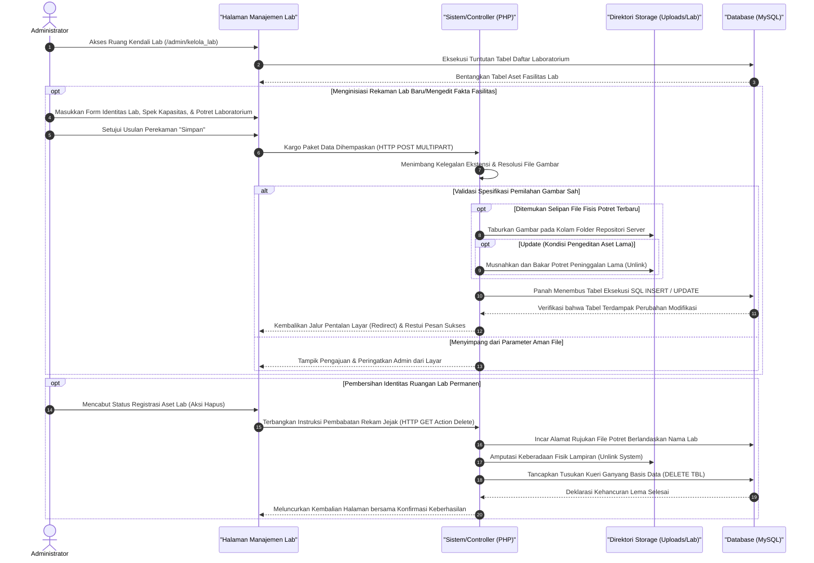

# Sequence Diagram: Kelola Fasilitas Laboratorium (Admin Web FIKOM)

Diagram sekuensial ini merinci alur interaksi komprehensif di dalam modul administrator ketika hendak mengkreasi, memodifikasi, maupun mencabut rincian ketersediaan aset laboratorium fakultas.

## Penjelasan Alur

Rangkaian interaksi skematik dari operasi Kelola Laboratorium dikhususkan demi mengakomodasi kelengkapan dokumentasi fasilitas belajar fungsional milik Fakultas Ilmu Komputer. Ketika administrator mulai melangkahkan kursornya masuk ke beranda sistem kendali lab, sirkuit kode secara lincah membongkar tabel penyimpanan MySQL untuk merangkum daftar seluruh laboratorium riset atau komputer yang disajikan sejajar di muka layar. Pada area ini, admin ditugaskan menahkodai pencatatan aset inventaris dengan metode rekam tambah (*create*), peremajaan spesifikasi fungsional (*update*), hingga likuidasi ketersediaan aset ruangan yang usang (*delete*).

Saat formulir penyusunan lab baru dihamparkan, administrator akan dibimbing untuk meletakkan rincian identitas esensial. Susunan parameter itu wajarnya meliputi kode lab, penamaan ruang representatif, daftar spesifikasi komputer, jumlah kursi, beserta kewajiban menambatkan selembar potret gambar penampakan fisik fasilitas tersebut. Bersamaan dengan diusulkannya borang itu, bingkisan lalu-lintas bersandi `HTTP POST` melempar seluruh paku parameter identitas serta wujud potretnya ke peladen PHP. Mesin validasi gambar akan mengendus muatan format lampiran sebelum kemudian menyepakati untuk menanamkan citra foto di dalam pangkalan file (`direktori uploads/laboratorium`). Begitu posisi foto berlabuh dengan presisi, giliran seruan kueri SQL berbaris untuk memerintahkan *database* mengukir nilai deskriptif berserta penunjuk direktori foto tersebut secara permanen ke tubuh tabel fasilitas laboratorium. 

Serangkaian protokol pemusnahan (*Unlink*) dan penggantian (*Replace*) juga otomatis tereksekusi ketika rute pembaharuan fasilitas dikalkulasikan atau jika tombol pencabutan ruang lab diketuk. Seandainya di hari depan foto aset usang ingin dikubur guna diganti pajangan fasilitas anyar, pisau bedah mesin tanpa basa-basi akan menyayat file lawas dan melenyapkannya dari sisi *storage server*. Begitu juga saat perampingan penghapusan laboratorium mutlak dieksekusi melalui pancingan sinyal alamat `HTTP GET Delete`. Peladen mengekstrak nama berkas lampirannya, menghanguskannya, lalu berbalik kepada tabel saksi untuk membabat (*drop/delete*) lema rekaman lab selamanya. Penyatuan proses penyesuaian aset ini acapkali ditutup secara elok lewat pentalan arah layar komputasi (*redirect*) yang mendemontrasikan status kesuksesan pencapaian mutasi data di papan tampilan admin.

## Diagram

