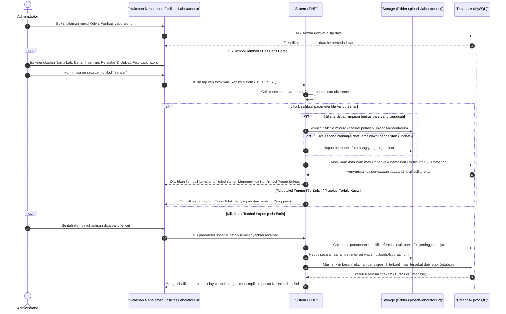

# Sequence Diagram: Kelola Fasilitas Laboratorium (Admin Web FIKOM)

Diagram sekuensial ini menjelaskan langkah-langkah praktis pada sistem ketika Admin mengelola data fasilitas laboratorium.

## Penjelasan Alur

Berikut adalah urutan proses yang terjadi ketika admin berinteraksi dengan halaman Kelola Fasilitas Laboratorium:

1. **Melihat Daftar Data**:
   Saat admin membuka menu "Kelola Fasilitas Laboratorium", sistem akan langsung mengambil semua data yang tersimpan di *Database* (MySQL) dan menampilkannya ke layar dalam bentuk tabel.

2. **Proses Tambah / Edit Data**:
   - Ketika admin menekan tombol **Tambah** atau **Edit**, muncul formulir isian. Admin memasukkan Nama Lab, Daftar Inventaris Peralatan dan mengunggah Foto Laboratorium.
   - Setelah menekan tombol **Simpan**, data dikirimkan ke sistem pengendali (PHP).
   - Sistem akan mengecek apakah format file benar dan ukurannya tidak terlalu besar.
   - Jika valid, sistem menyimpan file fisik tersebut ke dalam folder penyimpanan server (`/uploads/laboratorium`).
   - Khusus untuk **Edit**, sistem akan mendeteksi keberadaan file lama milik data tersebut dan otomatis menghapusnya agar memori (*storage*) tidak penuh.
   - Setelah file tersimpan, sistem menyisipkan (menyimpan) rincian dari form teks admin beserta rujukan penamaan file tadi secara permanen ke dalam *Database*.
   - Terakhir, halaman memuat ulang (di-*refresh*) dan tabel tampil dengan memunculkan pesan Sukses kepada sang Admin.

3. **Proses Hapus Data**:
   - Jika tombol / ikon **Hapus** diklik pada salah satu baris, sistem akan mendedah referensi nama Foto Laboratorium yang dimilikinya.
   - Sistem lalu menghapus file fisik tersebut langsung dari folder server (`/uploads/laboratorium`).
   - Setelah fisik fail dihapus bersih, sistem menghapus seutuhnya jejak baris rekam data tersebut dari *Database*.
   - Tabel dimuat ulang tanpa memunculkan baris data yang dihapus tadi, disertai pesan notifikasi keberhasilan operasional.

## Diagram

