# Sequence Diagram: Verifikasi Pendaftaran (Admin Web FIKOM)

Diagram sekuensial ini merunut alur ketika Administrator melayani atau mengelola pendaftar, terkhusus sewaktu petugas mensahkan berkas registrasi pengguna sivitas yang dititipkan mereka via daring.

## Penjelasan Alur

Bedanya pada layar peladen Verifikasi di mana peranan Admin bukan membangun catatan formulir baru, namun utuh difokuskan **memproses antrean verifikasi** status orang:

1. **Memantau Gerak Daftar Pendaftar**: 
   Awal membuka rute menu status persetujuan Registrasi Pendaftar, rel pangkalan layar MySQL menjaminkan kemudahan menengok untaian memadat sederet profil pemohon siap dirombak untuk disetujui / dinonaktifkan.

2. **Titipan Ketetapan (Validasi Terima / Blokir Tolak)**:
   - Pengelola dengan lapang mengecek kesesuaian lampiran arsip calon pemohon. Lewat pencetan *Detail Viewer* layar memperlihatkan berkas pindaian jaminan identitas KTP mereka dari muatan tabung server.
   - Selesai pengawasan mata validnya dokumen, penegasan dilakukan melewati pertukaran klik aksi penyelesaian di tombol **Terima** maupun **Tolak**. Putusan itu ditiupkan menyebrangi pemungut jaringan server.
   - Mesin lantas mengubah status lema data *table pendaftaran* sang pemilik pemohon di dalam bilik sel basis MySQL jadi sah tervalidasi. 
   - Antarmuka mengayun layar menari kembali segar di titik pangkal tabel lengkap berpasang lencana penyelesaian kesuksesan status terpoles di peramban.

3. **Gugurnya Pendaftaran Batal Tersandung Hapus**:
   - Jika admin berniat mencerabut habis kotoran penumpukan antrean akun pendaftar yang tidak melintasi tenggat ketentuan maka pentalan menuntut pelemparan menu penghapusan total. Tombol pencabut **Hapus Status Pemohon** diartikulasikan ke antrian khusus baris profil mereka. 
   - Modus operandi penggusur memori mengepal kendali menyerang memori internal *Folder Storage Situs* tuk menghancurkan luluh lantak presensi pembuangan sampah lampiran identifikasi / Buket Pendaftaran dokumen asal milik terdakwa, secara telak memberangus fail mereka di server (*Unlink Files*).
   - Dihempas binasa tak terlacak sisa letikan teks keberadaannya pada susunan memori meja basis *Data Tabel MYSQL*. Laporan penutupan penyapuan lincah mengirim pentalan penyegaran *Refresh Window* mengabarkan ketuntasan proses pengosongan memori!   

## Diagram

```mermaid
sequenceDiagram
    autonumber
    actor Admin as Panitia/Sekre Administrator (Verifikator Pendaftar)
    participant View as "Lembar Tinjauan Validasi Seleksi Calon Pemohon"
    participant System as "Sistem Pengawas Validasi (Kendali Parameter PHP)"
    participant Server as "Direktori Brankas Laci Salinan Dokumentasi Peserta Pendaftaran Asli"
    participant DB as "Lembayungan Skema Sinkronisasi Urutan Pendaftar Tertata di Database"

    Admin->>View: Seret penelurusan klik di Menu Utama Pelataran Pengurusan Pendaftar
    View->>DB: Rutinitas tuntutan pengkategorian urutan memadat di tabel calon antre
    DB-->>View: Tuangkan saringan suguhan etalase peserta ke hadapan verifikator 

    %% Putusan Penerimaan Hak Pemilik  
    opt Pemeriksaan Keabsahan & Rekomendasi Terima Dokumen Calon Mutlak
        Admin->>View: Pencet ikon tampilkan Detail, melihat bukti sinkron Dokumen Persyaratan
        Admin->>View: Lemparkan hakim penyelesaian (Tekan Sentuh Putusan Valid Beralaskan Pilihan "Diterima / Ditolak Laporan")
        View->>System: Kargo pesanan dituntut melintang pesat menuju parameter pembaruan penetapan pos peladen HTTP POST
        
        System->>DB: Rapalkan penetrap ketetapan skrip baris pengubahan Parameter Kepastian Status Konfirmasi Rekaman Asli 
        DB-->>System: Labeli penegakan rilis peresmian validasi putusan peserta tertumpu absolut menyelesaikanya    
        System-->>View: Putaran penyegaran menyapu rotasi rilis pemberitahuan berselimut sukses memperbarui kemajuan laporan validasi beriring Kotak Hijau 
    end

    %% Membinasakan Calon Berserakan Berakhir Pembatalan
    opt Lenyapkan Akar Bukti Registrasi Gagal Ekstirpasi Penghapusan Murni 
        Admin->>View: Tititpkan sentuhan tolak mencabut pendaftaran secara merapat baris peserta batal (Sentuh Merah Panel Hapus Total) 
        View->>System: Perintah lisan ditamburkan mendestruksi pengangkutan rute titipan singat pemicu peramban (Lajut Rombak HTTP GET Parameter Delete) 
        System->>DB: Kumpulkan lacakan kumpulan jejak penamaan tumpuan rujukan alamat presisi serpihan fotocopy persyaratan milik pendaftar itu tersaji
        System->>Server: Libas hancurkan kemurnian salinan dokumetansi tersebut dititipan bilik Server Folder Penyortiran (Esekusi Letup Titah Unlink Berbasis Direktori Menyapu Murni) 
        System->>DB: Angin letupan mengejar tuntas ganyang keberangkatan eksistensi pendaftaran mencabut rekam namanya dilarik TBL Memori MySQL mematangkan Lema Terkhi  
        DB-->>System: Balas konfirmasi kelegaan resolusi letupan gugur selesai menghabisis seluruh arsipnya
        System-->>View: Kemudi Penuntun Berlayar Peramban Mulus Tampil Di Ujung Lurus Membawa Bendera Riang Konfirmasi Menyenangkan Penyingkiran Valid Dibasmikan Sempurna
    end
```

