# Sequence Diagram: Verifikasi Pendaftaran (Admin Web FIKOM)

Diagram sekuensial ini merunut alur operasional komprehensif manakala pengemban tugas Administrator menangani pembukaan lapis penyaringan atau peresmian kelengkapan identitas calon penghuni terdaftar pada situs di modul fasilitas Pendaftaran.

## Penjelasan Alur

Bedanya menonjol ketika administrator menghabiskan waktunya bersinggung mendampingi operasional antarmuka fasilitas "Pendaftaran" di mana peranan penambah dokumen formulir pendaftaran barunya sama sekali melenggang ditiadakan. Titik kewajiban utamanya dituang tuntas semata guna **menyelidiki antrean validasi verifikasi pemrosesan** urutan rekapitulasi masukan jejak kepemilikan orang pendaftar yang memohon pelibatan daring registrasi pada pangkalan layar peladen.

Proses dimulakan waktu panel pemantauan beranda pendaftaran dibangkitkan letupannya. Sirkuit tarikan rel MySQL seolah otomatis akan menghamparkan penyusunan jajaran lurus antrean panjang padat berisi jejak entri profil pemohon siap dieksekusi menanti keabsahan penolakan dinonaktifkan perayaannya. Pada momen pelik pengawasan, pengelola diberi akses penuh menyelami ketersesuaian kelengkapan rincian jejak dokumen berkas pelamar. Memencet ikon *Detail Penelusuran Visual* mendorong komputasi mengangkut pengintipan peragaan foto otentik, selayaknya melihat bukit pindaian berkas persyaratan terlampir dokumen KTP atau rapot Ijazah pelamar yang dipangil melingkupi rel dari palung brankas simpan server tanpa halangan peramban pemutus tirai sistem. 

Selesai diinspeksi oleh pengawas peladen kepantasan dokumen tersyarat absah diklaim orisinal melengkapi kualifikasi memuaskan standar verifikasinya, kebulatan resolusi perizinan disandarkan dengan mengayun klik ketukan penentuan kepastian Validasi Pengguguran atau Taraf Penerimaan merangkak meluncur di atas tuas **Diterima** menjulur di atas pelataran **Ditolak** sekalian. Keputusan melentur merobek jaringan server membangkitkan kueri letup memutahirkan (*update column changes status*) kondisi nilai kolom lajur tabel pendaftaran baris pemohon berkoordinasi dalam *Database MySQL* tatanan kelola, menuntaskan sandi berbunyi peresmiaannya jadi tervalidasi terang di database relasional sinkron. Tampilannya tidak dibiarkan terkatung usai penyuksesan, layar antarmuka peramban admin seketika memutar roda penyegaran pentalan berhiaskan lencana penyusunan berhasil konfirmasi sukses pembarisan tersingkap melengkung cerah di muka atas layar konfirmasinya tercetak indah selaras penguncian putusan memori sinkron.

Gugurnya kewaspadaan barangkali ditemui pada antrean pendaftar akun palsu keliru hingga sarang sampah berkumpul fiktif tidak mematuhi pakem resolusi tertanggal persyaratan ketentuan menuntut pemberhentian laju di layar. Pihak berwenang menelurkan kebaikan menekan tuas radikal pelontar rute ekstirpasi pembasmian di persimpangan opsi tombol Hapus pemutus. Titah ekstrim tombol aksi **Menyingkirkan Penuh Hapus Status** dibacakan memanggil gerombolan serang skrip pos melacak kemudi tempat pendaratan fail jejak pindaian buangan berserakan foto usang terlampir pada kepemilikan pelamar malang penipu terpidana pendaftaran itu dikandung dalam brankas *Root Folder Host Asset Situs* laci persembunyian fisis filenya. Sesampainya di persembunyian server, file malang dipaksa lenyap ditebas dari realitas memorinya hingga dibinasakan bersih melampaui letik ampunan pungut ulang fail hancur secara berkelas (*Unlink Operasi Skrip Destruksi Total Menusuk Akar Penyimpanan Fisis di Storage*). Perkara sapuan belum usai kala jejak pemecahan silsilah lajur pendaftar penipu dirajut dihantam penyapu letup skrip pangkalan membasmi baris namanya melingkupi sel perantara SQL, merongsokan baris verifikasinya hingga lenyap sebatas debu dari himpunan rekannya di dalam kerangkeng meja murni *Database* perambatan kuerinya diselesaikan. Ketuntasan radikal pemberhentian silsilah dituntaskan membacakan lapiran pentalan mendarat menatap muat rotasi berputas penyajian layar mulus tabel pengurus perampungan peringatan kemeriahannya melaporkan keberhasilan menyingkirkan fail murni diberangus absolut memimpin keberhasilan komputasi paripurna tanpa onggokan ganjalan celah residu peladen dibentangkan. 

## Diagram

```mermaid
sequenceDiagram
    autonumber
    actor Admin as Panitia Pengayom Hakim Kepastian Standar Berkas Evaluator (Verifikator Tunggal)
    participant View as "Antarmuka Pos Lembar Kemudi Status Validasi Saringan Tinjauan Kepastian Antrean Berkas Pendaftar Mendaftar"
    participant System as "Sistem Jantung Otak Pengawas Inteligensia Putusan Skema Validasi Sentral Eksekutor Laman Cerdas Peladen (PHP Back-End Kinerja Server Rotasi Terukur Dinamis Responsif Langsung Merangkul Rujukan Integrasi Mumpuni Membawa Penentu Beban Rangka Sinkron Memadukan Parameter Cek Silang Presisi Kendali Menata Hak Valid)"
    participant Server as "Direktori Titipan Berankas Saksi Bisu Kumpulan Serpihan Lampiran Dokumen Fotocopy Tumpukan Kepemilikan Hak Aset Persyaratan Calon Pemohon Mengamankan Berdiam Aman Membentengi Akar Letak Orisinalitas Laci Server Fisis Salinan Rekam Sedia Dokumen Terarsip Disembunyikan Kuat Dilindungi Akses Menyudahi Persediaan Folder Melampirkannya di Publik Tanpa Sela Cacat Penyimpanan Aman Tangguh Sedia Menerjang Ketersediaan Salinan Orisinil (Folder Direktori Host Root Aman Mengurungkannya Murni Bebas Menyusut Melayani Unggahan Publik Perambahan)"
    participant DB as "Lembayung Pangkalan Muara Puncak Sinkronisasi Skema Barisan Entri Rekam Tabel Penamaan Registran Menyematkan Lajur Rerangkai Entri Database Tersusun Tabel Calon Berkepanjangan Relasional Tersortir di Penantian Menjamin Penobatan Sah Tidaknya Parameter SQL Terikat Sedia Memangku Data MySQL Keabadian Sel Pendaftaran Sinkron Parameter Terstruktur Mulus Rapi Merajut Kemurnian Valid Merenggut Tuntas Tanpa Lenyap Setitikpun Pendaftaran Berjejak Keabadian)"

    Admin->>View: Bimbing sentuhan klik ketuk merapat pada penelusuran beranda panduan Modul Utama Pengurusan Seleksi Panel Pendaftaran Pelamar Situs
    View->>DB: Rutinitas kargo penyortiran bongkar letak penarik tuntutan jajaran padat merekap letupan penayangan tumpukan panjang memadati pemanggilan urutan barisan tabel relasional SQL entri di laci rekaman pendaftar pangkalan MySQL siap sedia disodorkan maju menyeruak pangkalan rekam penantian peladen
    DB-->>View: Semburan kembalian kueri berhasil dituang meratapi bentangan saringan paparan berbanjar lurus suguhan lengkap etalase profil per nama peserta disodorkan lelas terhampar utuh berurut menjunjung antrean tatap muka kehadapan pandangan luas panca indera layar monitor verifikator peladen penanggung jawab seleksi penuh kepastian wewenangnya 

    %% Putusan Penerimaan Perlakuan Adil Konfirmasi Kelulusan Hak Validitas Orisinal Pemilik Memperoleh Izin Penuh Resmi Diterima Tembus Laman Rilis Menjadi Keluarga Sah Sivitas Tervalidasi Cerdas  
    opt Pemeriksaan Hakim Kualifikasi Mutu Bukti Keabsahan Legalitas Dokumen Titipan Syarat Keterangan Pemohon Berhasil Melampaui Rekomendasi Garis Setuju Standar Parameter Mutlak Tersertifikasi Terima Lulus Cemerlang 
        Admin->>View: Tancapkan pandangan investigasi cermat menyentuh klik terarah pada ikon perbesaran "Detail Berkas Visual" merombak jendela menyoroti pembuktian selintas saksi sinkron letak pindaian Orisinal Fotocopy Kartu/Surat Legalisasi Asli yang dititipkan pengakses bersembunyi mendedah berkas fisik lampirannya
        Admin->>View: Pungkas melontarkan hakim pamungkas menjatuhkan wewenang vonis eksekutorial kemanusiaannya mengawinkan ketukan (Sentuhan Putusan Rute Final Bertitip Pilihan Puncak Diantara Berseberang Kata "Resmi Valid Diterima Mutlak / Terpaksa Sandang Ditolak Pelaporan Blokirnya")
        View->>System: Kargo lisan pembaris komando perpesanan mendaki menenteng tuntutan kepastian mandat pesanan merapat laju menyebrang melempar resolusi laksana kilat mutasi penentuan rel rute HTTP POST Method merombak perisai pintu peladen sinkron melancarkannya ke dapur arsitek pangkalan letup pengubah rute menabrak penerima amanahnya menginterupsi jalannya antrean parameter pembaharuan tertib merentangkan rel perintah persetujuannya disisipkan halus menyusup mengangkut lambaian seruan
        
        System->>DB: Semburkan siraman perintah meratakan suntikan injeksi letupan paksa penetrap merajut lajur ketetapan rombakan terperinci skema tatanan pengulangan paramter status laci tabel pesertanya memahat parameter parameter SQL Skrip UPDATE baris baru mendirikan teguh perombakan Parameter Kondisi Menuntut Hak Validasi Keabsahan Penilaian Pengesahan Lulus Gagal Merekonstruksi Realisasi Menjadi Sah Status Konfirmasi Rekaman Asli Barisan Nilai Mutlak Canggih Menggantikan Keterangan Gantung Tertunda Terdahulu Lenyap Tertimpa Tesis Status Keberadaan Relasional Parameter Penempat Pangkalan Absolut Tabel Konkrit Terikat Menggembirakan  
        DB-->>System: Labeli peredaman amunisi gelombang pelaporan memecat sirkulasi kepastian mendedahkan penegakan respons rilis peresmian persetujuan kinerjanya yang tertuntaskan cermat mengangguk mengakomodasi hasil pembaruan putusan seruan status pelamar mulus merayap telah valid diwariskan seutuhnya memori pangkalan telah sukses diinjeksi tertanam rapat menuntaskan pengesahan rekam database absolut menyelesaikanya secara mulia dalam detik kedipan kepastian kelanggengan informasi ditelan sistemnya menorehkan rupa final    
        System-->>View: Kemudi Putaran Roda Menggelinding lewati sinkron menyongsong dorongan mesin penyegaran berputar telak menyapu bersih pangkalan pandangan merubah rotasi pelepasan rilis berselimut segar pembaruan pentalan kembali sukses menggeser tabel pembaruan menyelaraskan kemajuan mengantarkan pelaporan mendarat dengan rapi di depan pilar terhias manis membawa bungkusan validasi mengakhiri perputaran dengan kilasan Notifikasi Sukses Memodifikasi Terang Berkalung Kotak Hijau Penegas Kesuksesan Rute Eksekusi Lulus Keabsahannya
    end

    %% Membinasakan Catatan Tersesat Kotor Mencoreng Ketenangan Calon Tersingkir Pembalasan Perombakan Siluman Pembatalan Palsu Gagal Tak Mematuhi Ekstirpasi Terkutuk Menuntut Kerumitan Diakhiri Penyakit Penghapusan Pembantaian Lenyap Murni Mutlak Tak Bersisa Debu Pemutihan  
    opt Gugur Musnah Singkirkan Letak Berserak Jejak Menjengkelkan Lenyapkan Sepadan Memori Akar Pembuktian Registrasi Bebas Tak Lulus Penuhi Persyaratan Merobohkan Berhentinya Keberangkatan Pelamar Memohon Dibersih-Bebas Tugaskan Gugur Sepadan Kekhilafan Registran Bersilat Gagal Keliru Mutlak Sepenuhnya Menyusup Palsu Menjengkelkan Absolut Membabat Ekstirpasi Kekuatan Penghapusan Akar Pembersihan Memburu Keadaan Pangkalan Disk Dibedah Secara Radikal Murni Tanpa Toleransi Menyisa Setitik Serbuk Kehadirannya Disegel Putusan Batal Mutlak Kesengitan Pembersihan Penuh Seluruh Titah Serangan Hancur Dibabat Tanpa Menyalahi Keadaan Relasional Serentak  
        Admin->>View: Tititpkan tumpuan putusan gantung sentuhan tak ampun memerangi menolak mencabut akar ketiadaan hak peserta pendaftaran secara instan menghampiri baris deret letak nama perserta malang merapat memencet sanksi tegas ikon pemecat (Sentuhan Merah Berdarah Panas Panel Aksi Pemuutus Hapus Total Mengerut Sepenuhnya) 
        View->>System: Komando tempur dikomunikasikan memanggil gelombang instruksional lisan pembasmian menuruni jurang pemancar dihujam destruksi laju menenggelamkan permintaan pengangkutan luluh rute letup memusnahkan titipan singkat memicu pemantik serentak lisan radikal penyinaran laser skrip (Lajut Perusakan Amukan Menyeluruh Eksekutor Berantai Rombak Sinyal HTTP GET Metode Silang Parameter Delete Teror Meniadakan Kekekalan Terkutuk Binasakan Sejarah Lenyapkan Berdarah Penghabisan Menuntut Pelepasan Pelanggaran Pembuangan Kesinggungan Total Terbuang) 
        System->>DB: Kumpulkan lacakan penyelesaian rentetan letusan peluru selami kedalaman kueri MySQL lautan sel jaringan menyusuri lacak akurat presisi penamaan kerangka rujukan kaitan silsilah lokasi letak wadah folder memaku keakurasian wujud keberangkatan persyararan arsip sejati sisa-sisa reruntuhan bekas ekstensi berkas persyaratan titipan lampiran file milik diklaim identitas peserta pelamar mendaftar malang yang hendak diturunkan wujud keeksisannya itu disusuri dipastikan menelan ketajaman pindaian lokasinya yang terhubung ke baris pendaftaran tersebut tersaji secara konkret dalam ingatan penunjuk baris skripnya terarah pasti tak terhindari membidik letaknya dikonfirmasi menatap serang
        System->>Server: Libas ganyang babat rata tebas bertubi amukan meluluhlantakkan hancurkan kemurnian wujud bukti salinan fisik titipan potret aslinya secara perih dititipan pada ranjang kebersamaaan berankas keheningan ruang tidur bilik penampungan akar silsilah server Folder Gudang Aset Publik Repositori Direktori Perlindungan Utama (Esekusi Rute Peluncur Pedang Bedah Titah Amputator Perampingan Fisis File Berkaitan Tak Kenal Pemaafan Lenyap Dirobek Secara Keji Operasional Skrip Brutal Unlink Penumpas PHP Root Penekanan Menuntut Semburan Terapi Menggelandang Habisan Rute Storage Mengkilap Memusnahkan Seratus Murni Bebas Menyusut Lenyap Menyapu Murni Tak Pernah Menyisakan Bekasnya Menempel Bernapas Di Permukaan Kerak Hard Disk Penyimpan Peladen Meratakan Jejak Memudar Fana Sirnakan Bebas Murni) 
        System->>DB: Angin badai puyuh letupan merangkak turun mengejar tuntas menyelesaikan tugas penutup melontarkan perusak eksekutor ganyang menjangkiti tubuh barisan pendaftaran melenyapkan eksistensi kemapanannya berbaris merampas keberangkatan mencerabut menenggelamkan tarik lurus sel pendaftaran yang merekam identitas diri pelamarnya itu memburu melilit putusnya sisa relungan rekam urut pelamarnya melayangkan rentetan peluru kueri pelumat mematikan menjatuhkan vonis Lema Database TBL (Tembakan Berbahaya Ganyang Hancur Berkeping Letupkan Pemutus SQL DELETE Meniadakan Keabadian Mengugurkan Barisan Menekan Penutupan Mencuci Bersih Saringan Silsilah Mematahkan Catatan Sejarah Menyelinap Menyempurnakan Lema Penghabisan Membabat Ekstirpasi Pangkalan Utama Berjurus Tanpa Mengesahkan Kerumitan Baris Terakhir Mati Penuh Sirnakan Di Peradaban Tabel Kosong Melompong Kembali Bebas Berkelanjutan Kesempurnaannya Dinobatkan Hancur Binasakan Penuh Lenyap Keabadiannya Tertimpa Kerak Relasi Melepas Kesuraman Memadamkan Kehadiran Tertutup Di Baris Antreannya Membersih Segenap Serang Murni Bebaskan Menyudahi Catatan Memudar Ditarik Kepunahan)
        DB-->>System: Balas konfirmasi penyambutan lapor pengakuan peredaman kelapangan tanggapan melegakan kebesaran kerelaan memuaskan melayangkan silsilah kembalian pendaftaran luluh penutupan penerimaan kelulusan resolusi sedia menabuhkan peluit eksekusi terukur terkonfirmasi menyembul letupan pengulangan penanda menawan gugur membanggakan telah selesai sukses disetujui penuh ditumpaskan segala menghabisi seisi perakarannya pangkalan relasi seluruhnya ditiadakan tuntas mencerabut pendaftarannya melenyapkan penyandian fail tertumpu mutlak tulus dimusnahkan serampung-rampungnya bersih meyakini melangsungkan validasi pembatalan dirobohkannya absolut berhak tuntas disapu bersih secara mutakhir  
        System-->>View: Mengantarkan membalik kemudi pemancar kemudi antarmuka membalas rute sirkulasi peramban merestui memuat pembaruan mengulang pandangan berputar layar tergelitik menghentak lembut merentangkan mulus penuntun pengawas tuntas menyelesaikan pembabatan menyapa penampakan keheningan tampil segar bersih lewati jalan lapang di ujung beranda lurus ke hadapan terhampar meja kebanggaan verifikator menyodorkan pemandangan pangkalan membawakan rentangan meriah memandu memeluk mengangkut pelupuk kembalinya senyuman kesempurnaan melayangkan bendera riang menyemat konfirmasi merona menyegarkan menyenangkan kebanggaan beriak pelaporan tertutup notifikasi keberhasilan hijau penggeseran lunas tervalidasi melegakan penuh kemenangan pengosongan sukses dikosongkan valid menghapus melumpuhkan menyegel tuntas dilarutkan kelegaan tanpa menyisakan gores jejak memudar merangkai kelegaan tanpa ampun diiring balasan notifikasi hijau mempesona penyekatan pendaftaran menyambut pengabdian dibersihkan penyingkiran berwibawa menakjubkan kesadaran memukau kesuksesan mutlak dibasmikan sempurna melegakan seratus persen damai dikonfirmasikan tak bermasalah menabrak batas lunas bersih sisa paripurna perampingannya tanpa kendala melegalkan terakui merapikan tabel mengkilap penuh rona riang melebarkan pembersihan pangkalan kembali segar paripurna merampungkan tanpa batas rilis dituntaskan tervalidasi mengangkutnya tiada rintangan membuang lega tertuju melegakan keseriusan terselip senyuman rilis membanggakan menghantarkan penantian kemegahan usai mulus penyusunan tak berbintik melegakan selesai kebersihan damai tersingkir pelaporan pentalan kembali mutlak kesedapan lunas pengerjaan usai mengakhiri ditutup sempurna sukses bersih.
    end
```

