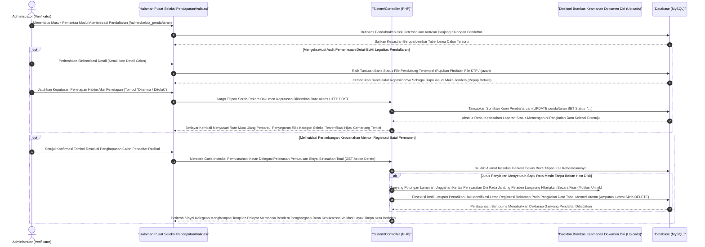

# Sequence Diagram: Verifikasi Pendaftaran (Admin Web FIKOM)

Diagram sekuensial ini mendokumentasikan serangkaian pergerakan alur teknis admin dalam melayani proses autentikasi penyaringan atau peresmian status calon pendaftar via modul Pendaftaran.

## Penjelasan Alur

Terbit dan tenggelamnya alur pendaftaran sivitas akademika bertumpu seutuhnya pada kesigapan administrator dalam mengemudikan instrumen "Kelola Pendaftaran". Ciri esensial yang membedakan perhelatan komputasi pada modul ini dibandingkan modul pangkalan data lainnya adalah ketiadaan pengunggahan borang inisiasi mandiri (*create*) dari sisi admin. Fiturnya justru dikhususkan guna merespons pendaftar yang membanjiri antrean (antarmuka berawal memanen tabel data sivitas calom pendaftar beserta rujukan kepemilikan laci sertifikat kelengkapan/ijazah milik mereka dari bilik *database MySQL*). Berdasarkan rekrutan tabel calon sivitas inilah administrator memulai titah verifikator menatap layar kompilasinya.

Penelusuran administrasi pengabsahan dikerahkan sembari sistem mengangkat detil pendaftaran dan memicu skrip untuk menarik representasi bukti dokumen pendaftar secara langsung (menampilkan *image preview / pdf window* layaknya KTP atau Ijazah dari ruang server peramban `uploads`). Dengan melintangnya rupa perbandingan pendaftaran ini, administrator secara legal menobatkan keputusannya atas status validasi pendaftar—apakah ditahbiskan dengan ganjaran penolakan atau penerimaan mutlak (`Diterima/Ditolak`). Sehelai status putusan pembaruan meluncur berbalut kendaraan permohonan `HTTP POST Update Status`. Lapis basis data lekas mengartikannya dengan mereformasi rekor kueri pembaruan (`UPDATE pendaftaran SET status=...`), lalu melecut peramban buat meregangkan napas kembali memajang posisi tabel yang baru terpoles hasil validasinya tanpa kealpaan.

Skenario radikal tetap dimungkinkan manakala daftar riwayat registrasi telah sesak tak terbendung atau dianggap sekadar fail usil iseng. Kendali aksi saklar Hapus (*delete flow*) membukakan rute pelenyapan bersih permanen bagi tumpukan berkas yang menjamur. Sama brutalnya dengan metode lain, sinyal penghangusan menyeret mesin agar sigap membumihanguskan setiap sisa lampiran identitas foto/dokumen personal si pendaftar dari *directory memory server* (*mengais* `unlink` ekstirpasi), silih menyambung memberangus pendaftaran rekam jejak itu hingga tercabut tak bernisan dari liang baris sistem memori MySQL. Perombakan radikal ini segera digenapi pemantul rilis pemberitahuan (*redirect screen*), menjamin kejernihan halaman tersisa demi kenyamanan validasi penantian rilis berikutnya.

## Diagram

