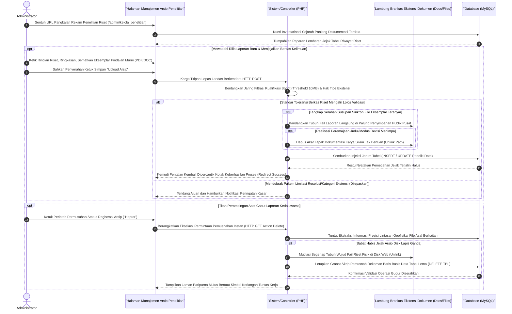

# Sequence Diagram: Kelola Data Penelitian (Admin Web FIKOM)

Diagram sekuensial ini merunut alur operasional komprehensif bagi prosedur pengarsipan rilis jurnal dan berkas laporan (*Research & Publication*) di dalam wadah modul Kelola Penelitian administrator pangkalan web Fakultas Ilmu Komputer.

## Penjelasan Alur

Manajemen perpustakaan riset jurnal pendidik berdiri sebagai pilar pertinggal riwayat keilmuan yang secara teknis mengusung alih wahana operasional pertukaran rupa fail berekstensi pelestarian utuh semacam pindaian *Portable Document Format* (PDF) maupun teks kompilasi (*DOC/DOCX*). Siklus pergerakan dimulai sederhana layaknya beranda administrator lain: sebuah ketukan pemanggilan sistem langsung memicu rentetan pembedahan arsip *database* demi menuai serapan tajuk, tanggal publikasi, beserta cantuman alamat dokumentasi hasil riset pengkaji terdahulu. Hadapan palka kontrol ini tak sekadar dijadikan etalase statis belaka melainkan juga ladang administratif menyusun dokumen yang mendesak untuk dibaptis, dipugar, atau sama sekali dikosongkan.

Bila kehendak penempatan tulisan baru mencuat, sistem memaksa si pangkal pengirim (admin) mengisikan sekelumit biografi riset seperti tajuk karangan ilmiah dan ikhtisar singkat abstrak, tidak luput menempatkan salinan aslinya di slot pemuatan lekat berkas (*upload panel*). Sepaket porsi informasi riset tersebut menunggangi roket perpindahan logis `HTTP POST`. Unit pos lalu mencegat dokumen. Lapis pemindai (*security filter checker*) menginterogasi keabsahan struktur muatannya—menakar pakem batas gundukan bobot (*limit quota size*) seraya menghalau muatan tipe yang bukan ditakdirkan selaku pedoman keilmuan sah (meloloskan fail kualifikasi dokumen murni saja). Andainya dokumen riset tersebut sah direngkuh, muatan peladen dengan sukarela membuka ruang kamar penyimpanan bagi fail bersangkutan demi mendiami area rak lumbung perpustakaan file statis web `/docs/penelitian`. Diiringi pendaratan aman tersebut, ikatan asinkron berlarut mengaitkan deskripsi abstrak dan rantai URL tujuannya selaku rekaman pertinggal baru menyongsong *database* relasional. 

Di simpang kebalikan, pemotongan eksistensi fail yang telah membusuk tak kalah krusial. Sistem dititahkan secara lisan (Lewat paramuka sirkuit pengawal berkode `Hapus`) membawa titah pencabutan berani. Tatkala alamat pemusnahan HTTP diketuk, pangkalan *server backend* mendelegasikan tugas dua cabang sekaligus: unit peladen mesin secara fisis menyerang wujud naskah dokumen lama guna diluluhlantakkan tak berbekas dari disk, silih berganti disusul tusukan kueri SQL dari *database* demi membabat bersih tapaknya dari tabel kepustakaan fakultas. Keampuhan alur penghapusan serempak nan brutal ini menghindarkan kepulauan wadah hosting aplikasi dari onggokan file usang misterius. Proses log komputasi dirangkai penyimpul status—layar ditolak mundur balik dan peramban mencuatkan bendera notifikasi yang menjamin ketenangan tugas penyunting. Administrator bahkan disediakan privilese opsional mencantum akses fitur ekstraksi (Unduh Dokumen) buat membedah dokumen pangkalan selayaknya pengunjung perpustakaan sungguhan.

## Diagram

