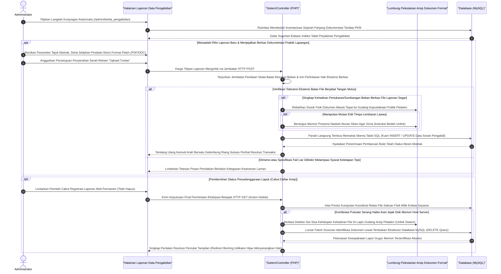

# Sequence Diagram: Kelola Data Pengabdian (Admin Web FIKOM)

Diagram sekuensial representatif ini membedah rancang arsitektur interaksi antarmuka administrasi di dalam peladen fakultas bilamana modul Pengabdian Kepada Masyarakat dikelolakan untuk sirkulasi pertukaran fail eksemplar laporannya (*PDF/DOCX*).

## Penjelasan Alur

Menyemai ladang rekaman histori civitas yang menjamah lapisan masyarakat merupakan urat nadi pengayom "Kelola Pengabdian". Secara teknikal, perwujudan diagram beralur (*sequence*) pada entitas operasi administrator ini berjalan setali tiga uang dengan sistem pustaka pengelolaan dokumen riset. Pada tahap persapaan pertama peladen, rute panggil bakal membongkar secara acak lalu merangkum baris rekam catatan pengabdian bermutu di pangkalan data yang memuat tak hanya entri tajuk pelaksanaan maupun pengurusnya, namun merangkum jejak tuju simpanan (*storage path*) salinan lampiran bukti sahnya pada sistem (layaknya dokumen PDF/DOC).

Fase menghembuskan nafas nyawa entitas pelaporan abdi masyarakt dikonstruksikan sedemikian rupa sewaktu admin merangkai ringkasan abstraksi berserta sisipan lampiran beban pindaian laporan di atas bidang pendaftaran isian. Komponen muatan ditenggelamkan menyusuri lalu-lintas ekspedisi permohonan siber `HTTP POST` tempat filter perisai pelindung beroperasi tangkas. Menyadari besarnya risiko penyerangan siber beralas arsip kotor, sistem mensyaratkan bobot file wajar seraya menghalang paksa segala jenis formatan ekstensil liar, semata meloloskan *MIME Type DOC* dan sejenisnya. Lolosnya kargo dokumen di muka gerbang penyaringan ini spontan menstimulus pemindah fail ke rahim penyimpanan publik *folder system*/lokasi khusus pendata. Tidak berlalu lama, titah pangkalan logik peladen beralih membaptis sandi tajuk isian ringkasan terintegrasikan bersama alamat sandi fail orisinil menuju laci *database* MySQL.

Perspektif keluwesan (*control flexibility*) pun dijahitkan apik saat admin memerintahkan titah pemusnahan rute (*action delete*) terhadap riwayat lapuk tanpa masa berlaku. Momen eksekutor mendelegasikan perintah pencabutan seketika dikanalisasi pangkalan *server backend* demi memecah skrip tugas menyasar dua sasaran beda: peladen mengkalkulasi koordinat lokasi naskah pengabdian kuno di rongga gudang sistem agar segera dibinasakan wujud *byte* failnya tanpa kompromi (*unlink manipulation*), kemudian menginstruksikan peladen penampung *database* mencoret habis baris keberadaannya. Kesisteman serba selaras dan brutal ini menggaransi kelestarian bobot *memory disk space host* peladen tetap lengang. Siklus serajin perampingan komputasi ini dengan rutin melingsirkan admin menatap layar segar paripurna berisi letupan notifikasi lunas sebagai perwujudan kepastian fungsional kerjanya yang terselesaikan absolut mumpuni.

## Diagram

