# Sequence Diagram: Pengaturan Sistem (Admin Web FIKOM)

Diagram sekuensial ini merunut alur arsitektur manajemen konfigurasi fundamental bagi administrator ketika merajut integrasi dasar aplikasi (seperti logo antarmuka sentral, konfigurasi laman statis, maupun struktur esensial identifikasi portal) di bilik tunggal modul Pengaturan/Statis.

## Penjelasan Alur

Dalam arsitektur *backend*, modul antarmuka Pengaturan lazimnya tak dirancang sebagai relasi penyekat data berjejaring panjang layaknya tabel *CRUD multi-record*; melainkan dikategorikan dalam trah sirkuit *Single Page Update* eksklusif. Bilamana pos perombakan tatanan laman (`kelola_pengaturan` atau padanan sistem *settings* laman) ditekan penelusuran administrator, peladen memanen langsung baris data rekam jejak identifikasi statis terpusat milik web itu sembari mendaratkannya di segenap bumbung kerangka kolom formulir administrator yang membentang (`input values`). Parameter bawaan itu merangkum narasi profil judul laman situs, alamat presisi gedung representasi letak geografis, susunan identitas pelaporan keluhan ke pos surel dan telepon, tak ayal mencadangkan keping pindaian ikon (*favicon*) atau logo kampus perlembagaan.

Pengabdian atas peremajaan identitas itu dituntaskan usai tangan admin meracik tulisan terbaru maupun menjajal mendirikan format baru lambang ikon portal yang tertaut di pengisian *upload attachment*. Persinyalan ganda pengekspresian sandi (*HTTPS POST config*) ditugaskan meretas batas gerbang memori PHP melampirkan titipan pembaharuan data pangkalan dan fail keping lampiran sekaligus. Seketika itulah mesin pengawas mendobrak masuk mendeteksi keberadaan galian fail fisis. Manakala penuangan lambang logo web diikutsertakan melawati seleksi limitasi beban proporsional berketentuan ketat, pos pergudangan berkas sistem menerima berkas suci itu beririsan mendelegasikan pemecahan bayangan identitas bekas logo lawas agar binasa tak merambah akar muatan disk peladen berlama-lama (`replace and unlink the old identity image`). 

Sirkus pelaksana transisi pengaturan usai ketika skrip mendesak *SQL Engine* menyelenggarakan injeksi perombakan lajur tunggal pada tabel sistem inti web (`UPDATE single Configuration Row Table`). Transaksi basis memori itu segera diikrarkan usai tanpa rintangan bermakna. Sirkulasi logika antarmuka melesat lewati rute pantulan kembali di area peramban memandu langkah admin meyakini rona logo terbaru pun tak lama mencetak kemegahan estetikanya selaras bertali kelengkapan notifikasi validasi berwarna segar hijau memukau pangkalan laman terpusat. 

## Diagram

```mermaid
sequenceDiagram
    autonumber
    actor Admin as Administrator (Pemegang Otoritas Utama Konfigurasi)
    participant View as "Antarmuka Modul Pengaturan Situs Inti"
    participant System as "Sistem/Controller Pengawal Batas (PHP)"
    participant Server as "Direktori Pelestarian Grafis Dasar Ekstensi Visual Web (Images/Assets)"
    participant DB as "Database Tersentralistik (MySQL)"

    Admin->>View: Mengorbitkan Layar Kendali Pangkalan Antarmuka Setelan Induk Konfigurasi Situs Penuai (/admin/kelola_pengaturan)
    View->>DB: Kueri Inventarisasi Sejarah Panjang Identitas Sentral Profil Inti Pendataan Web (Load Config Record)
    DB-->>View: Gelar Suguhan Etalase Indeks Seluruh Deretan Sel Teks Tersortir Identitas Portal Laman
    
    %% Proses Peremajaan Pemutakhiran Database Tunggal
    opt Meregistrasikan Rilis Peremajaan Penyesuaian Komposisi Atribut Modul Pengaturan Induk Aplikasi
        Admin->>View: Modifikasi Pengisian Bawaan Judul Web, Email Rujukan, Deskripsi Profil Singkat, & Susupkan Beban Gambar Lampiran Wujud (Logo Situs Baru/Favicon)
        Admin->>View: Tancapkan Eksekusi Menyerahkan Persetujuan Kepemilikan Putusan Pengikatan Pembaruan Aksi Terus Terang ("Simpan Konfigurasi")
        View->>System: Kargo Meluncur pada Rel Kecepatan Sinkron Sandiwara Ekspedisi Bertopeng Pengemasan (HTTP POST Transaksi Sentral)

        System->>System: Menakar Bobot Standar Kelegalan Toleransi Muatan Fisis Dimensi Gambar Sesuai Ketepatan Syarat (Filter Validation)
        
        alt Restu Filter Taraf Proporsional Melayang Sempurna Keadaan (Mulus Syarat Penuh)
            opt Bilamana Hadir Tangkapan Pelampiran File Sosok Sisipan Tipe Visual Berwujud (Identifikasi Logo Utama Anyar)
                System->>Server: Semayamkan Representasional Beban Baru Lampiran Eksemplar Masuk Pada Kolong Direktori Pusat (Setel Mengganti Replace Overwrite)
                System->>Server: Bersihkan Seluruh Ruang Residu Dokumen Bayangan Logo Silam Tak Bertuan Supaya Sirna Memori Disk (Singkirkan Menusuk Unlink Penghancur)
            end
            
            System->>DB: Lontarkan Perusak Entitas Tunggal Kueri (Injeksi UPDATE Tabel Parameter Setelan Sentralistik Inti Lema)
            DB-->>System: Labeli Kesepakatan Serah-Terima Kepustakaan Integrasi Rekam Identitas Mematuhi Pelaporan Rampung Sejati
            System-->>View: Pemantul Kilat Pentalan Kembali Rapi Ke Laman Utama Beriring Pelontaran Pengumuman Hijau Cemerlang Pembaruan
        else Spesifikasi Dimensi Atau Formatan Berkas Diintai Menyelinap Menantang Limitasi Resolusi Ambang Kepercayaan
            System-->>View: Pelintir Sisi Kendali Memutar Rute Kembali Menghantarkan Tangkisan Cacat Perihal Eror Pemberitahuan Ketidaksesuaian Visual Memerah 
        end
    end
```

