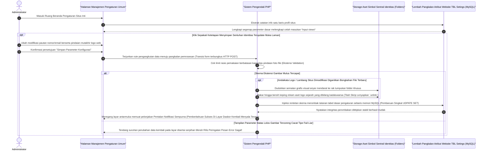

# Sequence Diagram: Pengaturan Sistem (Admin Web FIKOM)

Diagram sekuensial ini menjelaskan tahapan yang memandu pengoperasian ringkas halaman "Pengaturan", yang berfungsi mengurus rincian logo sampai judul fundamental Web FIKOM.

## Penjelasan Alur

Hal yang mengkhususkan fungsionalitas laman ini ketimbang tabel rekam jejak lain; pencatatan setingannya berada di *database* hanya diwakili sebaris rekam informasi inti (*Single configuration record*):

1. **Pemanggilan Laman Pengaturan**: 
   Sesaat admin mengetuk panel "Pengaturan Sistem", kueri sistem mengangkat satu *record* identitas pokok situs di pangkalan data. Pengisian tersebut akan merangkai formulir bawaan meliputi *Judul Situs*, Nomor Telpon Humas, sampai Email dan tersaji langsung menempati kolom isian layar.

2. **Perubahan & Klik Pembaruan Sinkron**:
   - Jika admin berniat memugar isian teks tersebut maupun mengganti lambang visual portal *Logo Favicon Web*, Admin bebas menghapus kolom isiannya lalu dikokohkan bersamaan ketukan simpan **Perbarui**.
   - Kiriman form ini dilimpahkan merapat menuju pos skrip pengaman pangkalan sistem (PHP).
   - Diandaikan pergantian simbol grafis/gambar dimanfaatkan melintasi toleransi ukuran batas memori berwewenang (*Batas megabyte max*). Mesin PHP secara halus memboyong logo anyar dan membanting posisi ke dalam saku penyimpanan lokasi file aset publik (*uploads atau img source*).
   - Bersamaan itu, rutinitas pengakhir menghanguskan dan menyapu foto logo pendahulunya ke arah tiada tersisa demi meringankan penumpukan data teronggok di sela penyimpanan *Server*.
   - Rangka logik kemudian menembuskan keping baris kueri bertingkat memutakhiran *SET UPDATE config* pada lapis saksi mata tabel pengaturan. Kesempurnaan putaran diakhiri memuat ulang laman admin di mana pemberitahuan segar ditimpakan ke sisi kanan atas layar: Sukses modifikasi!

## Diagram

