# Sequence Diagram: Pengaturan Sistem (Admin Web FIKOM)

Diagram sekuensial ini mendeskripsikan kerangka tahapan operasional secara praktis pada laman Pengaturan yang menaungi sentralisasi rincian logo sampai fundamental judul Web FIKOM.

## Penjelasan Alur

Keunikan dan kesederhanaan laman setelan terpusat dibanding tata kelola perekaman lazim lainnya mendiami prinsip pendaftarannya; rilis identitas institusi cuma diawetkan menempati singgasana sebaris lema konfigurasi inti tunggal di pangkalan data yang dilarang membentuk tumpukan riwayat. Prosesnya bermula manakala jari telunjuk admin diayunkan melibas tuas beranda instrumen opsi pengaturan rute utama web. Sistem peramban beranjak mengait seutas tembakan kueri pencarian MySQL yang segera mengangkut letak persembunyian catatan absolut satu setel parameter basis profil intitusi tersebut (meliputi Nama Situs Resmi Kampus, Nomor Pengaduan Induk Humas, kaitan e-mail sentral dan muatan sisa atribut lainnya). Tanpa ada tunda waktu, segala keping rekam parameter nilai riwayat termutakhir ditancapkan dan disebarkan seutuhnya menduduk paksa seluruh luasan isian kerangka form pendaftaran yang terpampangkan di bilik muka kontrol admin.

Transisi perombakan tatanannya direstuhi seketika admin mengubah sekelumit tulisan deskripsi ringkasnya atau menuntut penukaran wajah pelengkap portal secara fundamental dengan menyeret unggahan serpihan grafik Lambang Favicon atau aset Gambar Logo Utama situs ke rahang borang unggahan lampiran. Peresmian kepastian modifikasi lalu dilakukan dengan sentuhan jari menyenggol panel tindakan penukaran berkas mutlak **Perbarui dan Simpan**. Untaian pertukaran tatanan rincian konfigurasi peramban diluncurkan berselimut paket *HTTP POST* menabrak rintangan tembok jagaan pertama mesin filter pemeriksa *backend* pangkalan skrip pelindung server komputasi. 

Pada skenario khusus perbaikan diiringi pertukaran panji logo institusi situs, PHP bertugas menerawang kejujuran ekstensi dimensi spesifikasi limit penampungnya dengan seksama. Bersaman beranjaknya lolosan pengecekan valid format visual murni, mesin pengatur letak tak segan-segan menjebloskan tatanan logo anyar menyeret masuk mendirikan tempat bersemayam permanen ke ruang brankas aset gambar umum di peladen penyimpanan fisis internal. Di sisi pertukaran penggusuran letak, baris logik perampas mengambil kuasa untuk melenyapkan foto aset panji sejarah situs silam membedah letaknya dengan instrumen amuk pemusnahan (*Unlink Physical Object*), merelakan kebersihannya lenyap disapu debu dari piringan ruang *server disk memory* supaya sisa bebannya tak memperlambat operasional pangkalan hosting di masa depan. Selaras tergelarnya pembaharuan rupa logo aslinya, lajur kueri pemutakhiran mesin peladen di baris skema setelan terpusat disulut ledakannya (*Injeksi pembaruan UDPATE Parameter Table Settings*) agar mengubah memori MySQL berpadu. Akhir eksekusinya dipercantik kepastian menguatkan rotasi arah komputasi pemutar muat-ulang antarmuka laman admin yang dikelir warnai peringatan gemerlap berbunyi kebahagiaan Notifikasi Rampung Modifikasi Tersertifikasi Sukses Disimpan.

## Diagram

```mermaid
sequenceDiagram
    autonumber
    actor Admin as Biro Kepercayaan Pengatur Konfigurasi Setelan Laman
    participant View as "Antarmuka Lembar Pusat Manajemen Pengaturan Setelan Singel Muka Web"
    participant System as "Sistem Inteligensia Kontrol Pemutus (PHP Backend Rute)"
    participant Server as "Direktori Brankas Keamanan Pelestarian Aset Visual Laman Fisik Inti (Logo/Favicon Folder Storage)"
    participant DB as "Lembah Parameter Identifikasi Kueri Setelan (Seting TBL Induk Tunggal MySQL)"

    Admin->>View: Lancarkan pijakan mengetuk pilihan navigasi Setelan Pengaturan Situs Inti Beranda
    View->>DB: Ekstrak sel catatan terdata khusus satu lumbung sejarah kueri identitas pangkalan penamaan
    DB-->>View: Sebar luaskan sisa jejak pendataan rekam ke penjuru kompartemen celah antarmuka pengisian borang administrator

    %% Proses Pembaruan Skema Modifikasi Rekam Tunggal Parameter Profil 
    opt Restu Mengunci Pembaharuan Kepastian Aksi Putusan Pertukaran Wujud Visual Penampakan Situs Depan 
        Admin->>View: Rombak nilai modifikasi kelengkapan narasi atau lekatkan bongkahan beban lampiran Logo visual baru berkualifikasi Jpg/Png unggulan
        Admin->>View: Pungkasi putusan mantap tekan persetujuan penyegelan tindakan form "Simpan Perbaikan/Pembaruan"
        View->>System: Kargo eksekusi meluncur lewati penyebrangan pengangkutan melintas kencang rute tertutup bersendi pengiriman HTTP POST Data

        System->>System: Bentangkan jejaring deteksi sensor seleksi pembatas toleransi ambang resolusi kualitas tipe beban aset lampiran file muka pendatang baru
        
        alt Skema Validasi Bukti Standarisasi Ambang Format Spesifikasi Memuaskan Mengkilap Sehat Merata Valid 
            opt Andaikata Berkas Titipan Pengiriman Terbukti Mewujudkan Pengaduan Tumpukan Lampiran Fisik Representatif Anyar 
                System->>Server: Sematkan pelesat pindaian visual mendarat di laci kekuasaan pangkalan mapan ruang perlindungan khusus
                System->>Server: Kuras riwayat akar keberadaan memori foto pajangan perhiasan sejarah laman terdahulu menghantam penghancuran ekstirpasi meluluhlantakkan wujud disk murni seratus persen lewat instruksi musnah (Unlink Action Trigger)
            end
            
            System->>DB: Eksekusi beriring rentetan pertukaran nilai isian skema sebaris tabel meramubaurkan integrasi memori baru database (Skrip Letup Kueri UPDATE Parameter Settings Valid)
            DB-->>System: Nyatakan persetujuan modifikasi parameter berhasil menduduki bangku tatanan singgasana terlegitimasi mapan dan kukuh terekam utuh
            System-->>View: Kemudi penyegar rotasi menendang menguatkan layar pentalan penampakan mengorbit diiring kemilau rilis Peringatan Riang Notifikasi Kotak Bersepuhkan Emas Merayakan Pembaharuan Rilis Sempurna Parameter 
        else Pelanggaran Parameter Memaksa Mendobrak Pakem Lapis Spesifikasi Format Dimensi Cacat Tak Semestinya Ilegal  
            System-->>View: Batalkan suruhan perombakan kemajuan peramban dipelintir seketika berselimut amukan merah kemunculan Percikan Pop Up Error Berpesan Terhenti Teguh Tanpa Kompromi Tanda Gagal Total File Tersingkir 
        end
    end
```

