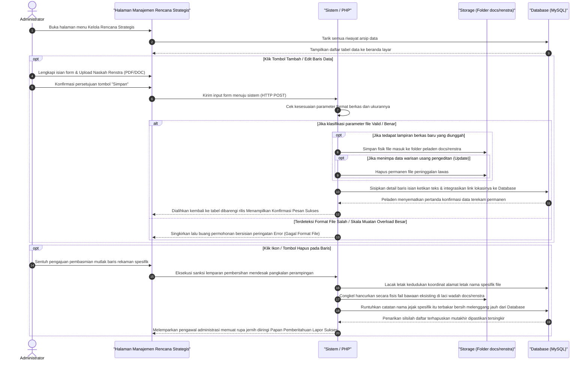

# Sequence Diagram: Kelola Rencana Strategis (Admin Web FIKOM)

Diagram sekuensial ini merunut alur operasional komprehensif bagi modul administrator ketika mereka menyelenggarakan perbaikan basis data secara praktis seputar pengelolaan rencana strategis.

## Penjelasan Alur

Proses dimulai ketika admin membuka menu Kelola Rencana Strategis. Begitu halaman diakses, sistem secara otomatis menarik seluruh riwayat data rencana strategis yang tersimpan di dalam *Database* MySQL untuk langsung disajikan ke layar admin dalam wujud susunan tabel yang rapi. Muka tampilan awal ini berfungsi sebagai pusat pantauan beranda sebelum admin memutuskan tindakan kontrol selanjutnya terhadap himpunan pangkalan data.

Apabila admin membutuhkan penambahan data baru atau perbaikan data masa lalu, mereka dapat beralih menekan tombol ikonis **Tambah** atau **Edit**. Tindakan dorongan ini akan memunculkan sebuah bentangan formulir tempat admin bisa mengetikkan sasaran kebijakan Tahun Periode dan Visi Renstra, serta dipersilakan melampirkan berkas fisik berupa Naskah Renstra (PDF/DOC). Usai admin menekan tombol **Simpan**, peramban web akan memaketkan susunan input data tersebut dan mengirimkannya ke lintasan sistem pengendali di sisi mesin (PHP). Secara sigap, sistem peladen lalu mendeteksi apakah ukuran file dan format ekstensinya memenuhi takaran standar persyaratan aman. Jika muatan berkas tersebut difilter valid melewati ambang toleransi sistem, mesin seketika akan menyandarkan fisik file yang tervalidasi tersebut ke dalam laci penyimpanan wadah server (`/docs/renstra`). Terkhusus pada rutinitas skenario **Edit**, pangkalan sistem dibekali kepintaran untuk langsung mengeruk dan menenggelamkan file rekaman lawas bawaan lama milik data tersebut ke jurang pemusnahan (`unlink action`), mendisiplinkan agar sumur memori penyimpanan peladen tidak gampang tumpah. Sesaat sehabis menuntaskan titipan berkas barunya di dalam perut memori penyimpanan, susunan kerangka input ketikan tulisan admin tadi diintegrasikan mengikat pada jalinan jejak rujukan file, disuntik menembus *Database* secara terekam permanen. Akhir dari pergumulan antarmuka data tersebut membawa pengguna bergulir kembali menatap rilis tabel utuh lewat muatan rotasi ulang halaman (tehnik pentalan *redirect*), lazimnya disuguhi dengan manis berupa pemberitahuan lencana warna-warni tanda keberhasilan proses perekaman baru.

Di sisi kebalikannya, mekanisme ketertiban kebersihan lingkungan rekaman riwayat tetap dijaga setajam kilat dengan kehadiran tombol menu **Hapus**. Bilamana admin menyepakati tekanan tuas tombol hapus di atas letak salah satu baris pendaftaran tertentu, sistem tak menunda sedetikpun memusatkan komputasi lacakannya pada pencarian rujukan nama sandi Naskah Renstra (PDF/DOC) dari file titipannya. Begitu presisi namanya terkuak, fail salinan fisik tersebut murni dicongkel lepas dan dieksekutor musnah seratus persen dari ruang penampung server penyimpanan (`/docs/renstra`). Selepas komputasi meyakini tidak berwujudnya sisa-sisa jejak fail kotor di *server storage*, runtutan penyerbuan perusak menerpa barisan data relasinya di dalam *Database*, membinasakan bersih memori deret angka dan urutan yang memuat catatan rekaman itu tanpa ampunan (terbakar baris *query delete* tiada jejak). Rangkaian skema operasi perampingan diakhiri mutlak menyertakan kembalinya rotasi layar antarmuka yang menghempaskan administrator memandang tatanan kelola tabel yang telah diubah menjadi ringkas tanpa mengusung jejak baris usang tersingkirkan tadi, tidak absen sembari mengantar konfirmasi seruan lapor sukses yang terselesaikan secara mulia.

## Diagram

