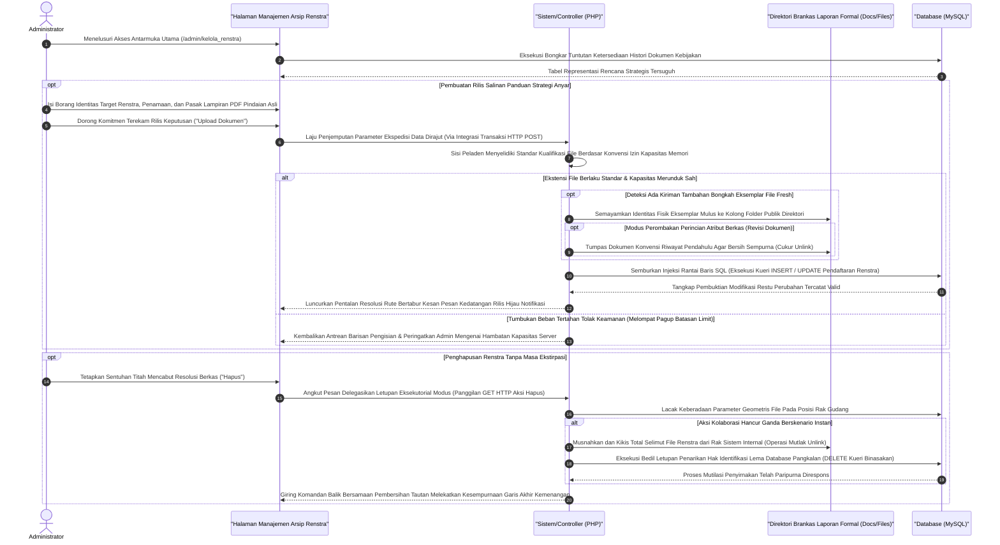

# Sequence Diagram: Kelola Rencana Strategis (Admin Web FIKOM)

Diagram sekuensial ini memetakan garis interaksi antara administrator dan sistem khusus untuk penanganan modul Kelola Renstra (Rencana Strategis) dan pemetaan arah kebijakan dokumenter.

## Penjelasan Alur

Lapis tatanan Rencana Strategis (Renstra) fakultas dipilah dan direkam dengan presisi ke dalam etalase publik melalui kompartemen administrasi khusus "Kelola Renstra". Ketika modul dokumenter kepengurusan fakultas ini dipanggil dari tidur lelap pangkalan data, antarmuka segera melaporkan sajian indeks berkas pedoman Renstra tahun-tahun periode pengabdian akademis yang berhasil digali MySQL. Di papan pergerakan arus komputasi inilah administrator berkuasa menarik penambahan berkas baru (eksemplar resolusi rancangan baru di tahun ajaran berikutnya), memperbaiki cetakan revisi minor, atau melucuti eksistensi naskah kadaluwarsa. 

Setiap peluncuran rencana kemajuan periode yang mengudara senantiasa menaiki moda rute siber aman (`HTTP POST`). Sang administrator perlu menyematkan atribut perihal dokumen panduan strateginya dengan cermat, diikuti pendaratan salinan naskah asli PDF yang mengikat di dalam kolom panel pendaftar borang. Skrip penerjemah PHP lantas tidak serta merta membukakan brankas fasilitas *hosting*; muatan itu dihakimi demi kewajaran memori, lolosnya ekstensi tak diundang yang bisa berujung fatal, lalu menurunkannya mulus sesudah validasi tipe (*mime type*) terpenuhi. Ketika potret dokumen Renstra ini mendarat seutuhnya di pangkuan rak khusus direktori `/docs`, mesin peladen seketika meracik pelumas kueri basis data untuk merutekan (*insert relational query*) alamat tautan file tersebut bersanding erat ke lembar pendaftaran deskripsinya di relung tabel MySQL. 

Pemotongan wujud rilis tahunan pun menganut siklus bersih sempurna tanpa peninggalan artefak berkarat. Administrasi yang menginstruksikan pelemparan pembasmian (`action_delete` di pucuk URL `HTTP GET`), tidak hanya melepaskan letupan pemusnahan basis pengarsipan lajur (*table log data*). Melampaui hal tersebut, rute letusan menyelaraskan koordinat pembedah arsip server guna memberangus paksa eksistensi pindaian fail Renstra masa lampau (`unlink procedure`) menyatu binasa. Kesinambungan sirkulasi logis tersebut kemudian berbalik tenang menayangkan penyumbangan *redirect* menuju ruang indeks mutakhir seraya membawa konfirmasi visual perombakan pangkalan data berhasil terkonsolidasi rapi.

## Diagram

