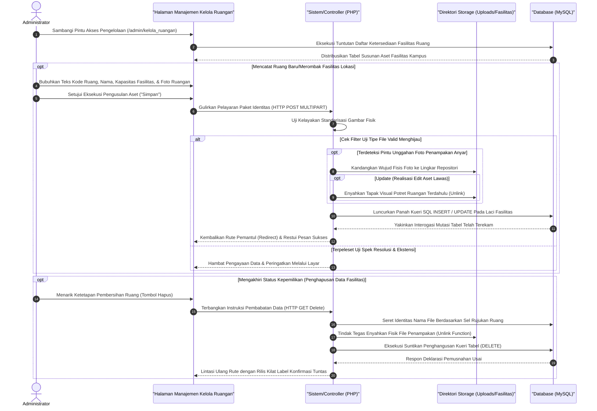

# Sequence Diagram: Kelola Fasilitas Ruangan (Admin Web FIKOM)

Diagram sekuensial ini menerangkan rangkaian prosedur penanganan alur interaksi (*CRUD*) pada antarmuka administrator dalam manajemen tata letak sarana fasilitas dan ruang sivitas pada kawasan kampus (Kelola Ruangan).

## Penjelasan Alur

Runtutan prosesual dalam narasi ini mendasar atas arsitektur pergerakan data modul Kelola Ruangan (dan/atau Laboratorium). Modul antarmuka ini didedikasikan agar fungsionaris kampus/administrator secara presisi dapat mencatatkan ketersediaan tempat bernaung akademik beserat inventaris di dalamnya. Kala pertama penelusuran masuk halaman, skrip internal langsung menarik rentetan deret tabel yang merangkum ketersediaan wujud fasilitas ruang belajar/lab dari lorong pangkalan data (*database* MySQL). Pengelolaan lantas bertumpu kepada rangkaian pembaruan fana: pendaftaran bangsal ruangan baru, rekontruksi parameter kapabilitas eksisting, hingga perombakan yang diinisiasi pemusnahan aset ruang tak terpakai dari memori sistem.

Di persimpangan tata operasional, tatkala seorang administrator beriktikad meresmikan suatu letak ruang kampus untuk dipampang di etalase masyarakat, skema pengisian form pun dilemparkan. Pada ruas borang itu, admin mematri parameter identitas ruang—seperti singkatan Kode Ruangan, Nama Ruang representatif, kuantitas batasan kapasitas, serta rentetan sarana (*facilities*). Selembar berkas lampung potret penampakan visual ruang pun disematkan bersamaan. Kompilasi nilai masukan dirapat lalu dikapalkan menuju skrip ujung palung peladen (*backend controller*) bernavigasi lintasan `HTTP POST`. Unit sistem utama tersebut lalu mencegat keberadaan kepingan foto untuk mengevaluasi batasan kelayakannya: menyaring dimensi ekstrem serta ekstensi siluman yang tak kompatibel. Terpenuhinya tes ambang minimal itu akan membukakan karpet merah agar peladen fisik menyimpan rupa foto masuk mengisi lumbung gambar (*upload array directory*). Beriringan mulus dengan kepastian repositori file, unit pusat menggaungkan bahasa pemrograman *query base* (sekelas `INSERT/UPDATE`) agar mesin penabung MySQL tak terlewat mencatatkan sandi teks dan indeks rujukan nama rupa foto ke baris susunan tabel fasilitas tersebut.

Mekanisme bongkar-pasang (Update mutasi file) beserta keabsahan eksekusi bedah tuntas (*Delete record*) tidak luput berjalan beruntun dengan tertib. Skrip penata ini menjanjikan operasi bahwa pengakuan hadirnya lampiran citra baru (*upload ganti foto ruangan*) otomatis mewajibkan mesin komputasi untuk mengebiri rupa foto ruangan purba dan membunuh eksistensinya (*unlink function*). Perlakuan identik diulang saat fitur hapus permanen ditarik menggunakan tombol penghancur eksekusi URL (`GET action Delete`). Seluruh keberadaan entitas saksi yang mendiami pangkalan data dicabut dan artefak filenya dibabat bersih tanpa ampun dari lapis ruang mesin instalasi peladen. Paragraf alur transisi ini selalu diselipi kelegaan tatkala fungsional mengantarkan isyarat keberhasilan—meredirect admin menuju susunan indeks anyar ditandai munculnya pop-up notifikasi tuntas warna kesuksesan di latar depannya.

## Diagram

