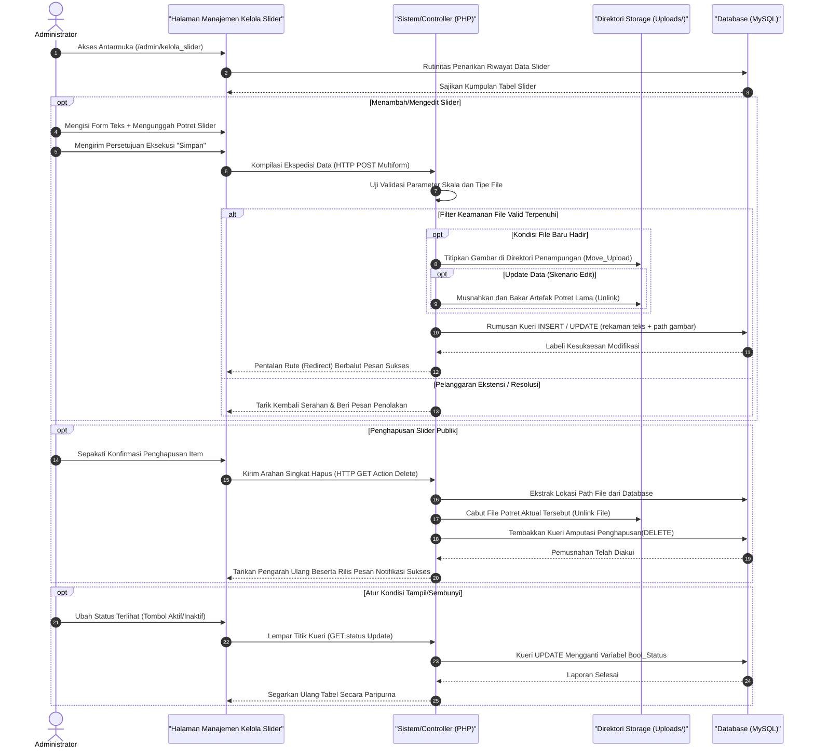

# Sequence Diagram: Kelola Slider (Admin Web FIKOM)

Diagram sekuensial ini merunut jalur interaksi teknis untuk keseluruhan skenario *Create, Read, Update,* dan *Delete* (CRUD) pada modul pengelola *slider* beranda.

## Penjelasan Alur

Diagram sekuensial ini merunut alur operasional komprehensif dari modul Kelola Slider pada antarmuka administrator, yang menaungi proses manipulasi dinamis panel spanduk (sorotan bergerak) di beranda utama Web FIKOM. Pada fase inisiasi ketika skrip muatan muka pertama kali dibaca, sistem lekas menyusun dan membentangkan riwayat matriks tabel tata letak grafis *slider* yang isinya telah ditarik seketika dari ruang simpan tabel pangkalan data (MySQL). Rentang interaksi perombakan panel tersebut dikelompokkan ke dalam empat siklus fundamental; meliputi operasi Penambahan (Tambah Gambar), Penyesuaian Dokumen (Edit), Manipulasi Akses Status (Aktif/Tidak Aktif), serta perintah radikal Penghapusan.

Tatkala sang admin berniat mengunggah *slider* murni yang baru—ataupun memugar potret lama pada entitas yang sudah eksis—peramban web akan menghimpun serangkaian teks tajuk, uraian singkat, beserta pecahan ekstensi *file* gambar yang terpilih, lantas menumpangkannya di atas rel pengiriman lalu-lintas bersandi `HTTP POST`. Lapis kendali internal pemroses peladen kemudian menyeleksi pengajuan ini dengan melaksanakan validasi ketat, guna menjamin muatan tak melanggar ketentuan resolusi dan hanya memercayai jenis arsip grafis yang diizinkan sistem. Sekiranya jaring filter tersebut dilampaui mulus, sistem serentak mengarahkan mesin repositori penyimpanan (*storage server*) buat menginapkan berkas digital orisinal itu merasuk ke dalam relung *folder upload* web. Segaris dengan pencapaian presisi relokasi *file* itu, jembatan pengendali sejenak berkoordinasi secara asinkron dengan mesin MySQL guna membukukan rincian teks berserta alamat pemanggilan *file* anyar pada hamparan lajur tabel yang relevan (*Insert/Update Query*).

Pola siklus bertolak belakang terjadi sewaktu administrator menekan tombol eliminasi (Hapus). Instruksi pencabutan tersebut diluncurkan instan memakai mode pemanggilan *request URL* (*HTTP GET*). Merespons hal itu, peladen lekas melenyapkan tapak *file* gambar fisik dari relung memori peladen (layaknya fungsi pisau bedah *unlink*), dikuti operasi amputasi langsung yang menggugurkan keabsahan sel *record* berkas identitasnya dari skema *database*. Begitu pula untuk *switch* status penampilan, sistem hanya menukar variabel visibilitasnya (*toggle activate*). Di paruh penghujung seluruh transisi keberhasilan tata letak ini, rutinitas algoritma bakal diakhiri lewat pengarahan paksa sirkulit visual halaman pendamping (*redirect*), menayangkan gelembung kilasan notifikasi sukses sembari secara bersamaan meregang perbarui ulang deretan tabel *slider* di hadapan layar administrator. 

## Diagram

