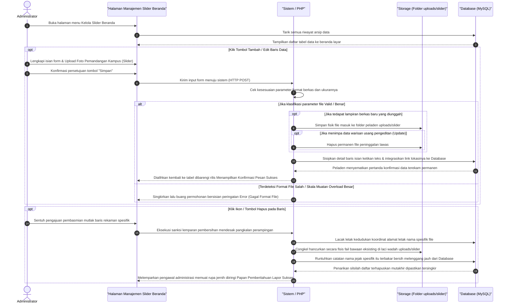

# Sequence Diagram: Kelola Slider Beranda (Admin Web FIKOM)

Diagram sekuensial ini memvisualisasikan langkah-langkah praktis pada sistem ketika Admin mengelola data slider beranda.

## Penjelasan Alur

Proses dimulai ketika admin membuka menu Kelola Slider Beranda. Begitu halaman diakses, sistem secara otomatis menarik seluruh riwayat data slider yang tersimpan di dalam *Database* MySQL untuk langsung disajikan ke layar admin dalam wujud tabel yang rapi. Tampilan awal ini berfungsi sebagai pantauan sebelum admin memutuskan tindakan selanjutnya.

Apabila admin membutuhkan penambahan data baru atau perbaikan data lama, mereka dapat menekan tombol **Tambah** atau **Edit**. Tindakan ini akan memunculkan sebuah formulir tempat admin bisa mengetikkan kemasan visual Teks Judul Utama dan Subjudul Pendek serta melampirkan Foto Pemandangan Kampus (Slider). Usai admin menekan tombol **Simpan**, peramban akan memaketkan data-data tersebut dan mengirimkannya ke sistem pengendali (PHP). Secara sigap, sistem lalu memeriksa apakah ukuran file dan format ekstensinya memenuhi standar keamanan. Jika wujud berkas tersebut difilter valid, mesin akan seketika menyimpan fisik file tersebut di dalam keranjang penyimpanan server (`/uploads/slider`). Khusus pada skenario **Edit**, pangkalan sistem akan langsung memberangus file foto lawas bawaan data tersebut agar memori penyimpanan tidak terbebani. Tepat saat fisik berkas dikamarkan dengan aman, teks ketikan admin beserta rujukan penamaan file tadi akan dijahit secara permanen ke dalam *Database*. Pengguna lantas digiring kembali menatap tabel utama lewat muatan ulang halaman (*refresh*) disuguhi pemberitahuan berwarna penanda keberhasilan proses simpan.

Di sisi lain, mekanisme kebersihan lingkungan data dijaga dengan ketersediaan tombol **Hapus**. Bilamana admin memutus letikan ikon hapus pada salah satu baris, sistem segera memusatkan pelacakan ke arah rujukan fisik nama file tipipannya. Fail fisis tersebut dicongkel keluar dan dimusnahkan dari server (`/uploads/slider`). Setelah meyakini ketiadaan fail, rentetan aksi perusak di *Database* bergerak melenyapkan barisan rekaman jejak catatan itu seutuhnya. Rangkaian perampingan usai seturut kembalinya putaran rotasi layar antarmuka memaparkan tabel yang telah terbebas dari baris data buangan tersebut diiringi pesan konfirmasi sukses terhapusnya data.

## Diagram
