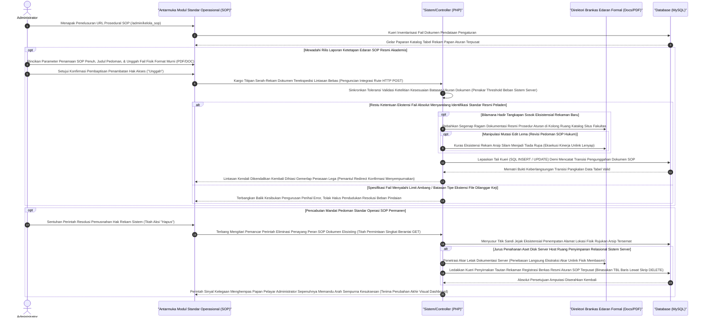

# Sequence Diagram: Kelola Standar Operasional Prosedur / SOP (Admin Web FIKOM)

Diagram sekuensial ini dipersembahkan guna mendeskripsikan secara mendetail tata kelola mekanisme pengunggahan dokumen formal Standar Operasional Prosedur (SOP) di kanal pengurus aplikasi (administrator). 

## Penjelasan Alur

Menyemarakkan kesarjanaan struktural dan tata kelola berorientasi akuntabilitas fakultas disandarkan mutlak pada akses penyaluran pustaka SOP berkualitas di bilik khusus "Kelola SOP". Proses serba dinamis ini diembuskan kencang begitu modulnya terpanggil menyambar kueri permintaan daftar dokumen eksisting dari jajaran memori *database MySQL*. Dari pijakan penyampaian inilah administrator didapuk sebagai hulu pertanggungjawaban buat mengeksekusi pemasukan instrumen aturan termutakhir, mencadangkan lembar revisi di atas dokumen regulasi konvensional, maupun menebas riwayat fail yang sudah membusuk ditarik wewenangnya. 

Sebagai wujud sirkulasi transisi rilis formal, pencatatan berkas SOP selalu mengharuskan perwujudan deskripsi pedoman, dikalibrasikan bersama tempelan orisinalitas dalam balutan berkas *document-basis* (berformat murni PDF atau DOCX). Terbukanya pintu keran unggul serangkaian data tersebut difasilitasi penuh melintasi parameter sinyal sandi komputasional berbalut identitas logis `HTTP POST`. Lapis gerbang pelindung internal sistem (PHP basis) mencegat sejenak kedatangan tamu lampiran berkas guna menghunjam filter deteksi uji tipe *mime format* serta menyensor batas kewajarannya melampaui ukuran ruang toleransi beban peladen maksimal. Begitu pindaian berkas membuktikan kesucian spesifikasinya, perwujudan file itu lantas dibawa rebah menyatu ke dalam asuhan *directory space records*. Menandakan sah diterimanya pedoman struktural SOP ke hadapan warga kampus ini, untaian SQL relasional dirapal buat melabel identitas nama aturan serentak memasang posisi lokasi rujukan filenya (`peta penyimpanan URL`) seirama ke rongga gudang *MySQL*. 

Prinsip perampingan memori eklektif tak kunjung luput diperhitungkan saat tombol Pemusnahan/Aksi Hapus diaktivasi secara masif. Berbalut tembakan memori peretas (*HTTP GET Delete*), pos peladen mengartikulasikan manuver tembakan dwiganda mematikan: sasaran perdana diluncurkan langsung kepada akar serabut nama fail yang direngkuh, menjarah dan membedahnya hancur menyublim dalam ketiadaan memori disk (`using unlink procedure`); pelampiasan target penutupan dititahkan di atas jembatan MySQL menggunakan rentetan sabda perusak tatanan lema `DELETE FROM`. Perjuangan sengit algoritma penyirnakan dokumen kelasa pengikat hukum prosedural itu diakhiri meriah lewati pengembalian kilat peramban admin (*redirect to table list*) berselimut warna gembira keberhasilan tanpa secuilpun komplikasi tersisa. 

## Diagram

