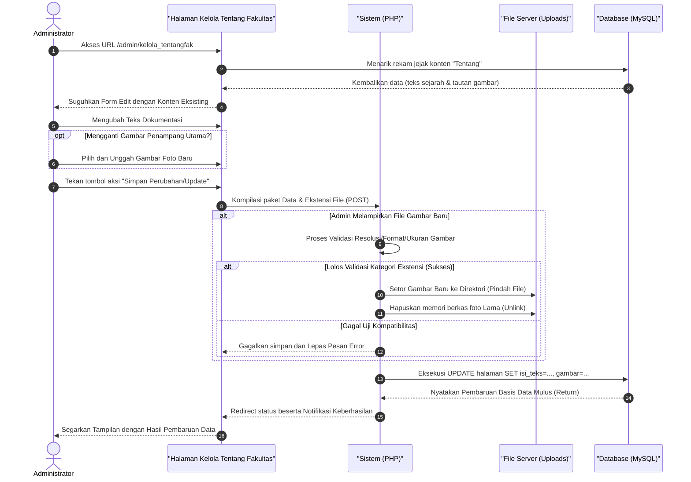

# Sequence Diagram: Kelola Tentang Fakultas (Admin Web FIKOM)

Diagram sekuensial ini memvisualisasikan alur sistem pada saat seorang administrator mengubah, menambah, atau menyesuaikan perincian sejarah dan deskripsi profil di fitur Kelola Tentang Fakultas.

## Penjelasan Alur

Diagram sekuensial berikut ini memaparkan alur operasional bagi administrator tatkala memperbarui informasi sejarah maupun deskripsi statis kampus pada modul Administrator "Kelola Tentang Fakultas". Alur pergerakan diinisiasi ketika administrator meninjau halaman antarmuka formulir pembaruan. Sesaat ketika modul ini dipanggil, sistem secara mutlak akan merengkuh arsip data deskripsi serta rekam jejak gambar yang ada dalam pangkalan data (MySQL) terlebih dahulu. Tujuannya adalah agar admin dapat menyaksikan teks konten yang sedang dipublikasikan saat ini mengisi (*pre-fill*) kotak-kotak formulir di layarnya.

Setelah admin mencurahkan gagasan perubahan untuk teks dokumentasi dan menimbang-nimbang berkas lampiran gambar jika dirasa perlu diubah, peramban klien akan mengemas seluruh pengajuan formulir utuh tersebut. Transaksi pengajuan dokumen, termasuk pelekatan gambar digital apabila ada yang diikutsertakan, dikirim lekat melalui alur jaringan lalu-lintas `HTTP POST`. Sesampainya di tangan peladen utama aplikasi (PHP), pemeriksaan perombakan diurai dengan saksama. Perhatian algoritma sistem dikhususkan pada skenario manakala administrator menitipkan gambar pembaruan. Apabila skenario ini terjadi, mesin bertugas untuk memvalidasi bobot serta format aman dari fotonya; seumpama gambar tersebut sah untuk dipajang, sistem dengan segera menyimpan potret unggahan baru tersebut berdampingan selagi membakar (*unlink*) artefak *file* gambar yang usang dari dalam gudang lokal penyimpanan instalasi peladen (*storage server*). 

Usai serangkaian pengecekan berkas tertunaikan secara utuh tanpa melahirkan interupsi atau pesan penolakan (*error validation*), barulah pos komunikasi ke pihak *database* digetarkan asinkron untuk mencabut jejak rekaman lama dan menjahitkan data (*query SQL UPDATE*) deskriptif ke dalam lajur tabel halaman. Seruan akhir perbaikan tabel memicu perintah (*redirect*), menyematkan umpan balik hijau kesuksesan, seraya secara otomatis menyegarkan antarmuka *browser* agar administrator bisa melirik rupa mutakhir sejarah fakultas yang akan dibaca masyarakat. 

## Diagram

