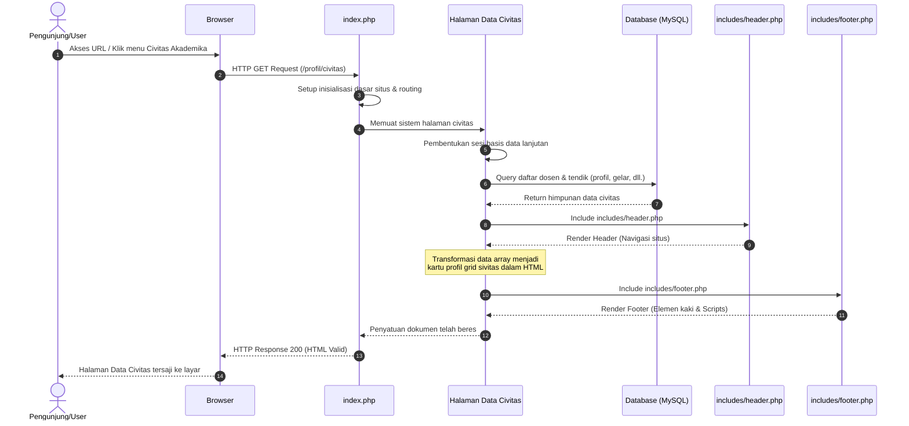

# Sequence Diagram: Halaman Data Civitas Akademika

Diagram sekuensial ini menjelaskan alur operasional di balik layar ketika pengguna melihat halaman informasi **Data Civitas Akademika** (seperti profil dosen maupun tenaga kependidikan).

## Penjelasan Alur

Berikut adalah penjabaran langkah demi langkah dari diagram ini:
1. **Permintaan Akses**: Pengguna membuka halaman civitas akademika melalui menu profil yang tersedia.
2. **Penerimaan Permintaan**: `index.php` selaku tulang punggung situs menerima panggilan HTTP ini dan mulai memuat berkas inisiasi utama (*routing* & *system config*).
3. **Pemuatan Fitur Civitas**: Sesuai dengan pembacaan URL yang diakses, sistem selanjutnya mengeksekusi skrip berkas halaman data civitas (`pages/civitas.php` atau sejenisnya).
4. **Koneksi Database**: Halaman civitas ini kemudian membangun komunikasi ke *server* basis data fakultas.
5. **Eksekusi Kueri Data Civitas**: Sistem memohon basis data untuk mengeluarkan senarai nama staf pengajar (dosen) berserta detail pangkat/pendidikan dan tenaga kependidikan dari tabel sivitas.
6. **Distribusi Data Civitas**: Data mentah yang diserahkan `MySQL` ini disimpan sementara ke dalam ingatan program (variabel/array).
7. **Pemuatan Header**: Puncak halaman (*navbar*, *logo*, inisialisasi *style*) dipanggil melalui komponen `includes/header.php`.
8. **Penggabungan Tampilan**: Sistem mulai menjajarkan profil setiap civitas akademika secara rapi—mungkin dalam bentuk matriks (*grid*)—bercampur padu dengan susunan HTML statis.
9. **Penutupan (*Footer*)**: Bagian bawah halaman diambil menggunakan berkas `includes/footer.php`.
10. **Pemulangan Hasil**: Hasil susunan struktur grafis berupa respons HTML komprehensif dikirimkan kepada peramban pengunjung.

## Diagram

